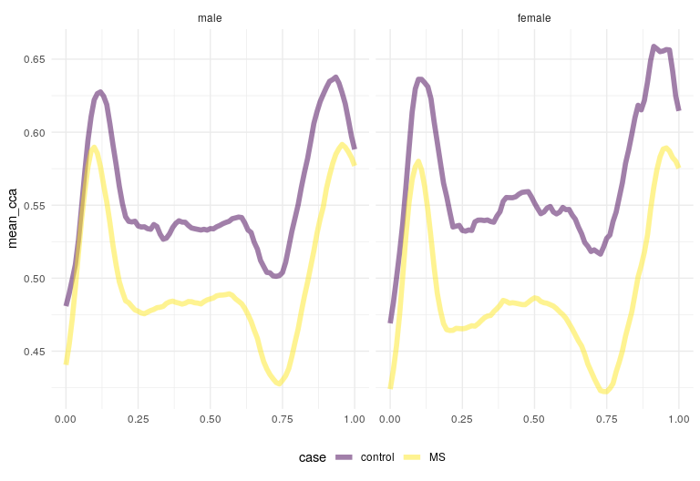

<!-- README.md is generated from README.Rmd. Please edit that file -->

# tidyfun 

<!-- badges: start -->

[](https://travis-ci.org/tidyfun/tidyfun)
[](https://www.tidyverse.org/lifecycle/#experimental)
[](https://ci.appveyor.com/project/tidyfun/tidyfun/branch/master)
[](https://codecov.io/github/tidyfun/tidyfun/branch/master)
<!-- badges: end -->

The goal of **`tidyfun`** is to provide accessible and well-documented
software that **makes functional data analysis in `R` easy** –
specifically data wrangling and exploratory analysis. This is achieved
by introducing a new data type (`tf`). Vectors of class `tf` can be
operated on using many standard functions (`+`, `mean`, etc.) as well as
several new functions in `tidyfun` (`tf_smooth`, `tf_where`).

**Crucially**, vectors of class `tf` can be included in data frames
containing other variables, enabling data manipulation using `tidyverse`
tools. This approach is connected to the conceptual framework in
functional data analysis, which assumes that *complete functions* are
the unit of observation; with `tidyfun`, full curves sit alongside
numeric, factor, and other observations on the same subject.

## Installation

``` r
devtools::install_github("tidyfun/tidyfun")
```

## Overview

**`tidyfun`** provides:

  - new **data types** for representing functional data: **`tfd`** &
    **`tfb`**
  - arithmetic **operators** and descriptive **statistics** for such
    data
  - `tidyverse`-verbs for handling functional data – especially
    **inside** data frames
  - new **graphics** functions for `tf` vectors and tidy functional data
    frames

For detailed information on the features of `tidyfun`, check out
articles on the following
    topics:

  - [Representing](https://tidyfun.github.io/tidyfun/articles/x01_tf_Vectors.html)
    functional data as `tf` vectors, and operating on those
    vectors
  - [Converting](https://tidyfun.github.io/tidyfun/articles/x02_Conversion.html)
    non-tidy functional data (matrices, “long” and “wide” data frames)
    to tidy functional
    data
  - [Wrangling](https://tidyfun.github.io/tidyfun/articles/x03_Data_Wrangling.html)
    data frames that include functional data using `tidyverse` and
    `tidyfun`
    tools
  - [Visualizing](https://tidyfun.github.io/tidyfun/articles/x04_Visualization.html)
    tidy functional data

The result is a package that enables exploratory data analysis like the
following, which computes group-specific mean curves in the `dti_df`
dataset, and plots the result:

``` r
library("tidyfun")
data(dti_df, package = "tidyfun")

dti_df %>% 
  group_by(case, sex) %>% 
  summarize(mean_cca = mean(cca, na.rm = TRUE)) %>% 
  ggplot(aes(y = mean_cca, color = case)) + 
    geom_spaghetti(size = 2) + 
    facet_grid(~ sex)
```



## What does it do?

#### New vector-like data types for functional data

**`tidyfun`** provides [new `S3`-classes for functional
data](https://tidyfun.github.io/tidyfun/reference/index.html#section-tf-sub-classes-constructors-converters),
either as raw data (class `tfd` for *t*idy *f*unctional *d*ata) or in
basis representation (class `tfb` for *t*idy *f*unctional *b*asis data).

Such `tf`-objects can be subsetted or subassigned, computed on and
summarized.

Almost all

  - operators like `==`, `+` or `*`
  - math functions like `sum`, `log` or `abs`
  - and statistics functions like `mean` or `sd`

are defined for **`tidyfun`**’s data structures
([more](https://tidyfun.github.io/tidyfun/reference/index.html#section-arithmetic-logical-and-summary-functions)).

The `tf` objects are basically glorified lists, so they work well as
columns in data frames. That makes it a lot easier to keep your other
data and functional measurements together in one object for
preprocessing, exploratory analysis and description. At the same time,
these objects actually behave like vectors of *functions* to some
extent, i.e., they can be evaluated on any point in their domain, they
can be integrated or differentiated, etc.

[See
here](https://tidyfun.github.io/tidyfun/articles/x01_tf_Vectors.html)
for more information on the operations defined for `tf` vectors.

#### Methods for converting existing data to `tf`

**`tidyfun`** includes functions `tfd` and `tfb` for converting
matrices, data frames, etc. to `tf` vectors. It also provides
`tf_gather` & `tf_nest` in order to reshape tables with functional data,
by going from wide to narrow or from long to short; functions like
`as.matrix`, `tf_spread` & `tf_unnest` can reverse these data
conversions.

[See
here](https://tidyfun.github.io/tidyfun/articles/x02_Conversion.html)
details on getting data into (and out of) the `tf`
format.

#### `tidyverse` verbs for dealing with functional data inside data frames

All `dplyr` verbs work on `tf`-columns, so you can `filter`, `mutate`,
`group_by` & `summarize`, etc., functional data pretty much like
conventional “tidy” data. **`tidyfun`** adds several functions that are
useful in conjunction with these, like `tf_anywhere` and `tf_smooth`.

[See
here](https://tidyfun.github.io/tidyfun/articles/x03_Data_Wrangling.html)
to see how you can wrangle functional data.

#### New `ggplot2` `geoms` and `stats` for functional data

**`tidyfun`** defines **pasta-themed** `geom`s for functional data:

  - **`geom_spaghetti`** for lines,
  - **`geom_meatballs`** for (lines &) points,
  - **`gglasagna`** for [lasagna
    plots](https://asset.jmir.pub/assets/76aeec48564abf0e6f6da8e9cd06346d.png),
    with an **`order`**-aesthetic to sort the lasagna layers,
  - **`geom_capellini`** for
    [glyphs](http://ggobi.github.io/ggally/index_files/figure-html/glyphs-basic-usage-1.png)
    plots (i.e., sparklines),

as well as new methods for base R graphics functions `plot`, `lines` and
`points` for quick and easy visualizations of functional data.

[See
here](https://tidyfun.github.io/tidyfun/reference/index.html#section-visualization-display)
for the documentation of the visualization approaches or take a look at
the
[Visualization](https://tidyfun.github.io/tidyfun/articles/x04_Visualization.html)
vignette.

-----

Found a bug? Got a question? Missing some functionality?  
Please let us know so we can make it better.
