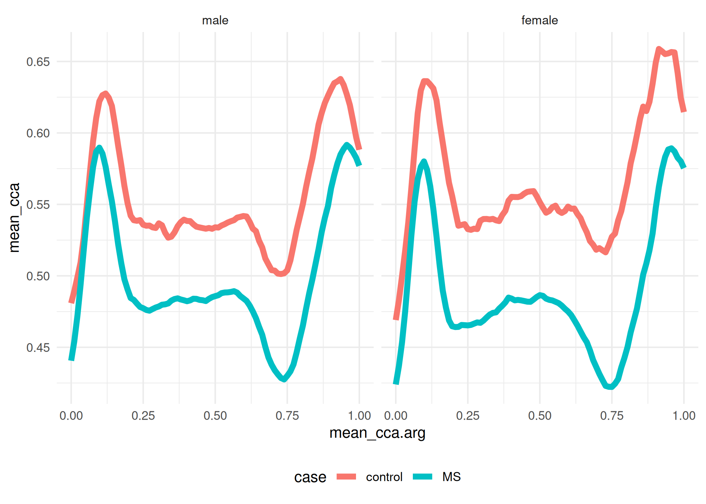

<!-- README.md is generated from README.Rmd. Please edit that file -->

# tidyfun <a href="https://tidyfun.github.io/tidyfun/"></a>

<!-- badges: start -->

[](https://lifecycle.r-lib.org/articles/stages.html#experimental)
[](https://github.com/tidyfun/tidyfun/actions/workflows/full-check.yaml)
[](https://tidyfun.r-universe.dev/tidyfun)
[](https://opensource.org/licenses/MIT)
[](https://app.codecov.io/gh/tidyfun/tidyfun)
<!-- badges: end -->

**`tidyfun`** is a **`tidyverse`**-oriented interface layer around the
core **`tf`** package. It makes functional data analysis in `R` easier
by focusing on data wrangling, exploratory analysis, and graphics for
functional data stored in ordinary data frames.

The underlying **`tf`** package defines the `tf` vector type and the
core functional-data methods. **`tidyfun`** builds on those objects with
helpers for working inside data frames, plus plotting and workflow tools
that fit naturally into the **`tidyverse`**.

**Crucially**, vectors of class `tf` can be included in data frames
alongside other variables, enabling data manipulation with standard
**`tidyverse`** tools. This matches the functional-data view that
*complete functions* are the unit of observation; with **`tidyfun`**,
full curves sit alongside numeric, factor, and other observations on the
same subject.

## Installation

Install the released version from CRAN:

``` r
install.packages("tidyfun")
```

Or install the current development version from GitHub:

``` r
install.packages("pak")
pak::pak("tidyfun/tidyfun")
```

## Overview

**`tidyfun`** provides:

- **`tidyverse`**-friendly **wrangling** tools for functional data
  inside data frames
- **`tidyfun`**-level **graphics** helpers for `tf` vectors and tidy
  functional data frames
- documentation and examples that sit on top of the core **`tf`** data
  structures and methods

For detailed information on the features of **`tidyfun`**, check out
articles on the following topics:

- [Representing](https://tidyfun.github.io/tidyfun/articles/x01_tf_Vectors.html)
  functional data as `tf` vectors, and operating on those vectors with
  core **`tf`** methods and **`tidyfun`** conveniences
- [Converting](https://tidyfun.github.io/tidyfun/articles/x02_Conversion.html)
  non-tidy functional data (matrices, “long” and “wide” data frames) to
  tidy functional data using **`tidyfun`** workflows built on **`tf`**
- [Wrangling](https://tidyfun.github.io/tidyfun/articles/x03_Data_Wrangling.html)
  data frames that include functional data using **`tidyverse`** and
  **`tidyfun`** tools
- [Visualizing](https://tidyfun.github.io/tidyfun/articles/x04_Visualization.html)
  tidy functional data with **`tidyfun`** graphics helpers
- [Registering](https://tidyfun.github.io/tidyfun/articles/x06_Registration.html)
  functional data with the **`tf`** registration methods documented for
  use in the **`tidyfun`** ecosystem

The result is a package that enables exploratory data analysis like the
following, which computes group-specific mean curves in the `dti_df`
dataset, and plots the result:

``` r
library("tidyfun")
data(dti_df, package = "tidyfun")

dti_df |>
  group_by(case, sex) |>
  summarize(mean_cca = mean(cca, na.rm = TRUE)) |>
  tf_ggplot(aes(tf = mean_cca, color = case)) +
  geom_line(linewidth = 2) +
  facet_grid(~sex)
```



## What does it do?

#### Core `tf` data types and methods

The underlying [**`{tf}`**](https://github.com/tidyfun/tf) package
defines the `tf` vector classes and related methods, including raw
functional data (`tfd`) and basis representations (`tfb`). For an
overview, see the [`tf` vectors
article](https://tidyfun.github.io/tidyfun/articles/x01_tf_Vectors.html)
and the [reference index](https://tidyfun.github.io/tidyfun/reference/).

Such `tf`-objects can be subsetted or subassigned, computed on and
summarized.

Almost all

- operators like `==`, `+` or `*`
- math functions like `sum`, `log` or `abs`
- and statistics functions like `mean` or `sd`

are defined for these `tf` data structures, as illustrated in the [`tf`
vectors
article](https://tidyfun.github.io/tidyfun/articles/x01_tf_Vectors.html)
and the [reference index](https://tidyfun.github.io/tidyfun/reference/).

The `tf` objects are basically glorified lists, so they work well as
columns in data frames. That makes it a lot easier to keep your other
data and functional measurements together in one object for
preprocessing, exploratory analysis and description. At the same time,
these objects actually behave like vectors of *functions* to some
extent, i.e., they can be evaluated on any point in their domain, they
can be integrated or differentiated, etc.

[See
here](https://tidyfun.github.io/tidyfun/articles/x01_tf_Vectors.html)
for more information on the operations defined for `tf` vectors.

#### Methods for converting existing data to `tf`

The underlying **`tf`** package provides the `tfd` and `tfb`
constructors for converting matrices, data frames, etc. to `tf` vectors.
**`tidyfun`** builds on those objects with `tf_gather` & `tf_nest` to
reshape tables with functional data, by going from wide to narrow or
from long to short; functions like `as.matrix`, `tf_spread` &
`tf_unnest` can reverse these data conversions.

[See
here](https://tidyfun.github.io/tidyfun/articles/x02_Conversion.html)
for details on getting data into (and out of) the `tf` format.

#### **`tidyverse`** verbs for dealing with functional data inside data frames

All **`dplyr`** verbs work on `tf`-columns, so you can `filter`,
`mutate`, `group_by` & `summarize`, etc., functional data pretty much
like conventional “tidy” data. **`tidyfun`** workflows also work
naturally with **`tf`** helpers such as `tf_anywhere` and `tf_smooth`.

[See
here](https://tidyfun.github.io/tidyfun/articles/x03_Data_Wrangling.html)
to see how you can wrangle functional data.

#### New **`ggplot2`** `geoms` and `stats` for functional data

**`tidyfun`** provides **`tf_ggplot()`**, which lets you use standard
**`ggplot2`** geoms (`geom_line`, `geom_point`, `geom_ribbon`, …) with
functional data via the `tf` aesthetic. It also includes specialized
**pasta-themed** geoms:

- **`gglasagna`** for [lasagna
  plots](https://asset.jmir.pub/assets/76aeec48564abf0e6f6da8e9cd06346d.png)
  (heatmaps), with an **`order`**-aesthetic to sort the lasagna layers,
- **`geom_capellini`** for
  [glyphs](http://ggobi.github.io/ggally/articles/glyph_files/figure-html/glyphs-basic-usage-1.png)
  plots (i.e., sparklines),
- **`geom_fboxplot`** for functional boxplots based on data depth,

as well as methods for base R graphics functions `plot`, `lines` and
`points` for quick and easy visualizations of functional data.

[See
here](https://tidyfun.github.io/tidyfun/articles/x04_Visualization.html)
for the documentation of the visualization approaches, or browse the
[reference index](https://tidyfun.github.io/tidyfun/reference/).

#### Curve registration

**`tidyfun`** documents multiple **`tf`** methods for aligning curves in
time via `tf_register`: elastic SRVF alignment, continuous registration
(CC), affine shift/scale models, and landmark registration. All methods
return `tf_registration` objects with a consistent interface for
extracting aligned curves, inverse warping functions, and diagnostic
summaries.

[See
here](https://tidyfun.github.io/tidyfun/articles/x06_Registration.html)
for a practical guide covering method selection, diagnostics, and worked
examples on real data.

------------------------------------------------------------------------

Found a bug? Got a question? Missing some functionality?  
Please let us know so we can make it better.
