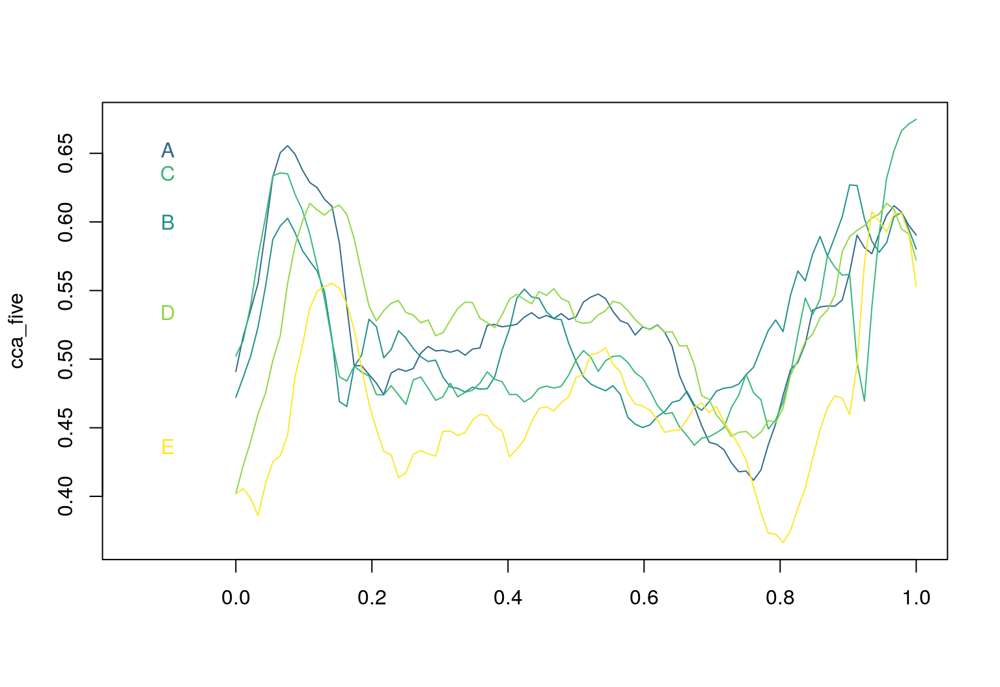
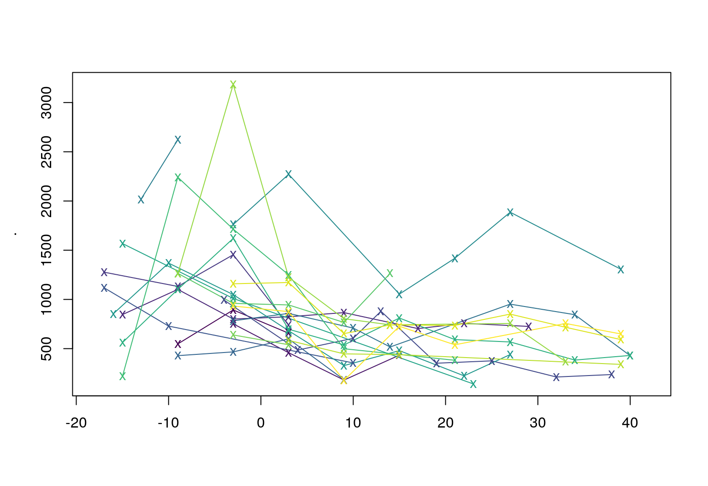
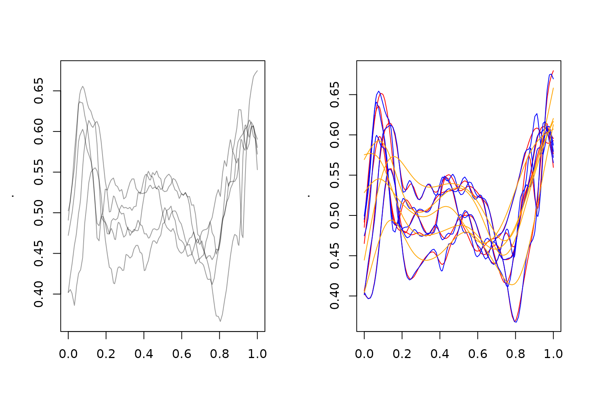
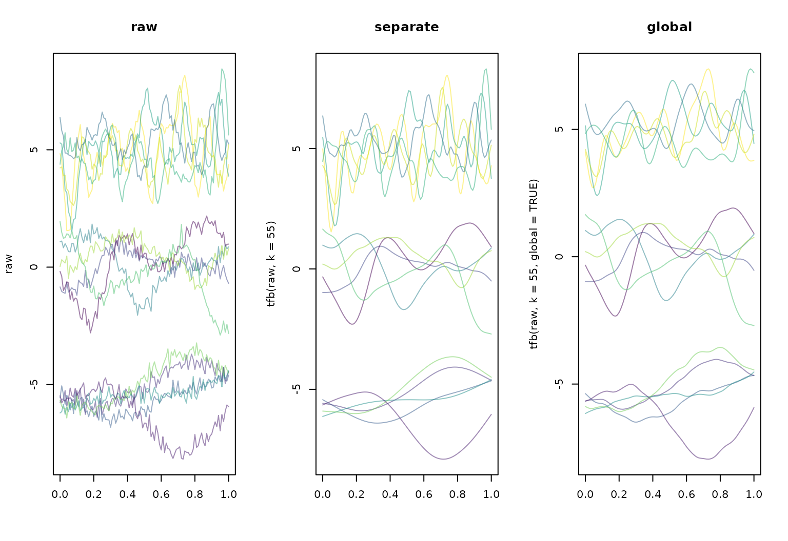
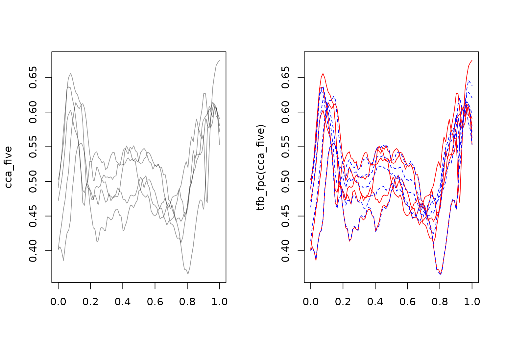
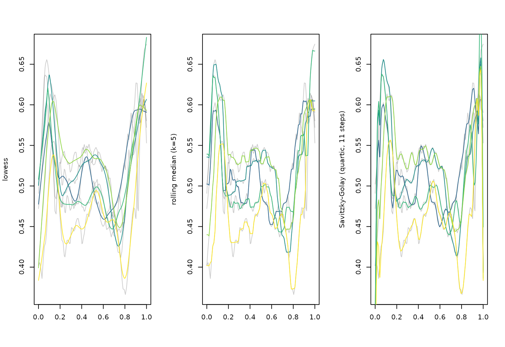
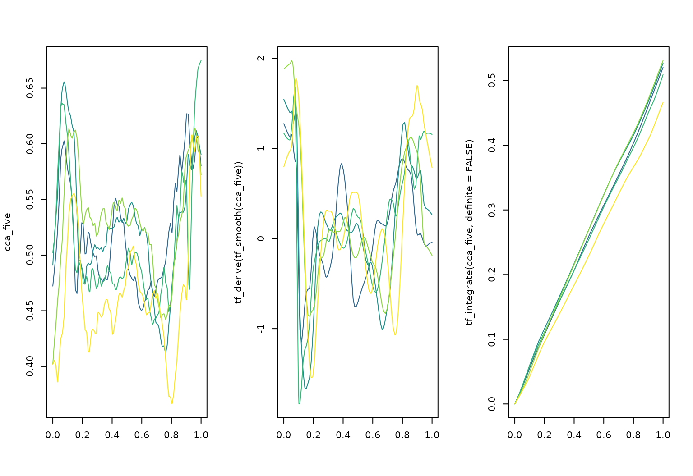
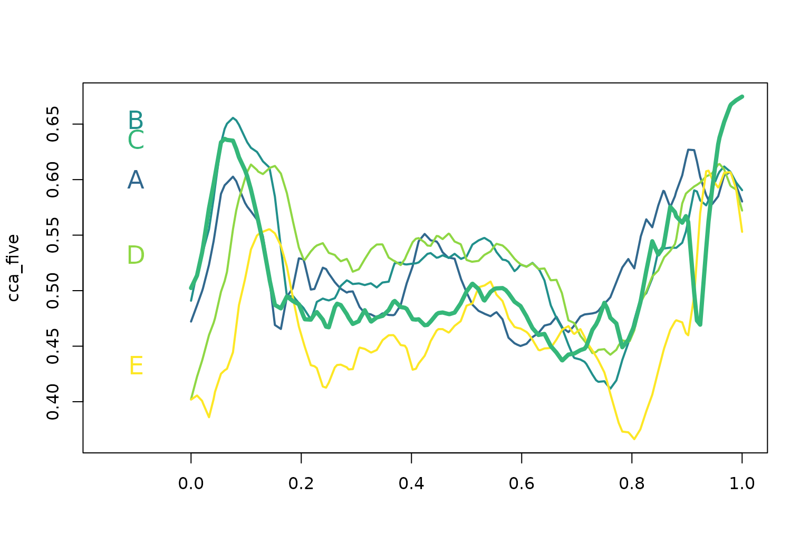

# tf Vectors and Operations

This vignette introduces the `tf` class, as well as the `tfd` and `tfb`
subclasses, and focuses on vectors of this class. It also illustrates
operations for `tf` vectors.

## `tf`-Class: Definition

### `tf`-class

**`tf`** is a new data type for (vectors of) functional data:

- an abstract superclass for functional data in 2 forms:

  - as (argument, value)-tuples: subclass **`tfd`**, also irregular or
    sparse
  - or in basis representation: subclass **`tfb`** represents each
    observed function as a weighted sum of a fixed dictionary of known
    “basis functions”.

- basically, a `list` of numeric vectors  
  (… since `list`s work well as columns of data frames …)

- with additional attributes that define *function-like* behavior:

  - how to **evaluate** the given “functions” for new arguments
  - their **domain**: the range of valid argument values

- `S3` based

### Example Data

First we extract a `tf` vector from the
[`tidyfun::dti_df`](https://tidyfun.github.io/tidyfun/reference/dti_df.md)
dataset containing fractional anisotropy tract profiles for the corpus
callosum (`cca`). When printed, `tf` vectors show the first few `arg`
and `value` pairs for each subject.

``` r
data("dti_df")

cca <- dti_df$cca
cca
## irregular tfd[382]: [0,1] -> [0.2528541,0.8282126] based on 73 to 93 (mean: 93) evaluations each
## interpolation by tf_approx_linear 
## 1001_1: (0.000,0.49);(0.011,0.52);(0.022,0.54); ...
## 1002_1: (0.000,0.47);(0.011,0.49);(0.022,0.50); ...
## 1003_1: (0.000,0.50);(0.011,0.51);(0.022,0.54); ...
## 1004_1: (0.000,0.40);(0.011,0.42);(0.022,0.44); ...
## 1005_1: (0.000,0.40);(0.011,0.41);(0.022,0.40); ...
## 1006_1: (0.000,0.45);(0.011,0.45);(0.022,0.46); ...
##     [....]   (376 not shown)
```

We also extract a simple 5-element vector of functions on a regular
grid:

``` r
cca_five <- cca[1:5, seq(0, 1, length.out = 93), interpolate = TRUE]
rownames(cca_five) <- LETTERS[1:5]
cca_five <- tfd(cca_five, signif = 2)
cca_five
## tfd[5]: [0,1] -> [0.3662524,0.6747586] based on 93 evaluations each
## interpolation by tf_approx_linear 
## A: ▅▇█▇▅▄▄▄▄▄▅▅▅▅▅▅▄▃▂▂▃▄▅▆▆▇
## B: ▄▆▆▅▄▄▄▄▃▃▅▅▄▄▃▃▃▃▃▄▄▆▆▇▆▆
## C: ▅▇▇▅▄▃▃▃▃▄▃▃▄▄▄▄▃▂▃▃▃▅▅▅▅█
## D: ▂▄▆▇▆▅▅▅▅▅▅▅▅▅▅▅▄▄▃▃▃▄▅▆▇▆
## E: ▁▂▄▅▅▃▂▂▃▃▂▃▃▄▄▃▃▃▃▂▁▁▃▄▆▆
```

For illustration, we plot the vector `cca_five` below.

``` r
plot(cca_five, xlim = c(-0.15, 1), col = pal_5)
text(x = -0.1, y = cca_five[, 0.07], labels = names(cca_five), col = pal_5)
```



### **`tf`** subclass: **`tfd`**

**`tfd`** objects contain “raw” functional data:

- represented as a list of **`evaluations`** \\f_i(t)\|\_{t=t'}\\ and
  corresponding **`arg`**ument vector(s) \\t'\\
- has a **`domain`**: the range of valid **`arg`**s.

``` r
cca_five |>
  tf_evaluations() |>
  str()
## List of 5
##  $ A: num [1:93] 0.491 0.517 0.536 0.555 0.593 ...
##  $ B: num [1:93] 0.472 0.487 0.502 0.523 0.552 ...
##  $ C: num [1:93] 0.502 0.514 0.539 0.574 0.603 ...
##  $ D: num [1:93] 0.402 0.423 0.44 0.46 0.475 ...
##  $ E: num [1:93] 0.402 0.406 0.399 0.386 0.409 ...
cca_five |>
  tf_arg() |>
  str()
##  num [1:93] 0 0.0109 0.0217 0.0326 0.0435 ...
cca_five |> tf_domain()
## [1] 0 1
```

- each **`tfd`**-vector contains an **`evaluator`** function that
  defines how to inter-/extrapolate `evaluations` between `arg`s

``` r
tf_evaluator(cca_five) |> str()
## function (x, arg, evaluations)
tf_evaluator(cca_five) <- tf_approx_spline
```

- **`tfd`** has two subclasses: one for regular data with a common grid
  and one for irregular or sparse data. The `cca` data are irregular
  (values are missing for some subjects at some arguments) but the
  example below more clearly illustrates support for sparse and
  irregular data using CD4 cell counts from a longitudinal study.

``` r
cd4_vec <- tfd(refund::cd4)

cd4_vec[1:2]
## irregular tfd[2]: [-18,42] -> [181,893] based on 3 to 4 (mean: 4) evaluations each
## interpolation by tf_approx_linear 
## [1]: (-9,548);(-3,893);( 3,657)
## [2]: (-3,752);( 3,459);( 9,181); ...
cd4_vec[1:2] |>
  tf_arg() |>
  str()
## List of 2
##  $ : num [1:3] -9 -3 3
##  $ : num [1:4] -3 3 9 15
cd4_vec[1:20] |> plot(pch = "x", col = viridis(20))
```



### **`tf`** subclass: **`tfb`**

Functional data in basis representation:

- represented as a list of **`coefficients`** and a common
  **`basis_matrix`** of basis function evaluations on a vector of
  `arg`-values.
- contains a **`basis`** function that defines how to evaluate the basis
  functions for new **`arg`**s and how to differentiate or integrate it.
- (internal) flavors:
  - `tfb_spline`: uses `mgcv`-spline bases
  - `tfb_fpc`: uses functional principal components
- significant memory and time savings:

``` r
refund::DTI$cca |>
  object.size() |>
  print(units = "Kb")
## 307.7 Kb
cca |>
  object.size() |>
  print(units = "Kb")
## 782.4 Kb
cca |>
  tfb(verbose = FALSE) |>
  object.size() |>
  print(units = "Kb")
## 181.6 Kb
```

#### **`tfb_spline`**: spline basis

- default for [`tfb()`](https://tidyfun.github.io/tf/reference/tfb.html)
- accepts all arguments of `mgcv`’s `s()`-syntax: basis type `bs`, basis
  dimension `k`, penalty order `m`, etc…
- also does non-Gaussian fits: `family` argument
  - all exponential families
  - but also: \\t\\-distribution, ZI-Poisson, Beta, …

``` r
cca_five_b <- cca_five |> tfb()
## Percentage of input data variability preserved in basis representation
## (per functional observation, approximate):
## Min. 1st Qu.  Median Mean 3rd Qu.  Max.
## 95.60 96.40 96.90 97.12 98.00 98.70
cca_five_b[1:2]
## tfb[2]: [0,1] -> [0.41581,0.6516056] in basis representation:
##  using  s(arg, bs = "cr", k = 25, sp = -1)  
## A: ▆██▆▃▃▃▄▄▄▄▄▅▅▄▄▃▁▁▁▂▄▅▆▇▇
## B: ▅▇▆▃▃▄▄▃▃▃▅▅▃▃▂▂▂▂▃▄▅▆▇▇▆▇
cca_five[1:2] |> tfb(bs = "tp", k = 55)
## Percentage of input data variability preserved in basis representation
## (per functional observation, approximate):
## Min. 1st Qu.  Median Mean 3rd Qu.  Max.
## 99.10 99.22 99.35 99.35 99.47 99.60
## tfb[2]: [0,1] -> [0.4147803,0.6551594] in basis representation:
##  using  s(arg, bs = "tp", k = 55, sp = -1)  
## A: ▅██▆▃▃▃▄▃▄▄▄▄▅▄▄▃▁▁▁▂▄▅▆▇▆
## B: ▄▇▆▃▄▄▄▃▃▃▅▄▃▃▂▂▂▂▃▄▄▆▆▇▆▆

# functions represent ratios in (0,1), so a Beta-distribution is more appropriate:
cca_five[1:2] |>
  tfb(bs = "ps", m = c(2, 1), family = mgcv::betar(link = "cloglog"))
## Percentage of input data variability preserved in basis representation
## (on inverse link-scale per functional observation, approximate):
## Min. 1st Qu.  Median Mean 3rd Qu.  Max.
## 99.40 99.47 99.55 99.55 99.62 99.70
## tfb[2]: [0,1] -> [0.4173213,0.6475771] in basis representation:
##  using  s(arg, bs = "ps", k = 25, m = c(2, 1), sp = -1) (Beta regression with cloglog-link) 
## A: ▆██▆▃▃▃▄▄▄▄▄▅▅▄▄▃▁▁▁▂▄▅▆▇▇
## B: ▄▇▆▃▃▄▄▃▃▃▅▅▃▃▂▂▂▂▃▄▅▆▇▇▆▇
```

#### Penalization:

**Function-specific (default), none**, prespecified (`sp`), or global:

``` r
layout(t(1:2))
cca_five |> plot()
cca_five_b |> plot(col = "red")
cca_five |>
  tfb(k = 35, penalized = FALSE) |>
  lines(col = "blue")
## Percentage of input data variability preserved in basis representation
## (per functional observation, approximate):
## Min. 1st Qu.  Median Mean 3rd Qu.  Max.
## 98.5 98.6 98.7 99.0 99.6 99.6
cca_five |>
  tfb(sp = 0.001) |>
  lines(col = "orange")
## Percentage of input data variability preserved in basis representation
## (per functional observation, approximate):
## Min. 1st Qu.  Median Mean 3rd Qu.  Max.
## 72.60 75.90 76.50 76.54 77.20 80.50
```



Right plot shows smoothing with function-specific penalization in red,
without penalization in blue, and with manually set strong smoothing
(`sp` \\\to 0\\) in orange.

**“Global” smoothing**:

1.  estimate smoothing parameters for subsample (~10%) of curves
2.  apply geometric mean of estimated smoothing parameters to smooth
    *all* curves

**Advantages:**

- (much) faster than optimizing penalization for each curve
- should scale well for largish datasets

**Disadvantages**

- no real borrowing of information across curves (very sparse or
  functional fragment data, e.g.)
- still requires more observations than basis functions *per curve*
- subsample could miss small subgroups with different roughness,
  over-/undersmooth parts of the data, see below.

Dataset with heterogeneous roughness:

``` r
layout(t(1:3))
clrs <- scales::alpha(sample(viridis(15)), 0.5)
plot(raw, main = "raw", col = clrs)
plot(tfb(raw, k = 55), main = "separate", col = clrs)
## Percentage of input data variability preserved in basis representation
## (per functional observation, approximate):
## Min. 1st Qu.  Median Mean 3rd Qu.  Max.
## 72.20 88.65 94.80 92.06 96.55 97.70
plot(tfb(raw, k = 55, global = TRUE), main = "global", col = clrs)
## Using global smoothing parameter `sp = 0` estimated on subsample of curves.
## Percentage of input data variability preserved in basis representation
## (per functional observation, approximate):
## Min. 1st Qu.  Median Mean 3rd Qu.  Max.
## 71.20 80.35 86.40 86.46 95.00 96.90
```



#### **`tfb`** FPC-based

- uses first few eigenfunctions computed from a simple unregularized
  (weighted) SVD of the data matrix by default
- corresponding FPC basis and mean function saved as `tfd`-object
- observed functions are linear combinations of those.
- amount of “smoothing” can be controlled (roughly!) by setting the
  minimal *percentage of variance explained* `pve`

``` r
cca_five_fpc <- cca_five |> tfb_fpc(pve = 0.999)
cca_five_fpc
## tfb[5]: [0,1] -> [0.3662524,0.6747586] in basis representation:
##  using  4 FPCs 
## A: ▅█▇▆▄▄▄▄▄▅▅▅▅▅▅▅▄▂▂▂▃▅▅▆▇▆
## B: ▅▇▆▃▄▄▄▄▃▄▅▅▄▃▃▃▃▃▃▄▄▆▆▇▆▆
## C: ▆▇▆▄▄▃▄▃▃▄▃▃▄▄▄▃▃▃▃▃▃▅▆▃▇█
## D: ▃▅▇▇▆▅▅▄▅▅▅▅▅▅▅▅▄▃▃▃▃▄▅▆▇▆
## E: ▁▃▅▅▄▂▂▃▃▃▂▃▄▄▃▃▃▃▃▁▁▂▃▆▆▅

cca_five_fpc_lowrank <- cca_five |> tfb_fpc(pve = 0.6)
cca_five_fpc_lowrank
## tfb[5]: [0,1] -> [0.3641026,0.6458109] in basis representation:
##  using  2 FPCs 
## A: ▅█▇▆▅▅▅▄▅▅▅▅▅▅▅▄▄▃▃▃▄▆▆▇▇▇
## B: ▆█▇▅▄▄▄▄▄▄▅▅▅▄▄▄▄▃▃▄▄▆▆▆▇█
## C: ▆█▇▄▄▄▄▃▃▄▄▄▄▄▄▃▃▃▃▄▄▆▆▅▇█
## D: ▃▆██▆▅▅▅▅▅▆▆▅▆▅▅▅▃▃▂▃▅▅█▇▆
## E: ▁▃▅▆▄▂▂▃▃▃▃▃▄▄▄▃▃▃▃▁▁▂▄▆▇▆
```

``` r
layout(t(1:2))
cca_five |> plot()
cca_five_fpc |> plot(col = "red", ylab = "tfb_fpc(cca_five)")
cca_five_fpc_lowrank |> lines(col = "blue", lty = 2)
```



`tfb_fpc` is currently only implemented for data on identical (but
possibly non-equidistant) grids. The **`{refunder}`**
`rfr_fpca`-functions provide FPCA methods appropriate for highly
irregular and sparse data and regularized/smoothed FPCA.

## `tf`-Class: Methods

**`tidyfun`** implements almost all types of operations that are
available for conventional numerical or logical vectors for `tf`-vectors
as well, so you can:

#### subset & subassign:

``` r
cca_five[1:2]
## tfd[2]: [0,1] -> [0.4117148,0.655613] based on 93 evaluations each
## interpolation by tf_approx_spline 
## A: ▄██▇▄▃▃▄▄▄▄▄▄▅▄▄▄▂▁▁▂▄▅▆▆▇
## B: ▃▆▆▄▃▄▄▃▃▃▄▅▄▃▂▂▂▂▃▃▄▅▆▇▆▇
cca_five[1:2] <- cca_five[2:1]
cca_five
## tfd[5]: [0,1] -> [0.3662524,0.6747586] based on 93 evaluations each
## interpolation by tf_approx_spline 
## A: ▄▆▆▅▄▄▄▄▃▃▅▅▄▄▃▃▃▃▃▄▄▆▆▇▆▆
## B: ▅▇█▇▅▄▄▄▄▄▅▅▅▅▅▅▄▃▂▂▃▄▅▆▆▇
## C: ▅▇▇▅▄▃▃▃▃▄▃▃▄▄▄▄▃▂▃▃▃▅▅▅▅█
## D: ▂▄▆▇▆▅▅▅▅▅▅▅▅▅▅▅▄▄▃▃▃▄▅▆▇▆
## E: ▁▂▄▅▅▃▂▂▃▃▂▃▃▄▄▃▃▃▃▂▁▁▃▄▆▆
```

#### compare & compute:

``` r
cca_five[1] + cca_five[1] == 2 * cca_five[1]
## [1] TRUE
log(exp(cca_five[2])) == cca_five[2]
## [1] TRUE
(cca_five - (2:-2)) != cca_five
## [1]  TRUE  TRUE FALSE  TRUE  TRUE
```

#### summarize across a vector of functions:

Compute functional summaries like mean functions, functional standard
deviations or variances or functional data depths over a vector of
functional data:

``` r
c(mean = mean(cca_five), sd = sd(cca_five))
## tfd[2]: [0,1] -> [0.01060056,0.6165761] based on 93 evaluations each
## interpolation by tf_approx_spline 
## mean: ▇███▇▇▇▇▇▇▇▇▇▇▇▇▇▆▆▆▆▇▇███
## sd  : ▁▂▁▁▁▁▁▁▁▁▁▁▁▁▁▁▁▁▁▁▁▁▁▁▁▁

tf_depth(cca_five) ## Modified Band-2 Depth (à la Sun/Genton/Nychka, 2012), others to come.
##        A        B        C        D        E 
## 1.221739 1.293478 1.319565 1.145652 1.019565
median(cca_five) == cca_five[which.max(tf_depth(cca_five))]
## [1] TRUE
summary(cca_five)
## tfd[6]: [0,1] -> [0.3662524,0.6747586] based on 93 evaluations each
## interpolation by tf_approx_spline 
## min      : ▁▂▄▄▃▃▂▂▃▃▂▃▃▄▃▃▃▂▂▂▁▁▃▃▅▆
## lower_mid: ▄▆▆▅▃▃▃▃▃▃▃▃▄▄▃▃▃▂▂▂▃▄▅▄▅▆
## median   : ▅▇▇▅▄▃▃▃▃▄▃▃▄▄▄▄▃▂▃▃▃▅▅▅▅█
## mean     : ▃▅▆▆▅▄▄▄▄▄▄▄▄▄▄▄▃▃▃▃▃▄▅▆▆▇
## upper_mid: ▅▇█▇▅▄▄▄▄▄▅▅▅▅▅▅▄▃▃▄▄▆▆▇▇█
## max      : ▅▇█▇▆▅▅▅▅▅▅▅▅▅▅▅▄▄▃▄▄▆▆▇▇█
```

#### summarize each function over its domain:

Compute summaries for each function like its mean or extreme values,
quantiles, etc.

``` r
tf_fmean(cca_five) # mean of each function's evaluations
##         A         B         C         D         E 
## 0.5202229 0.5266713 0.5090638 0.5308612 0.4661378
tf_fmax(cca_five) # max of each function's evaluations
##         A         B         C         D         E 
## 0.6269639 0.6556130 0.6747586 0.6135842 0.6075271
# 25%-tile of each f(t) for t > .5:
tf_fwise(cca_five, \(x) quantile(x$value[x$arg > 0.5], prob = 0.25)) |> unlist()
##     A.25%     B.25%     C.25%     D.25%     E.25% 
## 0.4747946 0.4675452 0.4650627 0.4770205 0.4462774
```

`tf_fwise` can be used to define custom statistics for each function
that can depend on both its `value` and its `arg`.

In addition, **`tidyfun`** provides methods for operations that are
specific for functional data:

### Methods for “functional” operations

#### evaluate:

`tf`-objects have a special `[`-operator: Its second argument specifies
`arg`ument values at which to evaluate the functions and has some
additional options, so it’s easy to get point values for `tf` objects,
in `matrix` or `data.frame` formats:

``` r
cca_five[1:2, seq(0, 1, length.out = 3)]
##           0       0.5         1
## A 0.4721627 0.4984125 0.5802742
## B 0.4909345 0.5307563 0.5904773
## attr(,"arg")
## [1] 0.0 0.5 1.0
cca_five["B", seq(0, 0.15, length.out = 3), interpolate = FALSE]
##           0 0.075 0.15
## B 0.4909345    NA   NA
## attr(,"arg")
## [1] 0.000 0.075 0.150
cca_five[1:2, seq(0, 1, length.out = 7), matrix = FALSE] |> str()
## List of 2
##  $ A:'data.frame':   7 obs. of  2 variables:
##   ..$ arg  : num [1:7] 0 0.167 0.333 0.5 0.667 ...
##   ..$ value: num [1:7] 0.472 0.475 0.476 0.498 0.475 ...
##  $ B:'data.frame':   7 obs. of  2 variables:
##   ..$ arg  : num [1:7] 0 0.167 0.333 0.5 0.667 ...
##   ..$ value: num [1:7] 0.491 0.521 0.504 0.531 0.472 ...
```

#### (simple, local) smoothing

``` r
layout(t(1:3))
cca_five |> plot(alpha = 0.2, ylab = "lowess")
cca_five |>
  tf_smooth("lowess") |>
  lines(col = pal_5)
## Using `f = 0.15` as smoother span for `lowess()`.

cca_five |> plot(alpha = 0.2, ylab = "rolling median (k=5)")
cca_five |>
  tf_smooth("rollmedian", k = 5) |>
  lines(col = pal_5)
## Setting `fill = 'extend'` for start/end values.

cca_five |> plot(alpha = 0.2, ylab = "Savitzky-Golay (quartic, 11 steps)")
cca_five |>
  tf_smooth("savgol", fl = 11) |>
  lines(col = pal_5)
```



#### differentiate & integrate:

``` r
layout(t(1:3))
cca_five |> plot(col = pal_5)
cca_five |>
  tf_smooth() |>
  tf_derive() |>
  plot(col = pal_5, ylab = "tf_derive(tf_smooth(cca_five))")
## Using `f = 0.15` as smoother span for `lowess()`.
cca_five |>
  tf_integrate(definite = FALSE) |>
  plot(col = pal_5)
```



``` r
cca_five |> tf_integrate()
##         A         B         C         D         E 
## 0.5202229 0.5266713 0.5090638 0.5308612 0.4661378
```

#### query

**`tidyfun`** makes it easy to find (ranges of) `arg`uments \\t\\
satisfying a condition on `value` \\f(t)\\ (and `arg`ument \\t\\):

``` r
cca_five |> tf_anywhere(value > 0.65)
##     A     B     C     D     E 
## FALSE  TRUE  TRUE FALSE FALSE
cca_five[1:2] |> tf_where(value > 0.6, "all")
## $A
## [1] 0.07608696 0.89130435 0.90217391 0.91304348 0.92391304 0.96739130 0.97826087
## 
## $B
##  [1] 0.05434783 0.06521739 0.07608696 0.08695652 0.09782609 0.10869565
##  [7] 0.11956522 0.13043478 0.14130435 0.95652174 0.96739130 0.97826087
cca_five[2] |> tf_where(value > 0.6, "range")
##        begin       end
## B 0.05434783 0.9782609
cca_five |> tf_where(value > 0.6 & arg > 0.5, "first")
##         A         B         C         D         E 
## 0.8913043 0.9565217 0.9565217 0.9347826 0.9347826
```

#### zoom & query

``` r
cca_five |> plot(xlim = c(-0.15, 1), col = pal_5, lwd = 2)
text(x = -0.1, y = cca_five[, 0.07], labels = names(cca_five), col = pal_5, cex = 1.5)
median(cca_five) |> lines(col = pal_5[3], lwd = 4)
```



``` r
# where are the first maxima of these functions?
cca_five |> tf_where(value == max(value), "first")
##          A          B          C          D          E 
## 0.90217391 0.07608696 1.00000000 0.10869565 0.93478261

# where are the first maxima of the later part (t > .5) of these functions?
cca_five[c("A", "D")] |>
  tf_zoom(0.5, 1) |>
  tf_where(value == max(value), "first")
##         A         D 
## 0.9021739 0.9565217

# which f_i(t) are below the functional median anywhere for 0.2 < t < 0.6?
# (t() needed here so we're comparing column vectors to column vectors...)
cca_five |>
  tf_zoom(0.2, 0.6) |>
  tf_anywhere(value <= t(median(cca_five)[, arg]))
##     A     B     C     D     E 
##  TRUE FALSE  TRUE FALSE  TRUE
```
