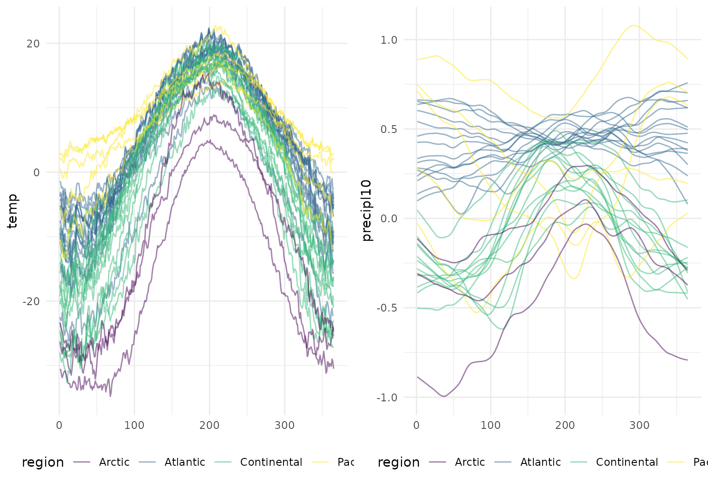
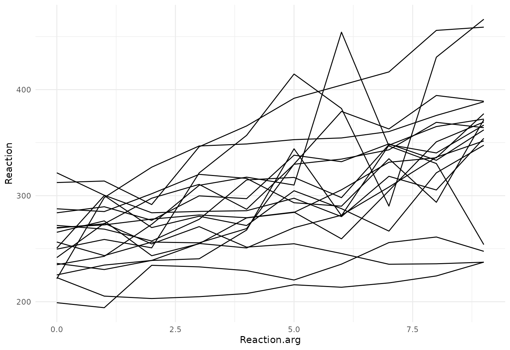
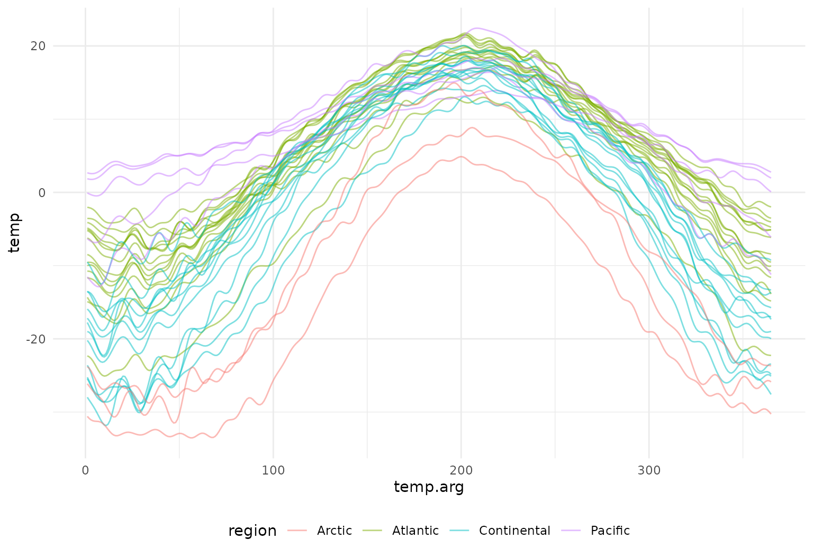

# Converting to & from \`tf\`

Functional data have often been stored in matrices or data frames.
Although these structures have sufficed for some purposes, they are
cumbersome or impossible to use with modern tools for data wrangling.

In this vignette, we illustrate how to convert data from common
structures to `tf` objects. Throughout, functional data vectors are
stored as columns in a data frame to facilitate subsequent wrangling and
analysis.

## Conversion from matrices

One of the most common structures for storing functional data has been a
matrix. Especially when subjects are observed over the same (regular or
irregular) grid, it is natural to observations on a subject in rows (or
columns) of a matrix. Matrices, however, are difficult to wrangle along
with data in a data frame, leading to confusing and easy-to-break
subsetting across several objects.

In the following examples, we’ll use `tfd` to get a `tf` vector from
matrices. The `tfd` function expects data to be organized so that each
row is the functional observation for a single subject. It’s possible to
focus only on the resulting `tf` vector, but in keeping with the broader
goals of **`tidyfun`** we’ll add these as columns to a data frame.

The `DTI` data in the **`refund`** package has been a popular example in
functional data analysis. In the code below, we create a data frame (or
`tibble`) containing scalar covariates, and then add columns for the
`cca` and `rcst` track profiles. This code was used to create the
[`tidyfun::dti_df`](https://tidyfun.github.io/tidyfun/reference/dti_df.md)
dataset included in the package.

``` r
dti_df <- tibble(
  id = refund::DTI$ID,
  visit = refund::DTI$visit,
  sex = refund::DTI$sex,
  case = factor(ifelse(refund::DTI$case, "MS", "control"))
)

dti_df$cca <- tfd(refund::DTI$cca, arg = seq(0, 1, length.out = 93))
dti_df$rcst <- tfd(refund::DTI$rcst, arg = seq(0, 1, length.out = 55))
```

In `tfd`, the first argument is a matrix; `arg` defines the grid over
which functions are observed. The output of `tfd` is a vector, which we
include in the `dti_df` data frame.

``` r
dti_df
## # A tibble: 382 × 6
##       id visit sex    case                                            cca
##    <dbl> <int> <fct>  <fct>                                   <tfd_irreg>
##  1  1001     1 female control (0.000,0.49);(0.011,0.52);(0.022,0.54); ...
##  2  1002     1 female control (0.000,0.47);(0.011,0.49);(0.022,0.50); ...
##  3  1003     1 male   control (0.000,0.50);(0.011,0.51);(0.022,0.54); ...
##  4  1004     1 male   control (0.000,0.40);(0.011,0.42);(0.022,0.44); ...
##  5  1005     1 male   control (0.000,0.40);(0.011,0.41);(0.022,0.40); ...
##  6  1006     1 male   control (0.000,0.45);(0.011,0.45);(0.022,0.46); ...
##  7  1007     1 male   control (0.000,0.55);(0.011,0.56);(0.022,0.56); ...
##  8  1008     1 male   control (0.000,0.45);(0.011,0.48);(0.022,0.50); ...
##  9  1009     1 male   control (0.000,0.50);(0.011,0.51);(0.022,0.52); ...
## 10  1010     1 male   control (0.000,0.46);(0.011,0.47);(0.022,0.48); ...
## # ℹ 372 more rows
## # ℹ 1 more variable: rcst <tfd_irreg>
```

Finally, we’ll make a quick spaghetti plot to illustrate that the
complete functional data is included in each `tf` column.

``` r
dti_df |>
  tf_ggplot(aes(tf = cca, col = case, alpha = 0.2 + 0.4 * (case == "control"))) +
  geom_line() +
  facet_wrap(~sex) +
  scale_alpha(guide = "none", range = c(0.2, 0.4))
```


We’ll repeat the same basic process using a second, and probably
even-more-perennial, functional data example: the Canadian weather data
in the **`fda`** package. Here, functional data are stored in a
three-dimensional array, with dimensions corresponding to day, station,
and outcome (temperature, precipitation, and log10 precipitation).

In the following, we first create a `tibble` with scalar covariates,
then use `tfd` to create functional data vectors, and finally include
the resulting vectors in the dataframe. In this case, our `arg`s are
days of the year, and we use `tf_smooth` to smooth the precipitation
outcome. Because the original data matrices record the different
observations in the columns instead of the rows, we have to use their
transpose in the call to `tfd`:

``` r
canada <- tibble(
  place = fda::CanadianWeather$place,
  region = fda::CanadianWeather$region,
  lat = fda::CanadianWeather$coordinates[, 1],
  lon = -fda::CanadianWeather$coordinates[, 2]
) |>
  mutate(
    temp = t(fda::CanadianWeather$dailyAv[, , 1]) |>
      tfd(arg = 1:365),
    precipl10 = t(fda::CanadianWeather$dailyAv[, , 3]) |>
      tfd(arg = 1:365) |>
      tf_smooth()
  )
## Using `f = 0.15` as smoother span for `lowess()`.
```

The resulting data frame is shown below.

``` r
canada
## # A tibble: 35 × 6
##    place       region     lat   lon                       temp
##    <chr>       <chr>    <dbl> <dbl>                  <tfd_reg>
##  1 St. Johns   Atlantic  47.3 -52.4 ▄▄▄▄▄▅▅▅▆▆▆▇▇▇██▇▇▇▇▆▆▆▅▅▅
##  2 Halifax     Atlantic  44.4 -63.4 ▄▄▄▄▄▅▅▆▆▇▇▇██████▇▇▆▆▆▅▅▄
##  3 Sydney      Atlantic  46.1 -60.1 ▄▄▄▄▄▅▅▅▆▆▇▇██████▇▇▆▆▆▅▅▄
##  4 Yarmouth    Atlantic  43.5 -66.1 ▄▄▄▄▅▅▅▆▆▇▇▇▇█████▇▇▇▆▆▆▅▅
##  5 Charlottvl  Atlantic  42.5 -80.2 ▄▄▃▄▄▄▅▅▆▆▇▇██████▇▇▆▆▆▅▄▄
##  6 Fredericton Atlantic  45.6 -66.4 ▃▃▃▄▄▅▅▆▆▇▇███████▇▇▆▆▅▅▄▄
##  7 Scheffervll Atlantic  54.5 -64.5 ▁▁▁▁▂▂▃▄▄▅▆▆▇▇▇▇▇▆▆▅▅▄▄▃▂▁
##  8 Arvida      Atlantic  48.3 -71.1 ▂▂▂▃▃▄▅▆▆▇▇███████▇▆▆▆▅▄▃▃
##  9 Bagottville Atlantic  48.2 -70.5 ▂▂▂▃▃▄▅▅▆▇▇▇█████▇▇▆▆▅▅▄▃▃
## 10 Quebec      Atlantic  46.5 -71.1 ▃▃▃▃▄▄▅▆▆▇▇███████▇▇▆▆▅▄▄▃
## # ℹ 25 more rows
## # ℹ 1 more variable: precipl10 <tfd_reg>
```

A plot containing both functional observations is shown below.

``` r
temp_panel <- canada |>
  tf_ggplot(aes(tf = temp, color = region)) +
  geom_line()

precip_panel <- canada |>
  tf_ggplot(aes(tf = precipl10, color = region)) +
  geom_line()

gridExtra::grid.arrange(temp_panel, precip_panel, nrow = 1)
```



## Conversion to `tf` from a data frame

#### … in “long” format

“Long” format data frames containing functional data include columns
containing a subject identifier, the functional argument, and the value
each subject’s function takes at each argument. There are also often
(but not always) non-functional covariates that are repeated within a
subject. For data in this form, we use `tf_nest` to produce a data frame
containing a single row for each subject.

A first example is the `sleepstudy` data from the **`lme4`** package,
which is a nice example from longitudinal data analysis. This includes
columns for `Subject`, `Days`, and `Reaction` – which correspond to the
subject, argument, and value.

``` r
data("sleepstudy", package = "lme4")
sleepstudy <- as_tibble(sleepstudy)

sleepstudy
## # A tibble: 180 × 3
##    Reaction  Days Subject
##       <dbl> <dbl> <fct>  
##  1     250.     0 308    
##  2     259.     1 308    
##  3     251.     2 308    
##  4     321.     3 308    
##  5     357.     4 308    
##  6     415.     5 308    
##  7     382.     6 308    
##  8     290.     7 308    
##  9     431.     8 308    
## 10     466.     9 308    
## # ℹ 170 more rows
```

We create `sleepstudy_tf` by nesting `Reaction` within subjects. The
result is a data frame containing a single row for each curve (one per
`Subject`) that holds two columns: the `Reaction` function and the
`Subject` ID:

``` r
sleepstudy_tf <- sleepstudy |>
  tf_nest(Reaction, .id = Subject, .arg = Days)

sleepstudy_tf
## # A tibble: 18 × 2
##    Subject   Reaction
##    <fct>    <tfd_reg>
##  1 308     ▂▂▂▄▅▇▆▃▇█
##  2 309     ▁▁▁▁▁▁▁▁▁▂
##  3 310     ▁▁▂▂▂▁▂▂▂▂
##  4 330     ▄▄▃▃▃▄▃▄▄▅
##  5 331     ▃▃▄▄▄▃▃▅▃▆
##  6 332     ▂▂▃▄▄▄█▅▄▂
##  7 333     ▃▃▃▄▄▅▅▅▅▅
##  8 334     ▃▃▂▂▃▃▄▅▅▆
##  9 335     ▂▃▂▃▂▂▂▂▂▂
## 10 337     ▄▄▃▅▆▆▇▇██
## 11 349     ▂▂▂▂▂▃▃▄▅▅
## 12 350     ▂▂▂▂▃▄▆▅▆▆
## 13 351     ▂▄▃▃▃▄▃▃▄▅
## 14 352     ▁▄▄▅▅▅▅▅▆▆
## 15 369     ▃▃▂▃▄▄▄▅▅▆
## 16 370     ▁▂▂▂▃▅▃▅▆▆
## 17 371     ▃▃▃▃▃▃▂▄▅▆
## 18 372     ▃▃▄▄▃▄▅▅▆▅
```

We’ll make a quick plot to show the result.

``` r
sleepstudy_tf |>
  tf_ggplot(aes(tf = Reaction)) +
  geom_line()
```



Alternatively, for this simple example that does not contain any
additional time-varying or time-constant covariates besides the values
that define the functions themselves, we could have simply done:

``` r
tibble(
  Subject = unique(sleepstudy$Subject), 
  Reaction = tfd(sleepstudy, id = "Subject", arg = "Days", value = "Reaction")
)
## # A tibble: 18 × 2
##    Subject   Reaction
##    <fct>    <tfd_reg>
##  1 308     ▂▂▂▄▅▇▆▃▇█
##  2 309     ▁▁▁▁▁▁▁▁▁▂
##  3 310     ▁▁▂▂▂▁▂▂▂▂
##  4 330     ▄▄▃▃▃▄▃▄▄▅
##  5 331     ▃▃▄▄▄▃▃▅▃▆
##  6 332     ▂▂▃▄▄▄█▅▄▂
##  7 333     ▃▃▃▄▄▅▅▅▅▅
##  8 334     ▃▃▂▂▃▃▄▅▅▆
##  9 335     ▂▃▂▃▂▂▂▂▂▂
## 10 337     ▄▄▃▅▆▆▇▇██
## 11 349     ▂▂▂▂▂▃▃▄▅▅
## 12 350     ▂▂▂▂▃▄▆▅▆▆
## 13 351     ▂▄▃▃▃▄▃▃▄▅
## 14 352     ▁▄▄▅▅▅▅▅▆▆
## 15 369     ▃▃▂▃▄▄▄▅▅▆
## 16 370     ▁▂▂▂▃▅▃▅▆▆
## 17 371     ▃▃▃▃▃▃▂▄▅▆
## 18 372     ▃▃▄▄▃▄▅▅▆▅
```

A second example uses the `ALA::fev1` dataset. **`ALA`** is not on CRAN,
so we do not show an install command here. The code below is
illustrative only and is not evaluated when the vignette is built.

In this dataset, both `height` and `logFEV1` are observed at multiple
ages for each child; that is, there are two functions observed
simultaneously, over a shared argument. We can use `tf_nest` to create a
dataframe with a single row for each subject, which includes both
non-functional covariates (like age and height at baseline), and
functional observations `logFEV1` and `height`.

``` r
ALA::fev1 |>
  group_by(id) |>
  mutate(n_obs = n()) |>
  filter(n_obs > 1) |>
  ungroup() |>
  tf_nest(logFEV1, height, .arg = age) |>
  glimpse()
```

#### … in “wide” format

In some cases functional data are stored in “wide” format, meaning that
there are separate columns for each argument, and values are stored in
these columns. In this case, `tf_gather` can be use to collapse across
columns to produce a function for each subject.

The example below again uses the
[`refund::DTI`](https://rdrr.io/pkg/refund/man/DTI.html) dataset. We use
`tf_gather` to transfer the `cca` observations from a matrix column
(with `NA`s) into a column of irregularly observed functions
(`tfd_irreg`).

``` r
dti_df <- refund::DTI |>
  janitor::clean_names() |>
  select(-starts_with("rcst")) |>
  glimpse()
## Rows: 382
## Columns: 8
## $ id         <dbl> 1001, 1002, 1003, 1004, 1005, 1006, 1007, 1008, 1009, 1010,…
## $ visit      <int> 1, 1, 1, 1, 1, 1, 1, 1, 1, 1, 1, 1, 1, 1, 1, 1, 1, 1, 1, 1,…
## $ visit_time <int> 0, 0, 0, 0, 0, 0, 0, 0, 0, 0, 0, 0, 0, 0, 0, 0, 0, 0, 0, 0,…
## $ nscans     <int> 1, 1, 1, 1, 1, 1, 1, 1, 1, 1, 1, 1, 1, 1, 1, 1, 1, 1, 1, 1,…
## $ case       <dbl> 0, 0, 0, 0, 0, 0, 0, 0, 0, 0, 0, 0, 0, 0, 0, 0, 0, 0, 0, 0,…
## $ sex        <fct> female, female, male, male, male, male, male, male, male, m…
## $ pasat      <int> NA, NA, NA, NA, NA, NA, NA, NA, NA, NA, NA, NA, NA, NA, NA,…
## $ cca        <dbl[,93]> <matrix[26 x 93]>

dti_df |>
  tf_gather(starts_with("cca")) |>
  glimpse()
## creating new <tfd>-column "cca"
## Rows: 382
## Columns: 8
## $ id         <dbl> 1001, 1002, 1003, 1004, 1005, 1006, 1007, 1008, 1009, 1010,…
## $ visit      <int> 1, 1, 1, 1, 1, 1, 1, 1, 1, 1, 1, 1, 1, 1, 1, 1, 1, 1, 1, 1,…
## $ visit_time <int> 0, 0, 0, 0, 0, 0, 0, 0, 0, 0, 0, 0, 0, 0, 0, 0, 0, 0, 0, 0,…
## $ nscans     <int> 1, 1, 1, 1, 1, 1, 1, 1, 1, 1, 1, 1, 1, 1, 1, 1, 1, 1, 1, 1,…
## $ case       <dbl> 0, 0, 0, 0, 0, 0, 0, 0, 0, 0, 0, 0, 0, 0, 0, 0, 0, 0, 0, 0,…
## $ sex        <fct> female, female, male, male, male, male, male, male, male, m…
## $ pasat      <int> NA, NA, NA, NA, NA, NA, NA, NA, NA, NA, NA, NA, NA, NA, NA,…
## $ cca        <tfd_irreg> (1,0.5);(2,0.5);(3,0.5); ..., (1,0.5);(2,0.5);(3,0.5)…
```

## Changing representation with `tf_rebase`

Sometimes you need to make different `tf` objects compatible – for
example, to combine raw observations with a basis representation, or to
ensure two functional data vectors are expressed on the same grid or in
the same basis. `tf_rebase` re-expresses one `tf` object in the
representation of another:

``` r
# reload the tidyfun version of the DTI data
data(dti_df, package = "tidyfun")

# raw functional data
cca_raw <- dti_df$cca[1:5]
cca_raw
## irregular tfd[5]: [0,1] -> [0.3662524,0.6747586] based on 93 to 93 (mean: 93) evaluations each
## interpolation by tf_approx_linear 
## 1001_1: (0.000,0.49);(0.011,0.52);(0.022,0.54); ...
## 1002_1: (0.000,0.47);(0.011,0.49);(0.022,0.50); ...
## 1003_1: (0.000,0.50);(0.011,0.51);(0.022,0.54); ...
## 1004_1: (0.000,0.40);(0.011,0.42);(0.022,0.44); ...
## 1005_1: (0.000,0.40);(0.011,0.41);(0.022,0.40); ...

# represent in a spline basis
cca_basis <- tfb(dti_df$cca[1:5], k = 25)
## Percentage of input data variability preserved in basis representation
## (per functional observation, approximate):
## Min. 1st Qu.  Median Mean 3rd Qu.  Max.
## 95.60 96.40 96.90 97.12 98.00 98.70
cca_basis
## tfb[5]: [0,1] -> [0.3684063,0.6796841] in basis representation:
##  using  s(arg, bs = "cr", k = 25, sp = -1)  
## 1001_1: ▆██▆▄▃▄▄▄▄▅▅▅▅▅▄▄▂▂▂▃▅▅▆▆▆
## 1002_1: ▅▆▆▄▄▄▄▄▃▄▅▅▄▃▃▃▃▃▃▄▅▆▆▇▆▆
## 1003_1: ▆▇▆▄▃▃▃▃▃▄▃▃▄▄▄▃▃▂▃▃▃▅▆▄▇█
## 1004_1: ▃▅▇▇▆▅▅▄▅▅▅▅▅▅▅▅▄▃▃▃▃▄▅▇▇▆
## 1005_1: ▁▃▅▅▄▂▂▂▃▃▂▃▃▄▃▃▃▃▃▁▁▂▃▅▇▅

# re-express the raw data in the same basis representation
cca_rebased <- tf_rebase(cca_raw, basis_from = cca_basis)
cca_rebased
## tfb[5]: [0,1] -> [0.3684063,0.6796841] in basis representation:
##  using  s(arg, bs = "cr", k = 25, sp = -1)  
## 1001_1: ▆██▆▄▃▄▄▄▄▅▅▅▅▅▄▄▂▂▂▃▅▅▆▆▆
## 1002_1: ▅▆▆▄▄▄▄▄▃▄▅▅▄▃▃▃▃▃▃▄▅▆▆▇▆▆
## 1003_1: ▆▇▆▄▃▃▃▃▃▄▃▃▄▄▄▃▃▂▃▃▃▅▆▄▇█
## 1004_1: ▃▅▇▇▆▅▅▄▅▅▅▅▅▅▅▅▄▃▃▃▃▄▅▇▇▆
## 1005_1: ▁▃▅▅▄▂▂▂▃▃▂▃▃▄▃▃▃▃▃▁▁▂▃▅▇▅

# or convert a spline-based representation to a grid-based one for a specific grid:
tf_rebase(cca_basis, basis_from = cca_raw)
## irregular tfd[5]: [0,1] -> [0.3684063,0.6796841] based on 93 to 93 (mean: 93) evaluations each
## interpolation by tf_approx_linear 
## 1001_1: (0.000,0.49);(0.011,0.52);(0.022,0.54); ...
## 1002_1: (0.000,0.47);(0.011,0.49);(0.022,0.51); ...
## 1003_1: (0.000,0.49);(0.011,0.52);(0.022,0.55); ...
## 1004_1: (0.000,0.41);(0.011,0.42);(0.022,0.44); ...
## 1005_1: (0.000, 0.4);(0.011, 0.4);(0.022, 0.4); ...
```

This is useful when you want to ensure that operations between `tf`
objects (e.g., addition, comparison) use a common representation, or
when you want to convert between `tfd` and `tfb` representations while
matching a specific basis configuration. It is required for many
operations that would otherwise not be well-defined.

## Splitting and combining functions

`tf_split` separates each function into fragments defined on
sub-intervals of its domain, and `tf_combine` joins fragments back
together. This is useful for analyzing specific parts of a function
separately or for stitching together functional observations from
different sources.

``` r
# split CCA profiles at their midpoint
cca_halves <- tf_split(dti_df$cca[1:10], splits = 0.5)

# result is a list of tf vectors, one per segment
cca_halves[[1]]
## tfd[10]: [0,0.5] -> [0.3860009,0.6894555] based on 47 evaluations each
## interpolation by tf_approx_linear 
## 1001_1: ▄▅▆▇█▇▇▆▅▃▃▃▃▃▄▄▄▄▄▄▄▄▄▄▄▄
## 1002_1: ▃▄▅▆▆▅▅▃▃▃▄▄▄▄▄▃▃▃▃▃▄▅▅▅▄▄
## 1003_1: ▄▅▇▇▇▆▅▄▃▃▃▃▃▃▃▃▃▃▃▃▃▃▃▃▃▃
## 1004_1: ▁▂▃▄▅▆▆▆▆▅▄▅▅▄▄▄▄▅▄▄▅▅▅▅▅▄
## 1005_1: ▁▁▁▂▃▄▅▅▅▄▂▂▁▂▂▂▂▂▂▂▂▂▂▃▃▃
## 1006_1: ▂▂▃▃▄▅▆▆▆▆▅▄▄▄▄▄▄▄▄▄▅▅▅▅▅▄
##     [....]   (4 not shown)
cca_halves[[2]]
## tfd[10]: [0.5,1] -> [0.3662524,0.7028992] based on 47 evaluations each
## interpolation by tf_approx_linear 
## 1001_1: ▅▅▅▄▄▄▄▄▃▃▂▂▂▂▂▃▄▄▅▅▅▆▆▆▆▆
## 1002_1: ▄▃▃▃▃▃▃▃▃▃▃▃▃▃▄▄▅▅▆▆▆▆▆▆▆▆
## 1003_1: ▄▄▄▄▄▃▃▃▂▂▂▃▃▃▃▃▄▅▅▅▅▃▅▆▇█
## 1004_1: ▄▄▅▅▄▄▄▄▄▃▃▂▂▂▃▃▄▄▄▅▆▆▆▆▆▆
## 1005_1: ▃▄▄▄▃▃▃▂▃▃▃▂▂▂▁▁▁▂▂▃▃▄▆▆▆▅
## 1006_1: ▄▅▅▅▅▄▄▄▄▄▄▄▅▅▅▅▆▆▇▆▇▆▆▅▅▄
##     [....]   (4 not shown)

# recombine
cca_recombined <- tf_combine(cca_halves[[1]], cca_halves[[2]])
## ! removing 10 duplicated points from input data.
cca_recombined 
## tfd[10]: [0,1] -> [0.3662524,0.7028992] based on 93 evaluations each
## interpolation by tf_approx_linear 
## 1: ▄▇▇▆▄▃▃▄▄▄▄▄▄▅▄▄▄▃▂▂▂▄▅▅▆▆
## 2: ▄▆▆▄▃▄▄▄▃▃▄▅▄▃▃▃▃▃▃▄▄▅▆▆▆▆
## 3: ▄▇▆▄▃▃▃▃▃▃▃▃▃▄▄▃▃▂▃▃▃▄▅▄▅█
## 4: ▂▄▆▆▆▅▅▄▄▄▅▅▅▄▅▄▄▃▃▂▃▄▄▆▆▆
## 5: ▁▂▄▅▄▂▂▂▂▃▂▃▃▄▄▃▂▃▃▂▁▁▃▄▆▆
## 6: ▃▄▅▆▆▅▄▄▄▄▅▅▅▅▅▅▄▄▄▅▅▆▆▆▆▄
##     [....]   (4 not shown)
```

## Conversion from `fda` objects

The **`fda`** package represents functional data as `fd` objects (basis
function coefficients + basis definition). **`tf`** can convert these
directly using `tfb_spline`, which re-expresses the `fd` basis in `tf`’s
spline framework. This also works for `fdSmooth` objects returned by
[`fda::smooth.basis`](https://rdrr.io/pkg/fda/man/smooth.basis.html).

``` r
# create an fd object from the Canadian weather data
weather_basis <- fda::create.fourier.basis(c(0, 365), nbasis = 65)
weather_fd <- fda::smooth.basis(
  argvals = 1:365,
  y = fda::CanadianWeather$dailyAv[, , 1],
  fdParobj = weather_basis
)

# convert fdSmooth to tfb
weather_tf <- tfb_spline(weather_fd)
## Percentage of input data variability preserved in basis representation
## (per functional observation, approximate):
## Min. 1st Qu.  Median Mean 3rd Qu.  Max.
## 100 100 100 100 100 100
weather_tf[1:3]
## tfb[3]: [0,365] -> [-7.867481,19.46969] in basis representation:
##  using  s(arg, bs = "fourier", k = 65, sp = NA, xt = list(period = 365))  
## St. Johns: ▁▁▁▁▂▃▃▃▄▅▅▆▇▇██▇▇▆▅▅▄▃▃▂▂
## Halifax  : ▁▁▁▁▂▃▃▄▅▆▇▇█████▇▇▆▅▅▃▃▂▁
## Sydney   : ▁▁▁▁▂▃▃▄▄▅▆▇▇████▇▆▆▅▄▄▃▂▂
```

The resulting `tfb` object can then be used with all **`tidyfun`**
tools:

``` r
tibble(
  place = fda::CanadianWeather$place,
  region = fda::CanadianWeather$region,
  temp = weather_tf
) |>
  tf_ggplot(aes(tf = temp, color = region)) +
  geom_line(alpha = 0.5)
```



## Reversing the conversion

**`tidyfun`** includes a wide range of tools for exploratory analysis
and visualization, but many analysis approaches require data to be
stored in more traditional formats. Several functions are available to
aid in this conversion.

### Conversion from `tf` to data frames

The functions `tf_unnest` and `tf_spread` reverse the operations in
`tf_nest` and `tf_gather`, respectively – that is, they take a data
frame with a functional observation and produce long or wide data
frames. We’ll illustrate these with the `sleepstudy_tf` data set.

First, to produce a long-format data frame, one can use `tf_unnest`:

``` r
sleepstudy_tf |>
  tf_unnest(cols = Reaction) |>
  glimpse()
## Rows: 180
## Columns: 3
## $ Subject        <fct> 308, 308, 308, 308, 308, 308, 308, 308, 308, 308, 309, …
## $ Reaction_arg   <dbl> 0, 1, 2, 3, 4, 5, 6, 7, 8, 9, 0, 1, 2, 3, 4, 5, 6, 7, 8…
## $ Reaction_value <dbl> 249.5600, 258.7047, 250.8006, 321.4398, 356.8519, 414.6…
```

To produce a wide-format data frame, one can use `tf_spread`:

``` r
sleepstudy_tf |>
  tf_spread() |>
  glimpse()
## Rows: 18
## Columns: 11
## $ Subject    <fct> 308, 309, 310, 330, 331, 332, 333, 334, 335, 337, 349, 350,…
## $ Reaction_0 <dbl> 249.5600, 222.7339, 199.0539, 321.5426, 287.6079, 234.8606,…
## $ Reaction_1 <dbl> 258.7047, 205.2658, 194.3322, 300.4002, 285.0000, 242.8118,…
## $ Reaction_2 <dbl> 250.8006, 202.9778, 234.3200, 283.8565, 301.8206, 272.9613,…
## $ Reaction_3 <dbl> 321.4398, 204.7070, 232.8416, 285.1330, 320.1153, 309.7688,…
## $ Reaction_4 <dbl> 356.8519, 207.7161, 229.3074, 285.7973, 316.2773, 317.4629,…
## $ Reaction_5 <dbl> 414.6901, 215.9618, 220.4579, 297.5855, 293.3187, 309.9976,…
## $ Reaction_6 <dbl> 382.2038, 213.6303, 235.4208, 280.2396, 290.0750, 454.1619,…
## $ Reaction_7 <dbl> 290.1486, 217.7272, 255.7511, 318.2613, 334.8177, 346.8311,…
## $ Reaction_8 <dbl> 430.5853, 224.2957, 261.0125, 305.3495, 293.7469, 330.3003,…
## $ Reaction_9 <dbl> 466.3535, 237.3142, 247.5153, 354.0487, 371.5811, 253.8644,…
```

### Converting back to a matrix or data frame

To convert `tf` vector to a matrix with each row containing the function
evaluations for one function, use `as.matrix`:

``` r
reaction_matrix <- sleepstudy_tf |> pull(Reaction) |> as.matrix() 
 
head(reaction_matrix)
##            0        1        2        3        4        5        6        7
## 308 249.5600 258.7047 250.8006 321.4398 356.8519 414.6901 382.2038 290.1486
## 309 222.7339 205.2658 202.9778 204.7070 207.7161 215.9618 213.6303 217.7272
## 310 199.0539 194.3322 234.3200 232.8416 229.3074 220.4579 235.4208 255.7511
## 330 321.5426 300.4002 283.8565 285.1330 285.7973 297.5855 280.2396 318.2613
## 331 287.6079 285.0000 301.8206 320.1153 316.2773 293.3187 290.0750 334.8177
## 332 234.8606 242.8118 272.9613 309.7688 317.4629 309.9976 454.1619 346.8311
##            8        9
## 308 430.5853 466.3535
## 309 224.2957 237.3142
## 310 261.0125 247.5153
## 330 305.3495 354.0487
## 331 293.7469 371.5811
## 332 330.3003 253.8644

# argument values of input data saved in `arg`-attribute:
attr(reaction_matrix, "arg")
##  [1] 0 1 2 3 4 5 6 7 8 9
```

To convert a `tf` vector to a standalone data frame with
`"id"`,`"arg"`,`"value"`-columns, use
[`as.data.frame()`](https://rdrr.io/r/base/as.data.frame.html) with
`unnest = TRUE`:

``` r
sleepstudy_tf |> pull(Reaction) |> 
  as.data.frame(unnest = TRUE) |>
  head()
##        id arg    value
## 308.1 308   0 249.5600
## 308.2 308   1 258.7047
## 308.3 308   2 250.8006
## 308.4 308   3 321.4398
## 308.5 308   4 356.8519
## 308.6 308   5 414.6901
```
