# Data Wrangling

## Data manipulation using **`tidyfun`**

The goal of **`tidyfun`** is to provide accessible and well-documented
software that **makes functional data analysis in `R` easy**. In this
vignette, we explore some aspects of data manipulation that are possible
using **`tidyfun`** workflows with `tf` vectors, emphasizing
compatibility with the **`tidyverse`**.

Other vignettes have examined the **`tfd`** & **`tfb`** data types, and
how to convert common formats for functional data (e.g. matrices, long-
and wide-format data frames, **`fda`** objects) in these new data types.
Because our goal is “tidy” data manipulation for functional data
analysis, the result of data conversion processes has been a data frame
in which a column contains the functional data of interest. This
vignette starts from that point.

Throughout, we make use of some visualization tools – these are
explained in more detail in the
[visualization](https://tidyfun.github.io/tidyfun/articles/x04_Visualization.html)
vignette.

## Example datasets

The datasets used in this vignette are the
[`tidyfun::chf_df`](https://tidyfun.github.io/tidyfun/reference/chf_df.md)
and
[`tidyfun::dti_df`](https://tidyfun.github.io/tidyfun/reference/dti_df.md)
dataset. The first contains minute-by-minute observations of log
activity counts (stored as a `tfd` vector called `activity`) over seven
days for each of 47 subjects with congestive heart failure. In addition
to `id` and `activity`, we observe several covariates.

``` r
data(chf_df)

chf_df
## # A tibble: 329 × 8
##       id gender   age   bmi event_week event_type day  
##    <dbl> <chr>  <dbl> <dbl>      <dbl> <chr>      <ord>
##  1     1 Male      41    26         41 .          Mon  
##  2     1 Male      41    26         41 .          Tue  
##  3     1 Male      41    26         41 .          Wed  
##  4     1 Male      41    26         41 .          Thu  
##  5     1 Male      41    26         41 .          Fri  
##  6     1 Male      41    26         41 .          Sat  
##  7     1 Male      41    26         41 .          Sun  
##  8     3 Female    81    21         32 .          Mon  
##  9     3 Female    81    21         32 .          Tue  
## 10     3 Female    81    21         32 .          Wed  
## # ℹ 319 more rows
## # ℹ 1 more variable: activity <tfd_reg>
```

A quick plot of the first 5 curves:

``` r
chf_df |>
  slice(1:5) |>
  tf_ggplot(aes(tf = activity)) +
  geom_line(alpha = 0.1)
```

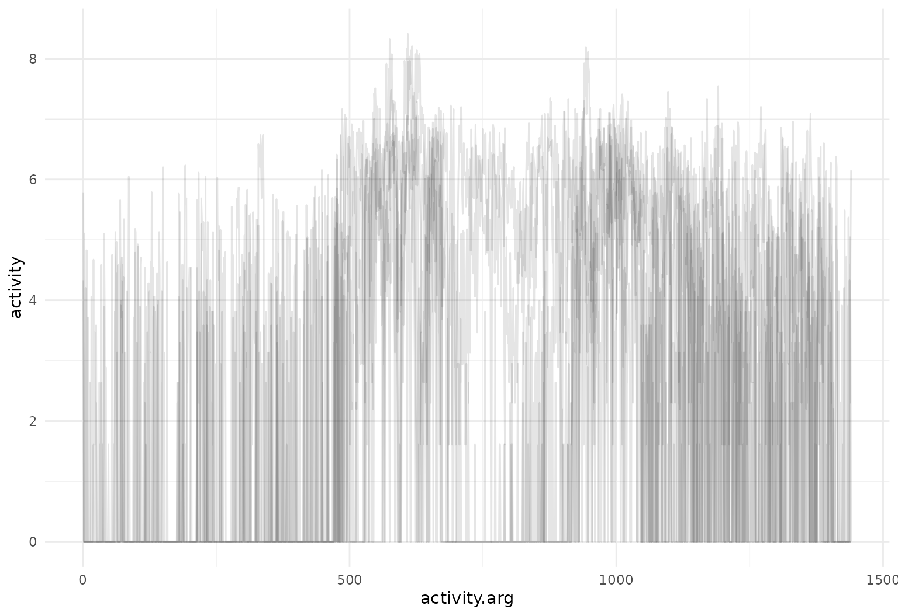

The
[`tidyfun::dti_df`](https://tidyfun.github.io/tidyfun/reference/dti_df.md)
contains fractional anisotropy (FA) tract profiles for the corpus
callosum (cca) and the right corticospinal tract (rcst), along with
several covariates.

``` r
data(dti_df)

dti_df
## # A tibble: 382 × 6
##       id visit sex    case                                            cca
##    <dbl> <int> <fct>  <fct>                                   <tfd_irreg>
##  1  1001     1 female control (0.000,0.49);(0.011,0.52);(0.022,0.54); ...
##  2  1002     1 female control (0.000,0.47);(0.011,0.49);(0.022,0.50); ...
##  3  1003     1 male   control (0.000,0.50);(0.011,0.51);(0.022,0.54); ...
##  4  1004     1 male   control (0.000,0.40);(0.011,0.42);(0.022,0.44); ...
##  5  1005     1 male   control (0.000,0.40);(0.011,0.41);(0.022,0.40); ...
##  6  1006     1 male   control (0.000,0.45);(0.011,0.45);(0.022,0.46); ...
##  7  1007     1 male   control (0.000,0.55);(0.011,0.56);(0.022,0.56); ...
##  8  1008     1 male   control (0.000,0.45);(0.011,0.48);(0.022,0.50); ...
##  9  1009     1 male   control (0.000,0.50);(0.011,0.51);(0.022,0.52); ...
## 10  1010     1 male   control (0.000,0.46);(0.011,0.47);(0.022,0.48); ...
## # ℹ 372 more rows
## # ℹ 1 more variable: rcst <tfd_irreg>
```

A quick plot of the `cca` tract profiles is below.

``` r
dti_df |>
  tf_ggplot(aes(tf = cca)) +
  geom_line(alpha = 0.05)
```

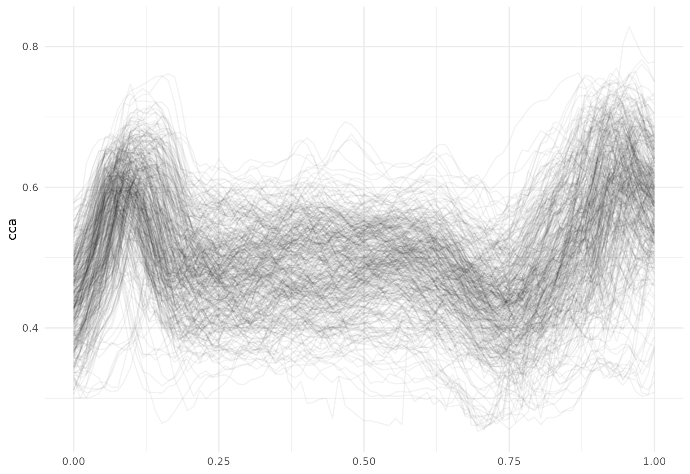

## Existing `tidyverse` functions

Dataframes using **`tidyfun`** to store functional observations can be
manipulated using tools from **`dplyr`**, including `select` and
`filter`:

``` r
chf_df |>
  select(id, day, activity) |>
  filter(day == "Mon") |>
  tf_ggplot(aes(tf = activity)) +
  geom_line(alpha = 0.05)
```

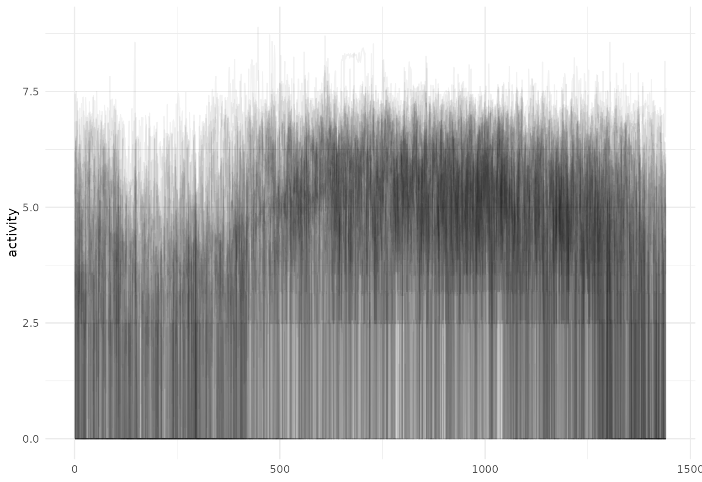

Operations using `group_by` and `summarize` also work – let’s look at
some daily averages of these activity profiles:

``` r
chf_df |>
  group_by(day) |>
  summarize(mean_act = mean(activity)) |>
  tf_ggplot(aes(tf = mean_act, color = day)) +
  geom_line()
```

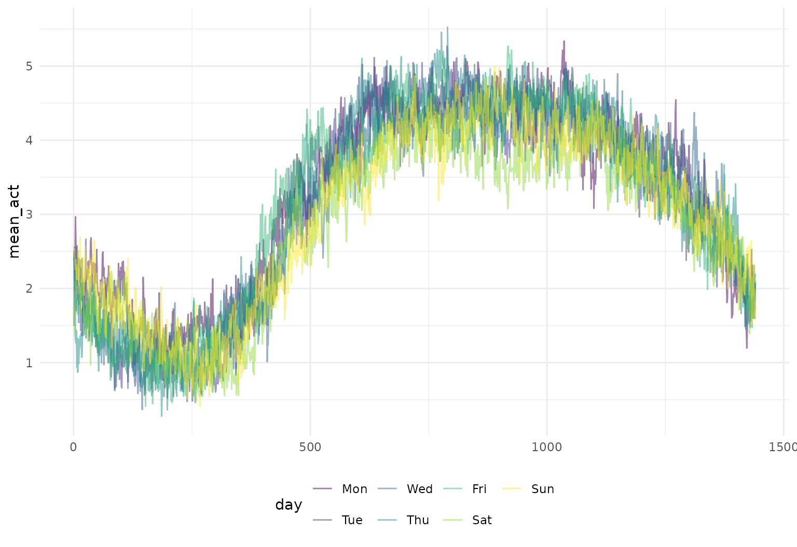

One can `mutate` functional observations – here we exponentiate the log
activity counts to obtain original recordings:

``` r
chf_df |>
  slice(1:5) |>
  mutate(exp_act = exp(activity)) |>
  tf_ggplot(aes(tf = exp_act)) +
  geom_line(alpha = 0.2)
```

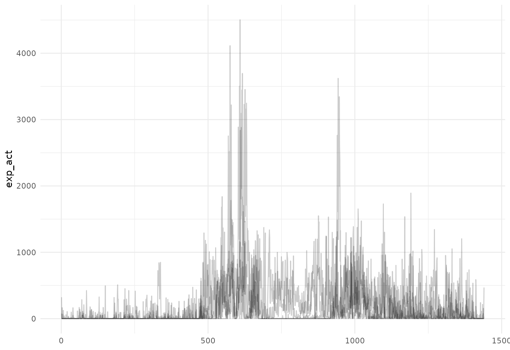

Functions for data manipulation from **`tidyr`** are also supported. We
illustrate by using `pivot_wider` to create new `tfd`-columns containing
the activity profiles for each day of the week:

``` r
chf_df |>
  select(id, day, activity) |>
  pivot_wider(
    names_from = day,
    values_from = activity
  )
## # A tibble: 47 × 8
##       id                        Mon                        Tue
##    <dbl>                  <tfd_reg>                  <tfd_reg>
##  1     1 ▁▂▁▁▁▁▁▁▂▃▅▅▁▁▁▂▃▅▅▂▂▂▃▃▂▁ ▁▁▁▁▁▃▂▁▂▁▄▄▄▆▅▆▅▄▆▅▅▅▂▃▄▂
##  2     3 ▆▅▄▅▄▄▅▄▄▄▆▅▃▅▅▆▅▅▅▅▄▅▅▄▅▅ ▂▁▂▁▁▁▁▄▂▁▁▂▆▆▅▅▄▅▆▇▇▆▅▄▄▅
##  3     4 ▃▂▂▂▁▁▁▁▆▅▃▆▆▆▆▆▅▅▆▆▆▅▅▅▄▁ ▁▂▁▁▁▁▃▁▄▆▅▆▆▅▆▅▄▅▅▅▅▄▄▄▄▄
##  4     5 ▆▆▆▅▅▅▅▅▅▅▆▆▅▆▆▆▅▅▅▅▆▅▆▇▇▇ ▅▅▅▆▅▅▆▅▆▇▇▆▇▇▇▇▆▆▆▆▆▆▆▆▆▅
##  5     6 ▁▁▁▁▁▁▁▄▅▅▄▅▃▁▁▂▅▄▅▅▅▄▅▃▂▁ ▁▁▁▁▁▁▁▄▆▅▄▅▃▄▅▅▄▅▅▄▅▄▃▃▁▁
##  6     7 ▁▁▁▁▃▁▂▂▁▃▃▄▅▆▅▅▅▅▅▃▄▆▅▅▅▅ ▄▂▂▄▁▁▂▁▁▄▄▅▅▅▅▅▄▆▄▅▄▄▄▅▅▄
##  7     8 ▁▁▁▁▁▁▁▁▁▁▆▆▁▄▅▆▆▆▆▇▆▄▂▃▁▁ ▁▁▁▁▁▁▁▂▃▅▅▅▄▆▄▆▆▆▅▁▁▁▁▁▁▁
##  8     9 ▁▂▁▁▁▁▁▁▁▁▄▂▃▄▄▃▄▄▂▂▃▃▄▃▂▃ ▁▁▂▁▁▁▁▁▁▁▁▄▃▃▃▂▃▁▃▃▄▃▃▃▃▁
##  9    10 ▁▁▁▁▁▄▂▄▆▄▃▃▅▂▅▄▄▅▅▄▃▁▃▂▁▁ ▁▁▁▂▂▄▅▄▇▇▇▇▆▇▆▆▆▅▅▅▄▃▄▂▂▁
## 10    11 ▁▁▁▂▁▃▁▁▃▅▅▃▄▆▅▅▅▄▆▅▆▅▆▆▆▂ ▁▁▁▁▄▃▂▁▄▆▄▅▆▃▄▃▅▆▅▅▅▅▆▁▁▂
## # ℹ 37 more rows
## # ℹ 5 more variables: Wed <tfd_reg>, Thu <tfd_reg>, Fri <tfd_reg>,
## #   Sat <tfd_reg>, Sun <tfd_reg>
```

(Note that this has made the data less “tidy” and is therefore not
generally recommended, but may be useful in some cases).

It’s also possible to join datasets based on non-functional keys. To
illustrate, we’ll first create a pair of datasets:

``` r
monday_df <- chf_df |>
  filter(day == "Mon") |>
  select(id, monday_act = activity)
friday_df <- chf_df |>
  filter(day == "Fri") |>
  select(id, friday_act = activity)
```

These can be joined using the `id` variable as a key (and then tidied
using `pivot_longer`):

``` r
monday_df |>
  left_join(friday_df, by = "id") |>
  pivot_longer(monday_act:friday_act, names_to = "day", values_to = "activity")
## # A tibble: 94 × 3
##       id day                          activity
##    <dbl> <chr>                       <tfd_reg>
##  1     1 monday_act ▁▂▁▁▁▁▁▁▂▃▅▅▁▁▁▂▃▅▅▂▂▂▃▃▂▁
##  2     1 friday_act ▁▁▁▂▂▁▁▂▃▄▆▅▂▁▁▁▂▅▅▄▃▃▂▂▂▁
##  3     3 monday_act ▆▅▄▅▄▄▅▄▄▄▆▅▃▅▅▆▅▅▅▅▄▅▅▄▅▅
##  4     3 friday_act ▅▅▃▃▃▃▃▄▄▄▄▆▆▅▅▆▆▆▆▆▅▅▅▆▆▅
##  5     4 monday_act ▃▂▂▂▁▁▁▁▆▅▃▆▆▆▆▆▅▅▆▆▆▅▅▅▄▁
##  6     4 friday_act ▂▂▂▁▁▂▂▄▃▁▁▃▅▅▅▅▄▄▆▆▅▁▁▁▁▅
##  7     5 monday_act ▆▆▆▅▅▅▅▅▅▅▆▆▅▆▆▆▅▅▅▅▆▅▆▇▇▇
##  8     5 friday_act ▆▆▆▅▅▆▆▆▆▆▇▆▆▆▆▆▅▆▆▆▆▅▅▅▆▆
##  9     6 monday_act ▁▁▁▁▁▁▁▄▅▅▄▅▃▁▁▂▅▄▅▅▅▄▅▃▂▁
## 10     6 friday_act ▁▁▁▁▁▁▂▄▆▆▃▃▂▅▅▄▃▄▄▅▄▃▄▃▁▁
## # ℹ 84 more rows
```

Similar tidying can be done for the DTI data – let’s look at average
RCST tract values for gender and case status:

``` r
dti_df |>
  group_by(case, sex) |>
  summarize(mean_rcst = mean(rcst, na.rm = TRUE)) |>
  tf_ggplot(aes(tf = mean_rcst, color = case)) +
  geom_line(linewidth = 2) +
  facet_grid(~sex)
## `summarise()` has regrouped the output.
## ℹ Summaries were computed grouped by case and sex.
## ℹ Output is grouped by case.
## ℹ Use `summarise(.groups = "drop_last")` to silence this message.
## ℹ Use `summarise(.by = c(case, sex))` for per-operation grouping
##   (`?dplyr::dplyr_by`) instead.
```

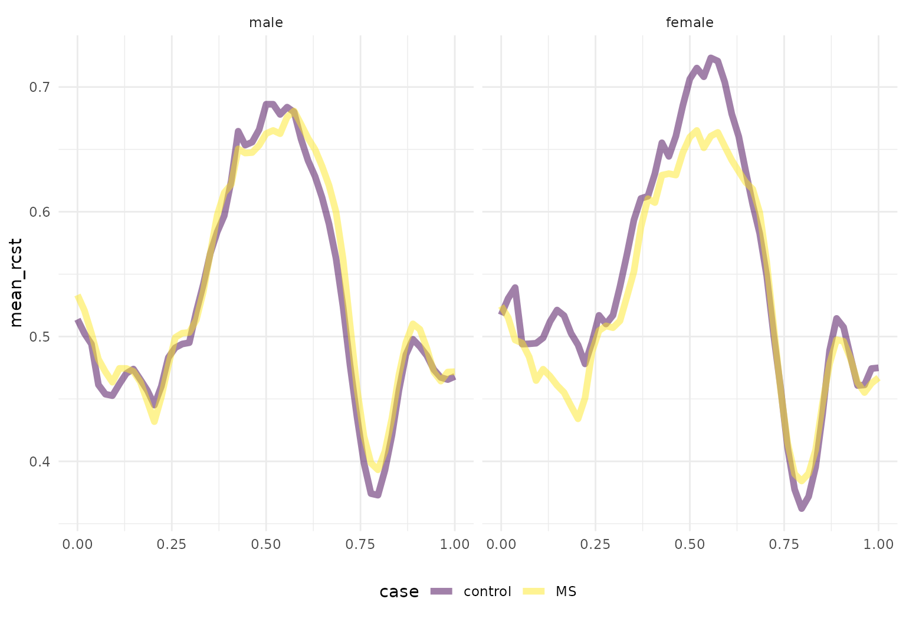

## `tf` helper functions in tidy workflows

Some **`dplyr`** functions are useful in conjunction with **`tf`**
helper functions. For example, one might use `filter` with
[`tf_anywhere()`](https://tidyfun.github.io/tf/reference/tf_where.html)
to filter based on the values of observed functions:

``` r
like_to_move_it_move_it <- chf_df |> filter(tf_anywhere(activity, value > 9))
glimpse(like_to_move_it_move_it)
## Rows: 6
## Columns: 8
## $ id         <dbl> 34, 34, 34, 35, 35, 35
## $ gender     <chr> "Female", "Female", "Female", "Female", "Female", "Female"
## $ age        <dbl> 56, 56, 56, 67, 67, 67
## $ bmi        <dbl> 25, 25, 25, 33, 33, 33
## $ event_week <dbl> 40, 40, 40, 47, 47, 47
## $ event_type <chr> ".", ".", ".", ".", ".", "."
## $ day        <ord> Wed, Thu, Sun, Thu, Fri, Sat
## $ activity   <tfd_reg> ▂▄▆▅▆▅▄▃, ▁▁▅▆▅▄▄▁, ▂▂▄▅▅▄▄▃, ▂▁▃▅▅▄▅▄, ▃▁▃▄▅▅▄▅, ▃▁▁▄▅▄▄▄…

like_to_move_it_move_it |>
  tf_ggplot(aes(tf = activity, colour = id)) +
  geom_line()
```

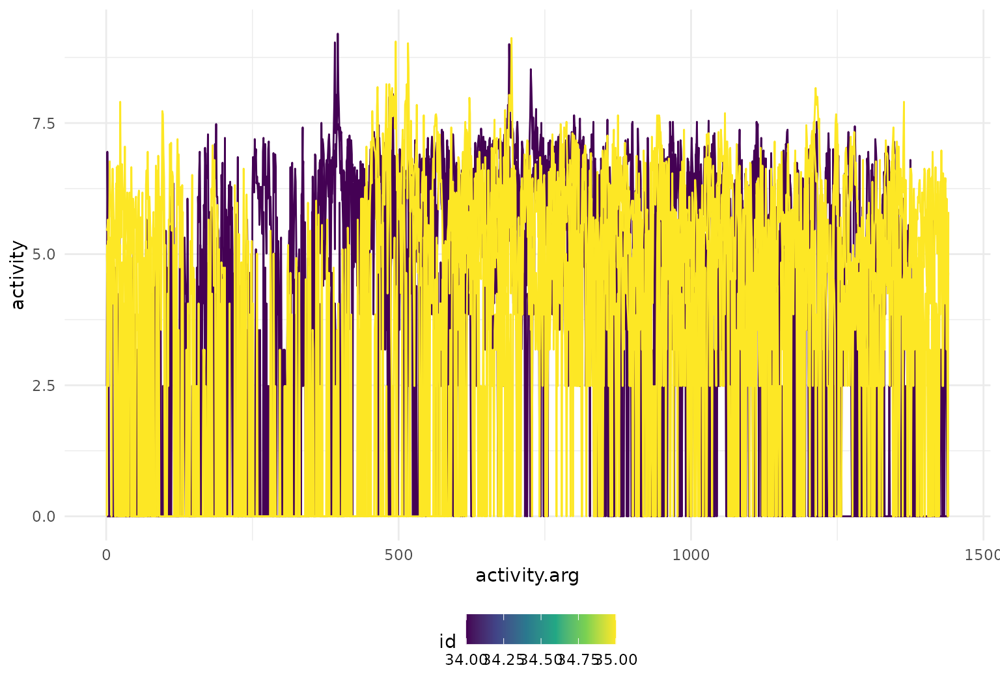

A second example of this functionality in the DTI data is below.

``` r
dti_df |>
  filter(tf_anywhere(cca, value < 0.26)) |>
  tf_ggplot(aes(tf = cca)) +
  geom_line()
```

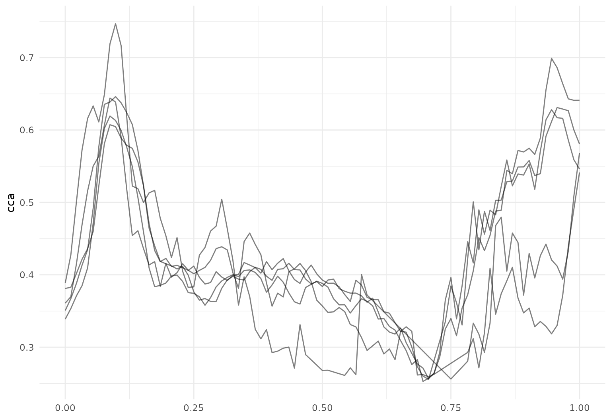

The existing `mutate` function can be combined with several `tf`
helpers, including
[`tf_smooth()`](https://tidyfun.github.io/tf/reference/tf_smooth.html),
[`tf_zoom()`](https://tidyfun.github.io/tf/reference/tf_zoom.html), and
[`tf_derive()`](https://tidyfun.github.io/tf/reference/tf_derive.html).

One can smooth existing observations using `tf_smooth`:

``` r
chf_df |>
  filter(id == 1) |>
  mutate(smooth_act = tf_smooth(activity)) |>
  tf_ggplot(aes(tf = smooth_act)) +
  geom_line()
## Using `f = 0.15` as smoother span for `lowess()`.
```

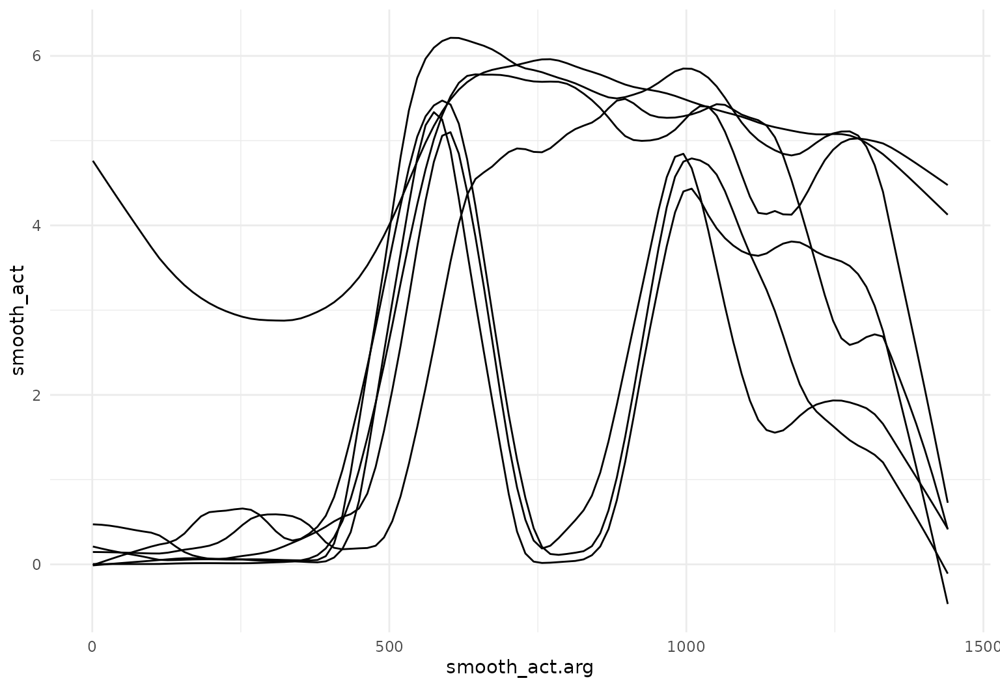

This can be combined with previous steps, like `group_by` and
`summarize`, to build intuition through descriptive plots and summaries:

``` r
chf_df |>
  group_by(day) |>
  summarize(mean_act = mean(activity)) |>
  mutate(smooth_mean = tf_smooth(mean_act)) |>
  tf_ggplot(aes(color = day)) +
  geom_line(aes(tf = mean_act), alpha = 0.2) +
  geom_line(aes(tf = smooth_mean), linewidth = 2)
## Using `f = 0.15` as smoother span for `lowess()`.
```

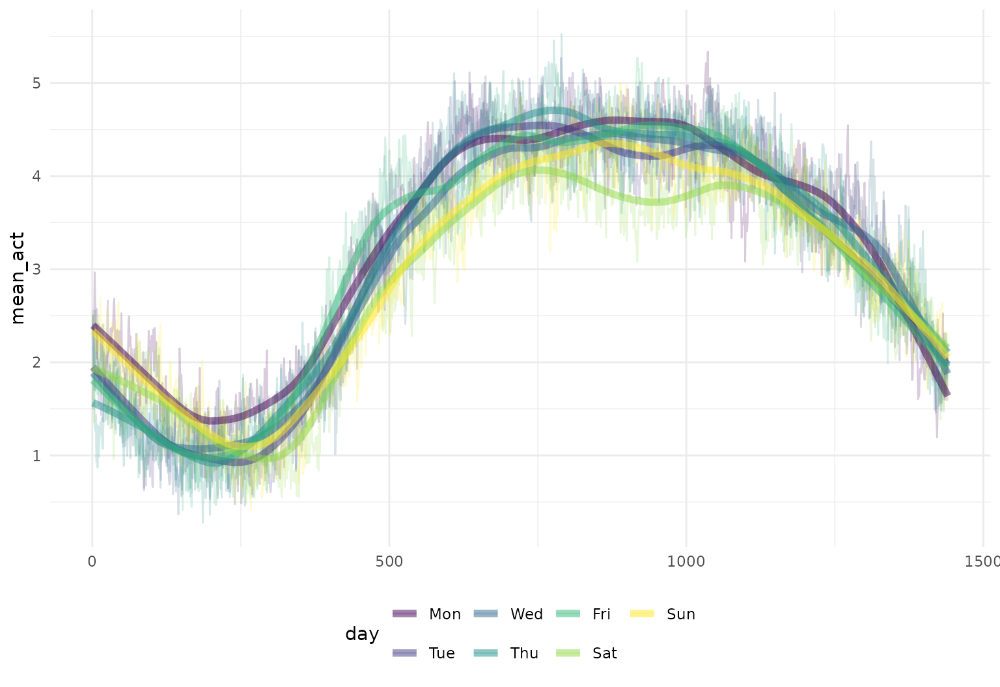

One can also extract observations over a subset of the full domain using
`tf_zoom`:

``` r
chf_df |>
  filter(id == 1) |>
  mutate(daytime_act = tf_zoom(activity, 360, 1200)) |>
  tf_ggplot(aes(tf = daytime_act)) +
  geom_line(alpha = 0.2)
```

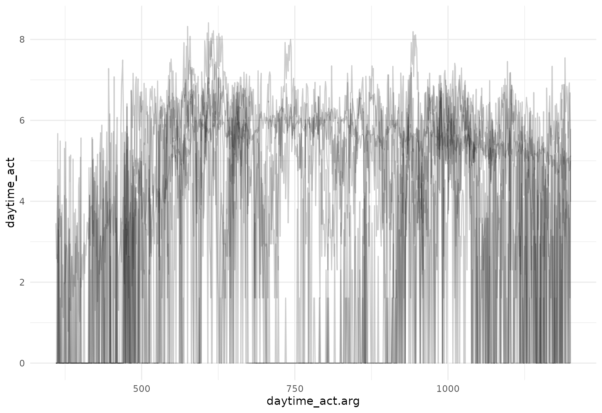

We can also convert from `tfd` to `tfb` inside a `mutate` statement as
part of a data processing pipeline:

``` r
dti_df <- dti_df |> mutate(cca_tfb = tfb(cca, k = 25))
## Percentage of input data variability preserved in basis representation
## (per functional observation, approximate):
## Min. 1st Qu.  Median Mean 3rd Qu.  Max.
## 88.3 96.7 97.7 97.3 98.3 99.4
```

It’s also possible to compute derivatives as part of a processing
pipeline:

``` r
dti_df |>
  slice(1:10) |>
  mutate(
    cca_raw_deriv = tf_derive(cca),
    cca_tfb_deriv = tf_derive(cca_tfb)
  ) |>
  tf_ggplot() +
  geom_line(aes(tf = cca_raw_deriv), alpha = 0.3, linewidth = 0.3, color = "blue") +
  geom_line(aes(tf = cca_tfb_deriv), alpha = 0.3, linewidth = 0.3, color = "red") +
  ylab("d/dt f(t)")
## ✖ Differentiating over irregular grids can be unstable.
```

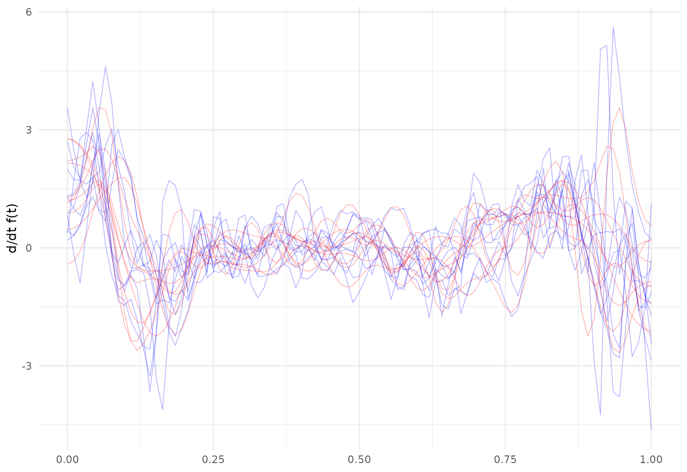

## Working with `data.table`

**`tidyfun`** functional data objects work within **`data.table`** as
well.

However, there is one specific known caveat when calculating the mean of
a `tf` vector within a **`data.table`** context: By default,
**`data.table`** will use optimized routines for summary statistics,
which may cause `mean` to dispatch to **`data.table`**’s own optimized
implementation, leading to unexpected behavior for `tf` vectors.

To ensure the correct mean calculation for `tf` vectors, there are two
solutions:

- Disable the optimization for the summary step and let
  [`mean()`](https://rdrr.io/r/base/mean.html) dispatch normally:

``` r
withr::with_options(
  list(data.table.optimize = 0),
  data.table::as.data.table(chf_df)[, list(mean_act = mean(activity)), by = day]
)
```

This caveat applies specifically to
[`mean()`](https://rdrr.io/r/base/mean.html) and is the only known
issue.
