# Visualization

The **`tidyfun`** package is designed to facilitate **functional data
analysis in `R`**, with particular emphasis on compatibility with the
`tidyverse`. In this vignette, we illustrate data visualization using
**`tidyfun`**.

We’ll draw on the
[`tidyfun::dti_df`](https://tidyfun.github.io/tidyfun/reference/dti_df.md)
and the
[`tidyfun::chf_df`](https://tidyfun.github.io/tidyfun/reference/chf_df.md)
data sets for examples.

## Plotting with `ggplot`

`ggplot` is a powerful framework for visualization. In this section,
we’ll assume some basic familiarity with the package; if you’re new to
`ggplot`, [this primer](https://rpubs.com/hadley/ggplot-intro) may be
helpful.

**`tidyfun`** provides
[`tf_ggplot()`](https://tidyfun.github.io/tidyfun/reference/tf_ggplot.md)
as the primary interface for plotting functional data with `ggplot2`. It
works just like
[`ggplot()`](https://ggplot2.tidyverse.org/reference/ggplot.html), but
understands `tf` vectors — use the `tf` aesthetic to map a `tf` column
to the plot, then add standard `ggplot2` geoms (`geom_line`,
`geom_point`, `geom_ribbon`, etc.).

For heatmaps, use **`gglasagna`**; for sparklines / glyphs on maps, use
**`geom_capellini`** (these use their own specialized stats and are
called directly without `tf_ggplot`). The older geoms
**`geom_spaghetti`**, **`geom_meatballs`**, and **`geom_errorband`** are
still available for backward compatibility.

### `tf_ggplot` with standard geoms

One of the most fundamental plots for functional data is the spaghetti
plot, which is implemented in `tidyfun` + `ggplot2` through
[`tf_ggplot()`](https://tidyfun.github.io/tidyfun/reference/tf_ggplot.md) +
[`geom_line()`](https://ggplot2.tidyverse.org/reference/geom_path.html):

``` r
dti_df[1:10,] |>
  tf_ggplot(aes(tf = cca)) + geom_line(alpha = .3)
```

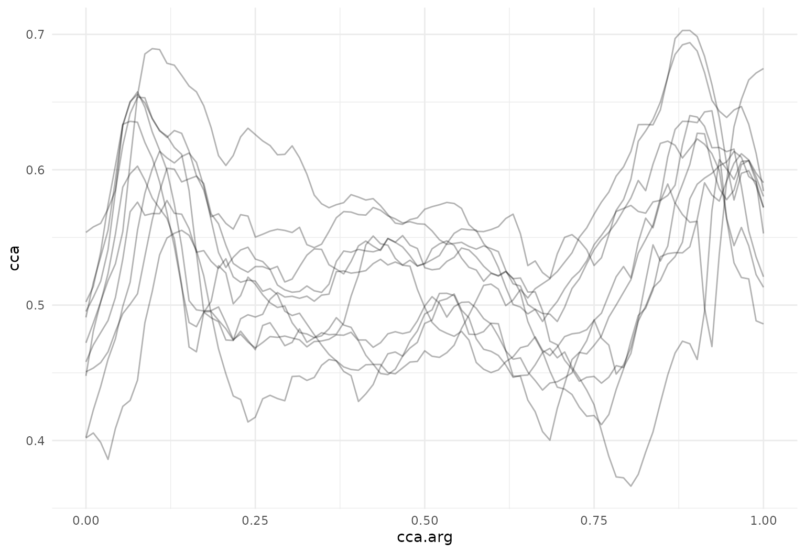

Adding
[`geom_point()`](https://ggplot2.tidyverse.org/reference/geom_point.html)
to
[`geom_line()`](https://ggplot2.tidyverse.org/reference/geom_path.html)
shows both the curves and the actually observed data values:

``` r
dti_df[1:3,] |>
  tf_ggplot(aes(tf = rcst)) + geom_line(alpha = .3) + geom_point(alpha= .3)
```

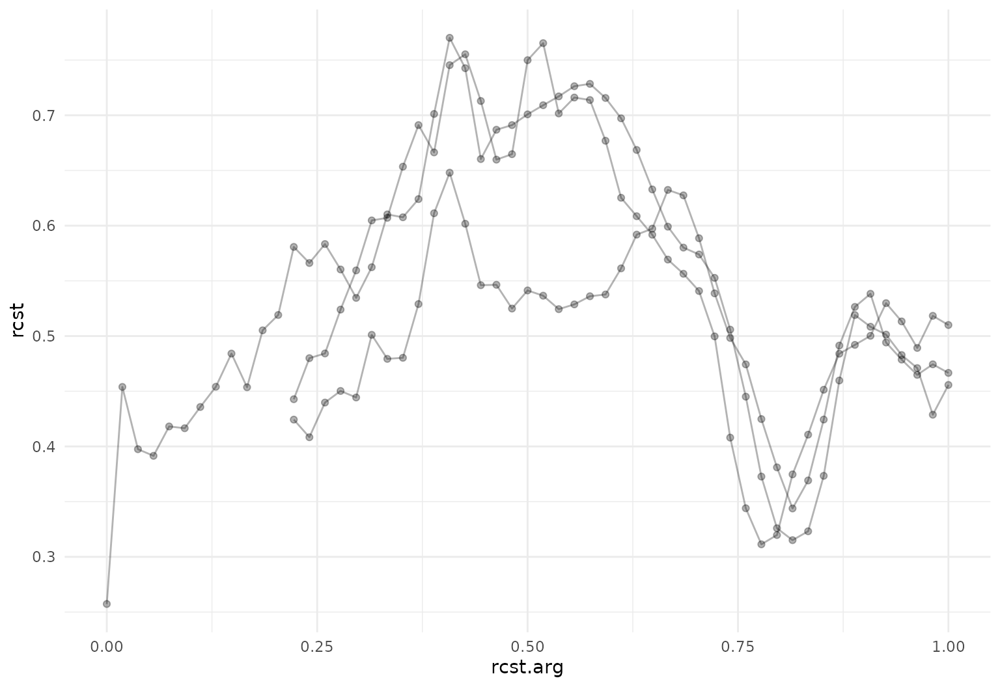

### Using with other `ggplot2` features

[`tf_ggplot()`](https://tidyfun.github.io/tidyfun/reference/tf_ggplot.md)
plays nicely with standard `ggplot2` aesthetics and options.

You can, for example, define the color aesthetic for plots of `tf`
variables using other observations:

``` r
chf_df |>
  filter(id %in% 1:5) |>
tf_ggplot(aes(tf = tf_smooth(activity, f = .05), color = gender)) + 
  geom_line(alpha = 0.3)
## Warning: Large data expansion: 28 rows × 1440 grid points = 40320 rows
## ℹ This may impact memory usage and plotting performance
## ℹ Use `arg` in `tf_ggplot()` to specify a coarser evaluation grid
```

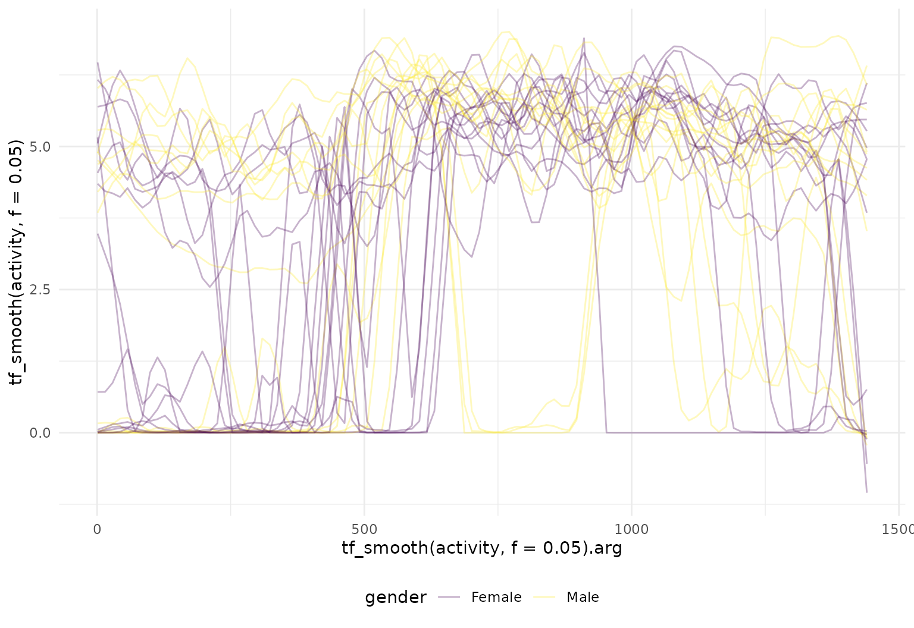

… or use facetting:

``` r
chf_df |>
  filter((id %in% 1:10) & (day %in% c("Mon", "Sun"))) |>
tf_ggplot(aes(tf = tf_smooth(activity, f = .05), color = gender)) +
  geom_line(alpha = 0.3) + facet_grid(~day)
## Warning: Large data expansion: 18 rows × 1440 grid points = 25920 rows
## ℹ This may impact memory usage and plotting performance
## ℹ Use `arg` in `tf_ggplot()` to specify a coarser evaluation grid
```

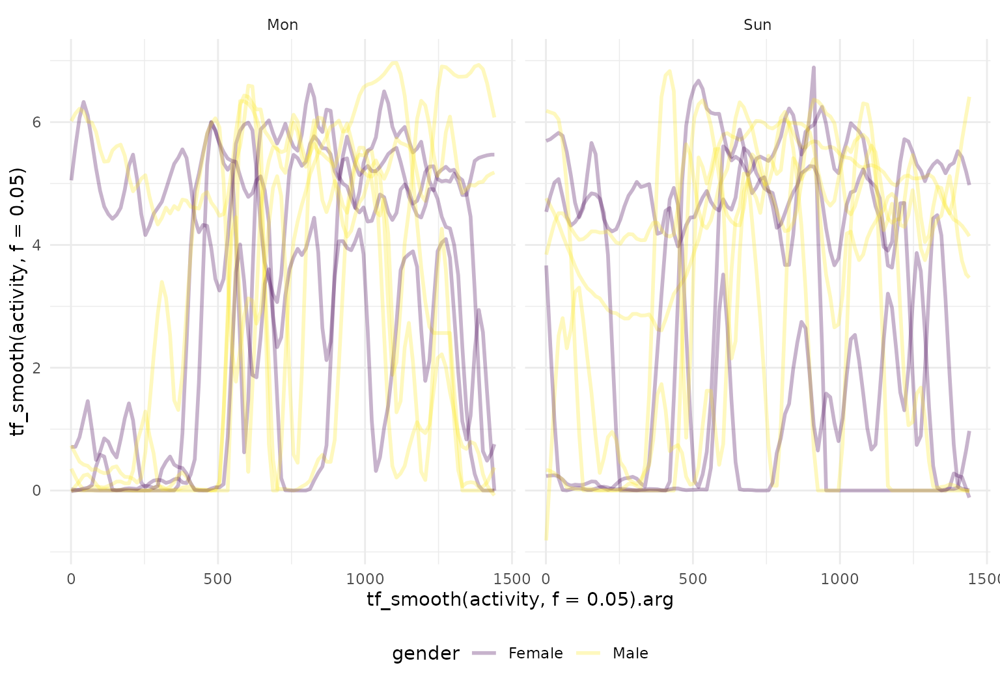

Another example, using the DTI data, is below.

``` r
dti_df |>
  tf_ggplot(aes(tf = cca, col = case, alpha = 0.2 + 0.4 * (case == "control"))) +
  geom_line() + facet_wrap(~sex) +
  scale_alpha(guide = "none", range = c(0.2, 0.4))
## Warning: Large data expansion: 382 rows × 93 grid points = 35526 rows
## ℹ This may impact memory usage and plotting performance
## ℹ Use `arg` in `tf_ggplot()` to specify a coarser evaluation grid
```

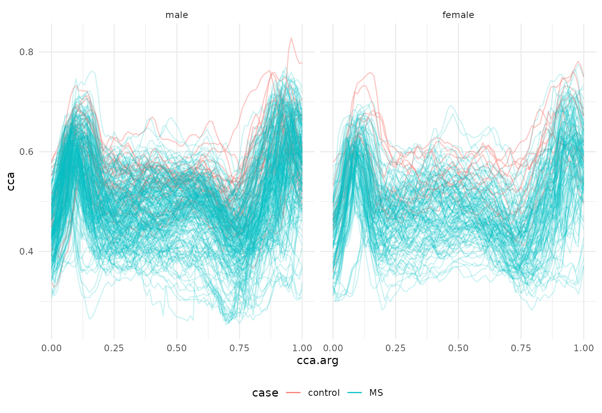

Together with **`tidyfun`**’s tools for functional data wrangling and
summary statistics, the integration with `ggplot2` can produce useful
exploratory analyses, like the plot below showing group-wise smoothed
and unsmoothed mean activity profiles:

``` r
chf_df |>
  group_by(gender, day) |>
  summarize(mean_act = mean(activity),
            .groups = "drop_last") |>
  mutate(smooth_mean = tfb(mean_act, verbose = FALSE)) |>
  filter(day %in% c("Mon", "Sun")) |>
  tf_ggplot(aes(color = gender)) +
  geom_line(aes(tf = smooth_mean), linewidth = 1.25) +
  geom_line(aes(tf = mean_act), alpha = 0.1) +
  geom_point(aes(tf = mean_act), alpha = 0.1, size = .1) +
  facet_grid(day~.)
## Warning: Large data expansion: 4 rows × 1440 grid points = 5760 rows
## ℹ This may impact memory usage and plotting performance
## ℹ Use `arg` in `tf_ggplot()` to specify a coarser evaluation grid
## Large data expansion: 4 rows × 1440 grid points = 5760 rows
## ℹ This may impact memory usage and plotting performance
## ℹ Use `arg` in `tf_ggplot()` to specify a coarser evaluation grid
## Large data expansion: 4 rows × 1440 grid points = 5760 rows
## ℹ This may impact memory usage and plotting performance
## ℹ Use `arg` in `tf_ggplot()` to specify a coarser evaluation grid
```

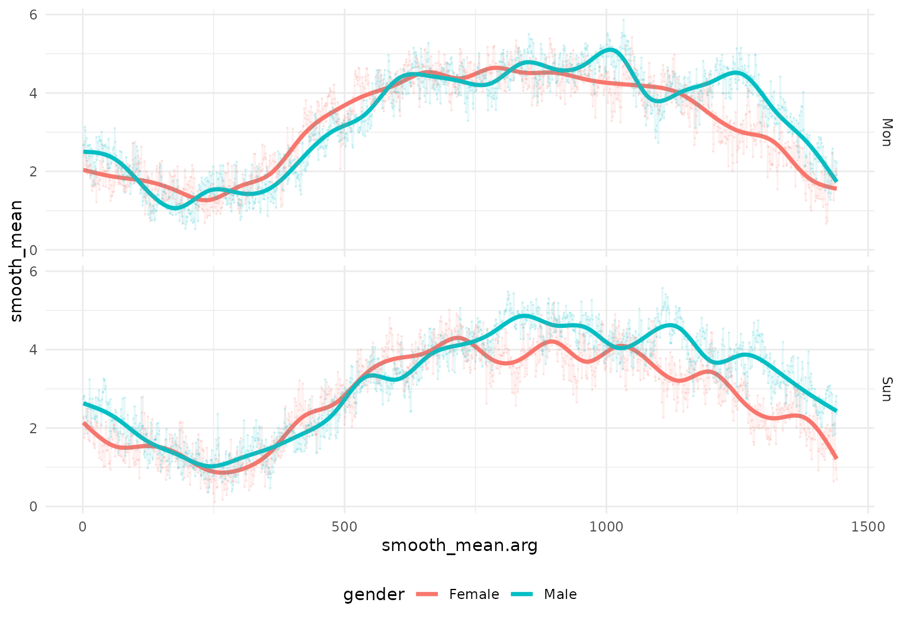

… or the plot below showing group-wise mean functions +/- twice their
pointwise standard errors:

``` r
dti_df |>
  group_by(sex, case) |>
  summarize(
    mean_cca = mean(tfb(cca, verbose = FALSE)), #pointwise mean function
    sd_cca = sd(tfb(cca, verbose = FALSE)), # pointwise sd function
    .groups = "drop_last"
  ) |>
  group_by(sex, case) |>
  mutate(
    upper_cca = mean_cca + 2 * sd_cca,
    lower_cca = mean_cca - 2 * sd_cca
  ) |>
  tf_ggplot() +
  geom_line(aes(tf = mean_cca, color = sex)) +
  geom_ribbon(aes(tf_ymin = lower_cca, tf_ymax = upper_cca, fill = sex), alpha = 0.3) +
  facet_grid(sex ~ case)
```

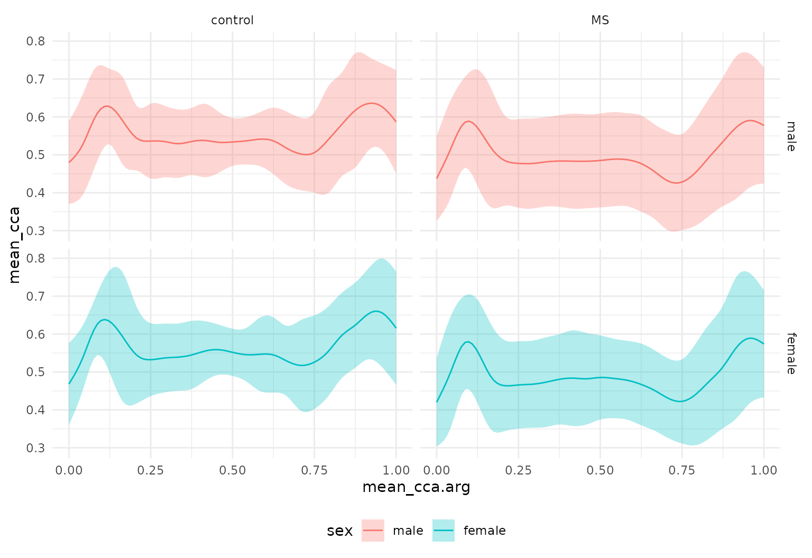

### Functional data boxplots with `geom_fboxplot`

“Boxplots” for functional data are implemented in `tidyfun` through
[`geom_fboxplot()`](https://tidyfun.github.io/tidyfun/reference/ggfboxplot.md).
They show the deepest function (using modified band depth, `"MBD"`, by
default) as a thick median curve, a filled central ribbon spanning the
pointwise range of the deepest half of the sample (by default), and
outer fence lines obtained by inflating that central envelope by a
factor of `coef = 1.5`. Curves that leave the fence envelope anywhere
are flagged as outliers and drawn separately.

Like
[`geom_boxplot()`](https://ggplot2.tidyverse.org/reference/geom_boxplot.html),
the layer follows the usual `ggplot2` interface closely. Grouping works
naturally through `colour`, `fill`, or `group`, and the same group
colour is reused for the ribbon, the outlier curves, and the median if a
group colour/fill is mapped; otherwise, the median defaults to black.

``` r
dti_df |> 
  tf_ggplot(aes(tf = cca, fill = case)) +
  geom_fboxplot(alpha = 0.35) +
  facet_grid(~ sex) + labs(title="MBD-based boxplot")
```

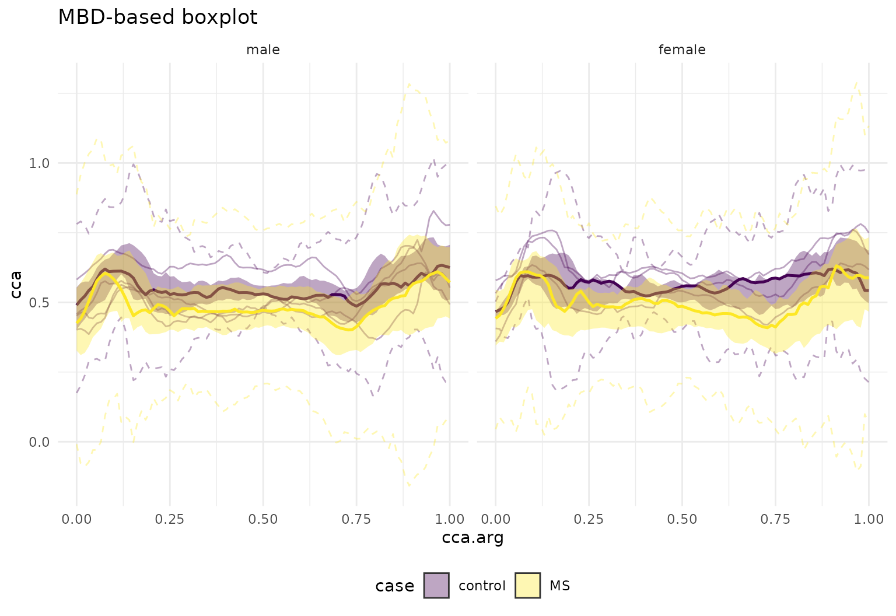

``` r
dti_df |>
  tf_ggplot(aes(tf = cca, colour = case)) +
  geom_fboxplot(depth = "FM", alpha = 0.3) +
  facet_grid(~ sex) + labs(title="FM-based boxplot")
```

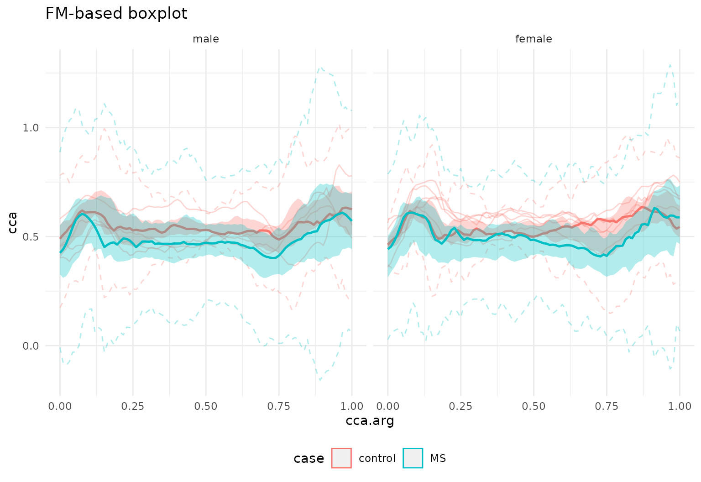

``` r
dti_df |>
  tf_ggplot(aes(tf = cca, colour = case)) +
  geom_fboxplot(depth = "RPD", alpha = 0.3) +
  facet_grid(~ sex) + labs(title="RPD-based boxplot")
```

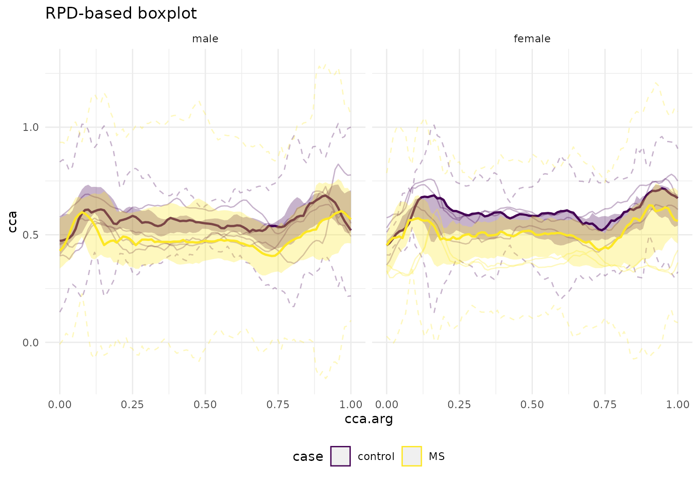

The layer also supports irregular functional data directly:

``` r
tf_ggplot(dti_df, aes(tf = rcst)) + geom_fboxplot()
```

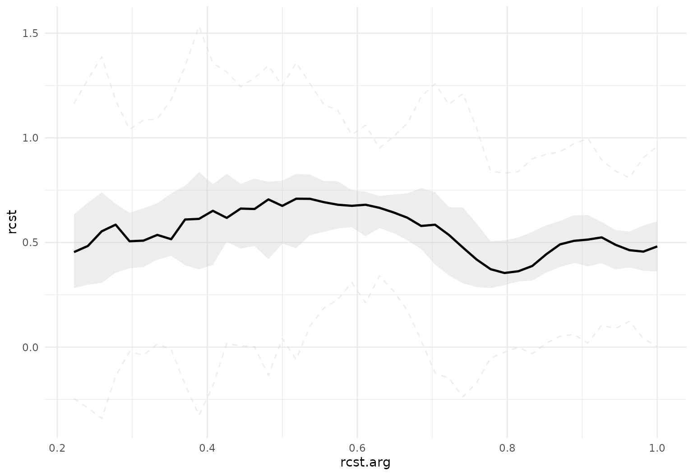

Useful arguments:

``` r
tf_ggplot(dti_df, aes(tf = rcst)) + 
  geom_fboxplot(alpha = .5)
```

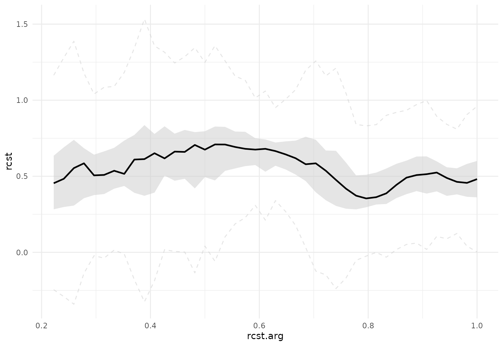

``` r
tf_ggplot(dti_df, aes(tf = rcst)) + 
  geom_fboxplot(alpha = .5, central = .2)
```


``` r
tf_ggplot(dti_df, aes(tf = rcst)) + 
  geom_fboxplot(alpha = .5, central = .2, outliers = FALSE)
```

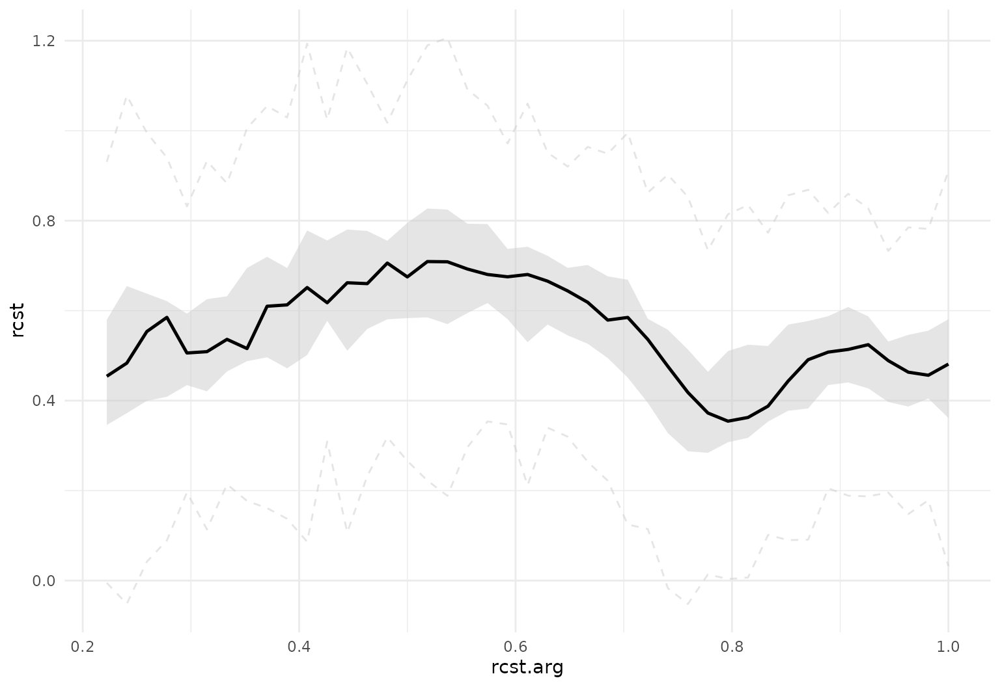

``` r
tf_ggplot(dti_df, aes(tf = rcst)) +
  geom_fboxplot(orientation = "y", alpha = .3)
```

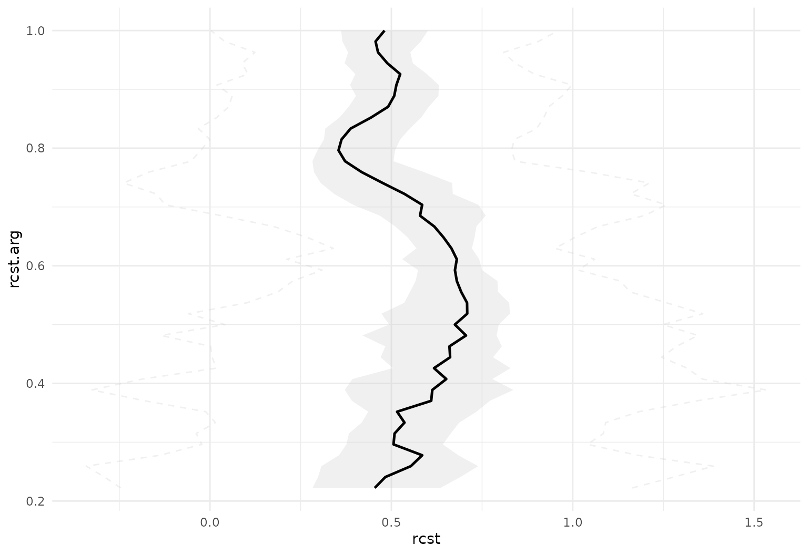

### Heatmaps for functional data: `gglasagna`

Lasagna plots are “[a saucy alternative to spaghetti
plots](https://pmc.ncbi.nlm.nih.gov/articles/PMC2937254/)”. They are a
variant on a heatmaps which show functional observations in rows and use
color to illustrate values taken at different arguments.

In `tidyfun`, lasagna plots are implemented through `gglasagna`. A first
example, using the CHF data, is below.

``` r
chf_df |>
  filter(day %in% c("Mon", "Sun")) |>
  gglasagna(activity)
```

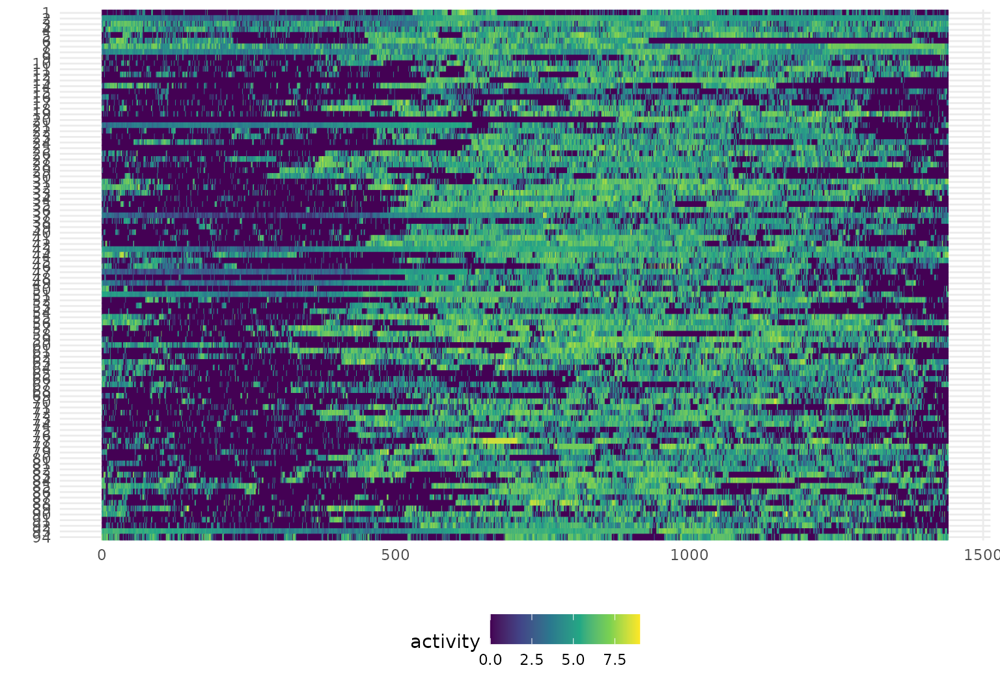

A somewhat more involved example, demonstrating the `order` argument and
taking advantage of facets, is next.

``` r
dti_df |>
  gglasagna(
    tf = cca,
    order = tf_integrate(cca, definite = TRUE),
    arg = seq(0, 1, length.out = 101)
  ) +
  theme(axis.text.y = element_text(size = 6)) +
  facet_wrap(~case, ncol = 2, scales = "free")
```

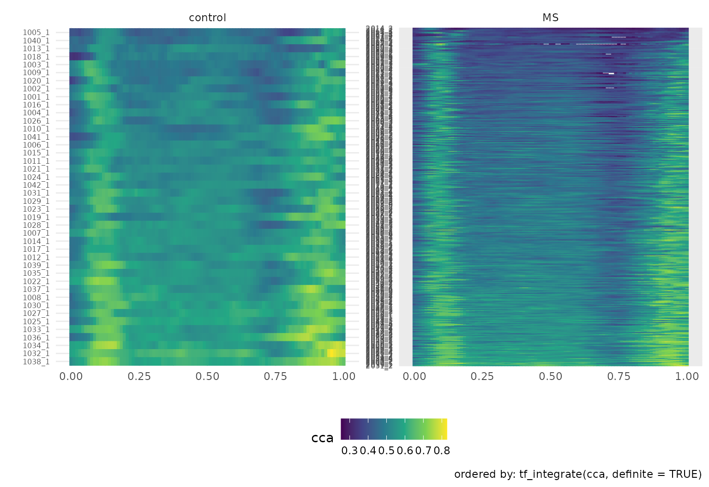

### `geom_capellini`

To illustrate `geom_capellini`, we’ll start with some data prep for the
iconic Canadian Weather data:

``` r
canada <- data.frame(
  place = fda::CanadianWeather$place,
  region = fda::CanadianWeather$region,
  lat = fda::CanadianWeather$coordinates[, 1],
  lon = -fda::CanadianWeather$coordinates[, 2]
)

canada$temp <- tfd(t(fda::CanadianWeather$dailyAv[, , 1]), arg = 1:365)
canada$precipl10 <- tfd(t(fda::CanadianWeather$dailyAv[, , 3]), arg = 1:365) |>
  tf_smooth()
## Using `f = 0.15` as smoother span for `lowess()`.

canada_map <-
  data.frame(maps::map("world", "Canada", plot = FALSE)[c("x", "y")])
```

Now we can plot a map of Canada with annual temperature averages in red,
precipitation in blue:

``` r
ggplot(canada, aes(x = lon, y = lat)) +
  geom_capellini(aes(tf = precipl10),
    width = 4, height = 5, colour = "blue",
    line.linetype = 1
  ) +
  geom_capellini(aes(tf = temp),
    width = 4, height = 5, colour = "red",
    line.linetype = 1
  ) +
  geom_path(data = canada_map, aes(x = x, y = y), alpha = 0.1) +
  coord_quickmap()
```

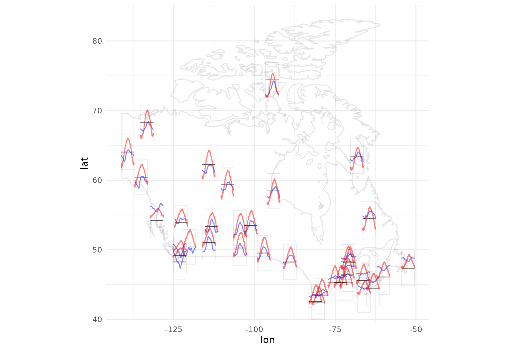

Another general use case for `geom_capellini` is visualizing FPCA
decompositions:

``` r
cca_fpc_tbl <- tibble(
  cca = dti_df$cca[1:30],
  cca_fpc = tfb_fpc(cca, pve = .8), 
  fpc_1 = map(coef(cca_fpc), 2) |> unlist(), # 1st PC loading
  fpc_2 = map(coef(cca_fpc), 3) |> unlist() # 2nd PC loading
) 
# rescale FPCs by sqrt of eigenvalues for visualization
cca_fpcs_1_2 <- 
  tf_basis(cca_fpc_tbl$cca_fpc, as_tfd = TRUE)[2:3] * 
    sqrt(attr(cca_fpc_tbl$cca_fpc, "score_variance")[1:2]) 
# scaled eigenfunctions look like this:
tibble(
   eigenfunction = cca_fpcs_1_2,
   FPC = factor(1:2)
) |> tf_ggplot() + 
  geom_line(aes(tf = eigenfunction, col = FPC)) + 
  geom_hline(yintercept = 0)
```

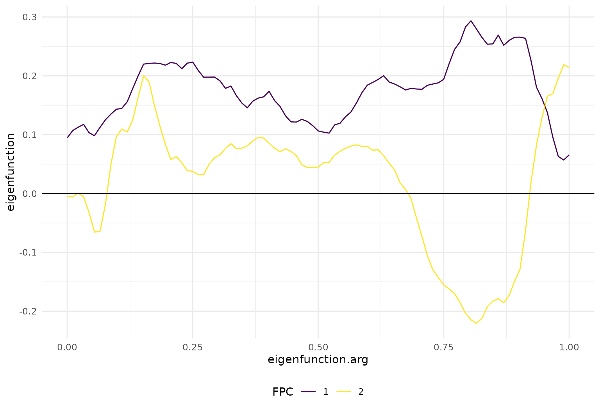

So FPC1 is mostly a horizontal (level) shift, while FPC2 mostly affects
the size and direction of the extrema around 0.13 and 0.8.

``` r
ggplot(cca_fpc_tbl[1:40,], aes(x =  fpc_1, y = fpc_2)) +
  geom_point(size = .5, col = "red") +
  geom_capellini(aes(tf =cca_fpc),width = .01, height = .01, line.linetype = 1) +
  labs(x = "FPC1 score", y = "FPC2 score")
## Warning: Removed 10 rows containing missing values or values outside the scale range
## (`geom_point()`).
## Warning: Removed 1 row containing missing values or values outside the scale range
## (`geom_segment()`).
## Removed 1 row containing missing values or values outside the scale range
## (`geom_segment()`).
## Removed 1 row containing missing values or values outside the scale range
## (`geom_segment()`).
## Removed 1 row containing missing values or values outside the scale range
## (`geom_segment()`).
## Removed 1 row containing missing values or values outside the scale range
## (`geom_segment()`).
## Removed 1 row containing missing values or values outside the scale range
## (`geom_segment()`).
## Removed 1 row containing missing values or values outside the scale range
## (`geom_segment()`).
## Removed 1 row containing missing values or values outside the scale range
## (`geom_segment()`).
## Removed 1 row containing missing values or values outside the scale range
## (`geom_segment()`).
## Removed 1 row containing missing values or values outside the scale range
## (`geom_segment()`).
```

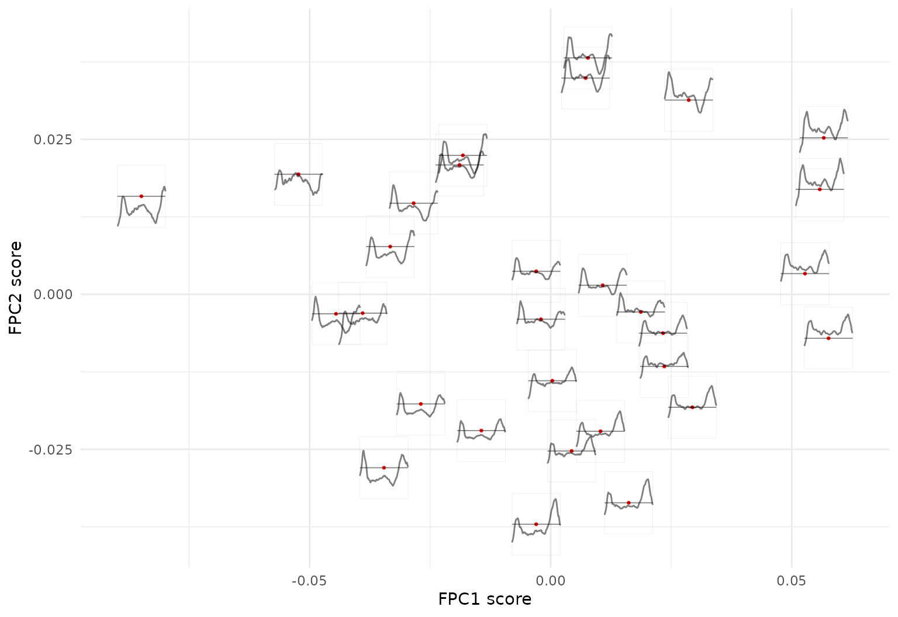
Consequently, we can see here that the horizontal axis representing the
1st FPC scores has the average level of functions increasing from left
to right (first FPC function is basically a level shift), while the size
and direction of the extrema at around 0.13 and particularly 0.8 change
along the vertical axis representing the 2nd FPC scores.

## Plotting with base R

**`tidyfun`** includes several extensions of base R graphics, which
operate on `tf` vectors. For example, one can use `plot` to create
either spaghetti or lasagna plots, and `lines` to add lines to an
existing plot:

``` r
cca <- dti_df$cca |>
  tfd(arg = seq(0, 1, length.out = 93), interpolate = TRUE)

layout(t(1:2))

plot(cca, type = "spaghetti")
lines(c(median(cca), mean = mean(cca)), col = c(2, 4))

plot(cca, type = "lasagna", col = viridis(50))
```

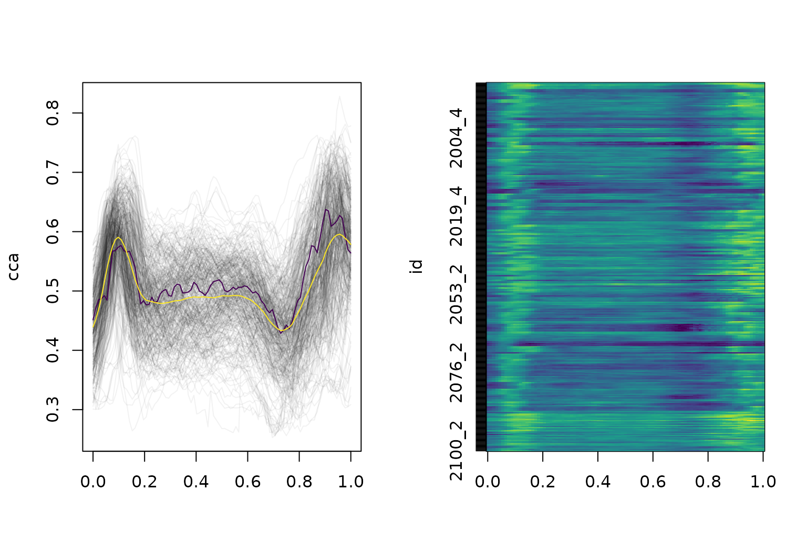

These `plot` methods use all the same graphics options and can be edited
like other base graphics:

``` r
cca_five <- cca[1:5]

cca_five |> plot(xlim = c(-0.15, 1), col = pal_5, lwd = 2)

text(
  x = -0.1, y = cca_five[, 0.07], labels = names(cca_five), col = pal_5, cex = 1.5
)

median(cca_five) |> lines(col = pal_5[3], lwd = 4)
```

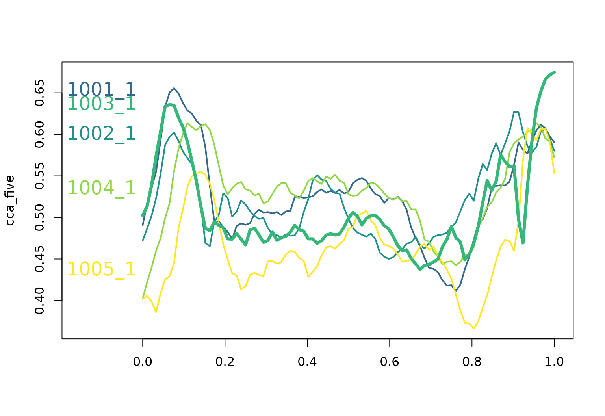

`tf` also defines a `plot` method for `tf_registration` objects
(returned by
[`tf_register()`](https://tidyfun.github.io/tf/reference/tf_register.html))
for visualizing function alignment (registration / phase variability).
Current versions of `tf` return a registration result that stores the
aligned curves, inverse warps, and template and can be inspected
directly:

``` r
cca_reg <- tf_register(
  cca[1:5],
  method = "landmark",
  landmarks = tf_landmarks_extrema(cca[1:5], "max")
)

cca_reg
## <tf_registration>
## Call: tf_register(x = cca[1:5], landmarks = tf_landmarks_extrema(cca[1:5], 
##     "max"), method = "landmark")
## 5 curves on [0, 1]
## Components: aligned, inv_warps, template, original data
summary(cca_reg)
## tf_register(x = cca[1:5], landmarks = tf_landmarks_extrema(cca[1:5], 
##     "max"), method = "landmark")
## 
## 5 curve(s) on [0, 1]
## 
## Amplitude variance reduction: 9.6%
## 
## Inverse warp deviations from identity (relative to domain length):
##     0%    10%    25%    50%    75%    90%   100% 
## 0.0172 0.0186 0.0207 0.0260 0.0359 0.0365 0.0369 
## 
## Inverse warp slopes (1 = identity):
##   overall range: [0.74, 1.345]
##   per-curve min slopes:
##    0%   10%   25%   50%   75%   90%  100% 
## 0.740 0.800 0.890 0.890 0.920 0.923 0.925 
##   per-curve max slopes:
##    0%   10%   25%   50%   75%   90%  100% 
## 1.067 1.082 1.104 1.233 1.314 1.333 1.345
plot(cca_reg)
```


The registered curves, inverse warping functions, and template can also
be extracted explicitly for custom plots:

``` r
layout(t(1:2))

plot(tf_inv_warps(cca_reg), col = pal_5, lwd = 2)
plot(tf_aligned(cca_reg), col = pal_5, lwd = 2)
lines(tf_template(cca_reg), col = "black", lwd = 4)
```

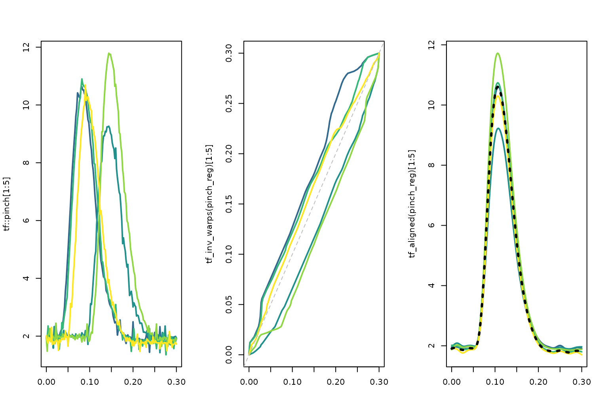
