# Vector-valued functional data: gait cycles and hurricane tracks

A `tf` vector represents a sample of functions \\f: \mathbb{R} \to
\mathbb{R}\\ (see the [tf vectors
vignette](https://tidyfun.github.io/tidyfun/articles/x01_tf_Vectors.html)
for an introduction to these classes and their operations). Many real
measurement processes, though, produce several coupled signals that
share a common argument: the `(hip, knee)` joint-angle pair sampled
across a gait cycle, the `(longitude, latitude)` position of a hurricane
sampled in time, the `(x, y, z)` body coordinates of a moving animal.
The natural object is a **vector-valued function** \\f: \mathbb{R} \to
\mathbb{R}^d\\, and `tf` represents a sample of those with the `tf_mv`
family: `tfd_mv` for raw evaluations and `tfb_mv` for basis
representations. Internally a `tf_mv` is a bundle of \\d\\ ordinary `tf`
vectors, so the multivariate methods shown below reuse the existing
univariate numerical kernels by mapping over components.

This article uses two real datasets to put the API through its paces:

- **[`tf::gait`](https://tidyfun.github.io/tf/reference/gait.html)** –
  regularly sampled hip and knee angles for 39 boys across one gait
  cycle. *Question: how variable is “normal” gait, where in the cycle
  does that variation concentrate, and what are the dominant modes of
  variation?*
- **[`dplyr::storms`](https://dplyr.tidyverse.org/reference/storms.html)**
  – irregularly sampled position and intensity of every Atlantic
  tropical storm or hurricane from 1975 to
  2024. *Question: do stronger storms travel further and move faster
        than weak ones?*

``` r

library(tf)
library(tidyfun)
library(dplyr)
```

## 1. A quick tour of vector-valued functional data

Before the case studies, this part introduces the objects: what a
vector-valued function *is*, the two classes that represent samples of
them, how to construct them, and the handful of geometric operations the
case studies lean on.

### What is a vector-valued function?

A `tf` vector stores a sample of scalar functions \\f: \[a, b\] \to
\mathbb{R}\\. A **vector-valued** function bundles \\d\\ of them on a
*shared* argument,

\\ f(t) = \big(f_1(t), \dots, f_d(t)\big), \qquad t \in \[a, b\], \\

so that as \\t\\ runs over the domain the value \\f(t)\\ traces a *path*
through \\\mathbb{R}^d\\. `tf` represents a sample of such paths with
the `tf_mv` family. Internally a `tf_mv` *is* a bundle of `d` ordinary
`tf` vectors sharing one argument, so every univariate verb –
evaluation, arithmetic, derivatives, integration, smoothing, basis
fitting – extends component-wise for free.

Two kinds of variation run through everything below: **amplitude** (how
large the values get) and **phase** (*where in* \\t\\ the features
happen). Much of the work in functional data analysis ([Ramsay and
Silverman 2005](#ref-ramsay2005functional)) is telling the two apart
([Marron et al. 2015](#ref-marron2015)), and Section 2 is largely about
exactly that.

### The `tf_mv` classes: `tfd_mv` and `tfb_mv`

Like their univariate cousins `tfd`/`tfb`, vector-valued functions come
in two flavours:

- `tfd_mv` – *raw evaluations*: each component is a `tfd`, i.e. values
  on a grid plus an interpolation rule.
- `tfb_mv` – *basis representation*: each component is a `tfb` (spline
  or FPC), i.e. basis coefficients.

Components are named, and a few accessors reach into the bundle:
[`tf_ncomp()`](https://tidyfun.github.io/tf/reference/tf_mv_methods.html)
(number of components),
[`tf_components()`](https://tidyfun.github.io/tf/reference/tf_mv_methods.html)
(the list of univariate `tf` vectors), `tf_component(x, k)` (one
component, by name or index), and
[`names()`](https://rdrr.io/r/base/names.html).

### Constructing `tf_mv` objects

[`tfd_mv()`](https://tidyfun.github.io/tf/reference/tfd_mv.html) accepts
three interchangeable input layouts. We use the built-in `gait` data
([Olshen et al. 1989](#ref-olshen1989gait); [Ramsay and Silverman
2005](#ref-ramsay2005functional)) throughout the gait case study – hip
and knee angles, in degrees, for 39 boys, each sampled at 20 points
across one gait cycle. The most direct construction is a **named list**
of univariate `tf` vectors:

``` r

data(gait)
g <- tfd_mv(list(hip = gait$hip_angle, knee = gait$knee_angle))
g
#> tfd_mv<d=2>[39] (hip, knee): [0.025, 0.975] -> [-12, 64] x [0, 82]
#> components based on 20 evaluations each, interpolation by tf_approx_linear
#> [1]: ▆▆▅▅▄▃▃▃▂▂▂▂▃▄▅▆▇▇▆▆ | ▂▂▂▂▂▂▂▂▂▃▃▄▆▇█▇▆▅▃▂
#> [2]: ▇▇▇▅▅▄▃▃▂▁▁▁▃▄▅▇▇▇▇▇ | ▂▃▃▃▂▂▂▁▁▁▂▄▆▇█▇▆▄▃▂
#> [3]: ▇▇▆▅▅▅▄▃▂▁▁▁▂▄▅▇███▇ | ▂▃▄▄▃▃▂▂▁▂▂▄▆███▇▅▃▂
#> [4]: ▆▆▅▄▃▃▂▂▁▁▁▂▂▃▄▅▅▆▅▅ | ▁▂▂▂▂▁▁▁▁▁▃▅▆▇▇▇▅▂▁▁
#> [5]: ▄▃▂▂▂▂▁▁▁▁▁▁▂▃▅▆▅▅▅▅ | ▁▁▁▁▁▁▁▁▁▂▃▅▆▇█▇▅▃▁▁
#> [6]: █▇▇▆▅▅▄▃▃▂▂▂▂▄▅▆▇███ | ▂▂▃▃▃▂▂▂▁▂▂▃▅▆▇▇▇▅▃▁
#> 
#>     [....]   (33 not shown)
```

The print-out shows `d = 2` components on a shared grid, with a
sparkline pair per subject. It behaves like a vector of 39 bivariate
curves; component accessors and bracket extraction expose the two levels
separately – curves on rows, argument values on columns, components on
the third array dimension:

``` r

tf_ncomp(g)
#> [1] 2
names(tf_components(g))
#> [1] "hip"  "knee"
dim(g[1:3, c(0.1, 0.5, 0.9)])
#> [1] 3 3 2
class(g[, , component = "hip"])
#> [1] "tfd_reg"    "tfd"        "tf"         "vctrs_vctr" "list"
```

The *same* object can be built from a **3-d array**
`[curve, arg, component]` – the layout
[`as.matrix()`](https://rdrr.io/r/base/matrix.html) returns –

``` r

arr <- as.matrix(g)            # [curve, arg, component]
dim(arr)
#> [1] 39 20  2
g_arr <- tfd_mv(arr, arg = tf_arg(g))
identical(as.matrix(g_arr), arr)
#> [1] TRUE
```

or from a **wide data frame** with one column per component (the long
`(id, arg, component, value)` schema is what
`as.data.frame(unnest = TRUE)` emits; `long = FALSE` gives the wide
schema the constructor consumes):

``` r

df <- as.data.frame(g, unnest = TRUE, long = FALSE)   # id, arg, hip, knee
head(df, 2)
#>     id   arg hip knee
#> 1 boy1 0.025  37   10
#> 2 boy1 0.075  36   15
g_df <- tfd_mv(df, id = "id", arg = "arg", value = c("hip", "knee"))
```

Each route also takes an optional `domain` and a per-component
`evaluator` (interpolation rule, default `tf_approx_linear`). A `tfd_mv`
becomes a basis object with
[`tfb_mv()`](https://tidyfun.github.io/tf/reference/tfb_mv.html),
choosing a `"spline"` or `"fpc"` basis; basis arguments apply globally
or per component when passed as a named list:

``` r

g_spline <- tfb_mv(g, basis = "spline", k = list(hip = 5, knee = 12),
                   verbose = FALSE)
g_spline
#> tfb_mv<d=2>[39] (hip, knee): [0.025, 0.975] -> [-12.68226, 64.90069] x [-0.3005807, 81.6327]
#>   hip: in basis representation: s(arg, bs = "cr", k = 5, sp = -1)
#>   knee: in basis representation: s(arg, bs = "cr", k = 12, sp = -1)
#> [1]: ▆▅▅▅▄▄▃▂▂▂▂▂▃▄▅▆▆▆▆▆ | ▂▂▂▂▂▂▂▂▂▃▃▄▆▇█▇▆▅▃▂
#> [2]: ▇▆▆▆▅▄▃▂▁▁▁▂▃▄▅▆▆▇▇▇ | ▂▃▃▃▂▂▂▁▁▁▂▄▆▇█▇▆▄▃▂
#> [3]: ▆▆▆▆▅▅▃▂▁▁▁▂▃▄▅▆▇▇▇█ | ▂▃▄▄▃▃▂▂▁▂▂▄▆███▇▅▃▂
#> [4]: ▆▅▅▄▃▃▂▂▁▁▁▂▃▃▄▅▅▅▅▅ | ▁▂▂▂▂▁▁▁▁▁▃▄▆▇▇▇▅▂▁▁
#> [5]: ▃▃▃▂▂▂▁▁▁▁▁▂▃▄▄▅▅▅▅▅ | ▁▁▁▁▁▁▁▁▁▂▃▅▆██▇▅▃▁▁
#> [6]: █▇▆▆▅▄▄▃▂▂▂▃▃▄▅▆▇▇██ | ▂▂▃▃▃▂▂▂▁▂▂▃▅▆▇▇▆▅▃▁
#> 
#>     [....]   (33 not shown)
```

### Geometry on the bundle: speed, arc length, reparametrization

Because a `tf_mv` traces a path, the usual curve-geometry quantities are
available, and they return *univariate* summaries of the multivariate
object:

- `tf_speed(f)` \\= \lVert f'(t)\rVert\\ – pointwise speed, a `tfd`,
- `tf_arclength(f)` – total path length, one number per curve,
- `tf_reparam_arclength(f)` – the same path traversed at *unit speed*.

``` r

head(tf_arclength(g))
#>     boy1     boy2     boy3     boy4     boy5     boy6 
#> 166.6539 200.2389 223.4584 193.6448 177.4843 191.0575
plot(tf_speed(g), alpha = 0.3, main = expression("pointwise speed " * "||" * f*"'"*(t) * "||"))
```


### Aligning vector-valued curves: a ladder

When curves differ mainly in *timing*, we usually want to factor that
out – but “factor out” can mean several different things. There is a
ladder of increasingly aggressive operations, distinguished by *what
each treats as a nuisance* ([Marron et al. 2015](#ref-marron2015)):

| rung | operation | removes | keeps | `tf` entry point |
|----|----|----|----|----|
| 1 | arc-length reparametrization | the clock (parametrization only) | shape **and** size | [`tf_reparam_arclength()`](https://tidyfun.github.io/tf/reference/tf_geom.html) |
| 2 | warp from a 1-d reference signal | phase, onto a chosen reference | amplitude, size, orientation | `tf_register(., method = "cc")` |
| 3 | joint multivariate warp | phase, from all components at once | amplitude, size, orientation | `tf_register(., method = "srvf_mv")` |
| 4 | full elastic shape registration | phase **+** rotation **+** scale | shape only | [`tf_register_shape()`](https://tidyfun.github.io/tf/reference/tf_register_shape.html) |

Rung 1 re-labels time within each curve without picking a template;
rungs 2 and 3 warp every curve onto a common template (from one
reference signal, or from all components jointly) but leave the values
untouched; rung 4 *additionally* rotates and rescales each curve,
landing in a **shape space** where only the geometric form remains.
Section 2 walks all four rungs on the gait data – and shows where the
top rung is, and is not, the right tool.

## 2. How variable is a “normal” gait cycle?

We built the two-component object `g` above. The two natural views of
these 39 curves are the **time-series** (`type = "facet"`, one panel per
component) and the **trajectory in phase space** (`type = "trajectory"`,
the default for two-component objects).

``` r

plot(g, type = "facet", alpha = 0.4)
```


``` r

plot(g, alpha = 0.4)   # type = "trajectory" by default for d = 2
```


The facet view shows that both joints flex twice per cycle; the
trajectory view collapses time and reveals the characteristic
“butterfly” loop traced out as the leg cycles through stance and swing.
Both views suggest the between-subject spread is far from uniform along
the cycle.

### Pointwise mean and standard deviation

[`mean()`](https://rdrr.io/r/base/mean.html) and `sd()` are vctrs group
generics and dispatch component-wise: they each return a length-1
`tfd_mv`. Plot the raw curves with `plot.tf`, then overlay the mean +/-
2 sd envelope with `lines.tf` – all arithmetic on the components is
component-wise on `tf_mv`, so `mu + 2 * s` is itself a `tfd_mv` and
`tf_component(...)` gives the per-axis envelope:

``` r

mu <- mean(g)
s  <- sd(g)

op <- par(mfrow = c(1, 2), mar = c(4, 4, 2, 1))
for (k in seq_len(tf_ncomp(g))) {
  nm <- names(tf_components(g))[k]
  plot(tf_component(g, k), alpha = 0.25,
       ylab = nm, main = nm)
  lines(tf_component(mu, k),              col = "red", lwd = 2)
  lines(tf_component(mu + 2 * s, k),      col = "red", lwd = 1.2, lty = 2)
  lines(tf_component(mu - 2 * s, k),      col = "red", lwd = 1.2, lty = 2)
}
```

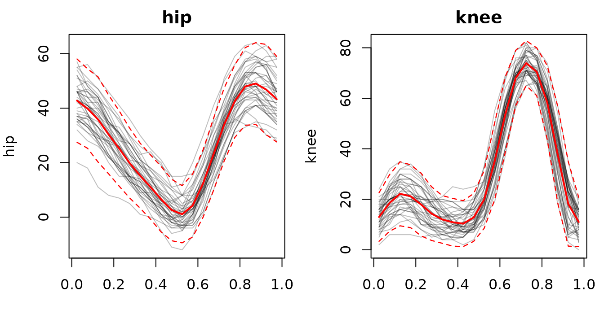

``` r

par(op)
```

The pointwise sd peaks roughly where the angle itself is changing
fastest – around the stance/swing transitions – so most of the
between-subject variability lives in *timing* of those transitions, not
in the angles attained at rest.

### Most- and least-varied subjects

[`tf_arclength()`](https://tidyfun.github.io/tf/reference/tf_arclength.html)
measures the path length traced out in `(hip, knee)`-space. A short
orbit = a subject whose `(hip, knee)` excursions are small or who moves
the two joints in lock-step; a long orbit = a subject with
large-amplitude, less synchronised excursions.

``` r

arc <- tf_arclength(g)
extreme <- c(which.min(arc), which.max(arc))
extreme
#>  boy1 boy39 
#>     1    39

plot(g, alpha = 0.15)
lines(g[extreme[1]], col = "steelblue", lwd = 2.2)
lines(g[extreme[2]], col = "firebrick", lwd = 2.2)
legend("bottomright", bty = "n",
       legend = c(sprintf("min arc length (%.0f deg)", arc[extreme[1]]),
                  sprintf("max arc length (%.0f deg)", arc[extreme[2]])),
       col = c("steelblue", "firebrick"), lwd = 2)
```

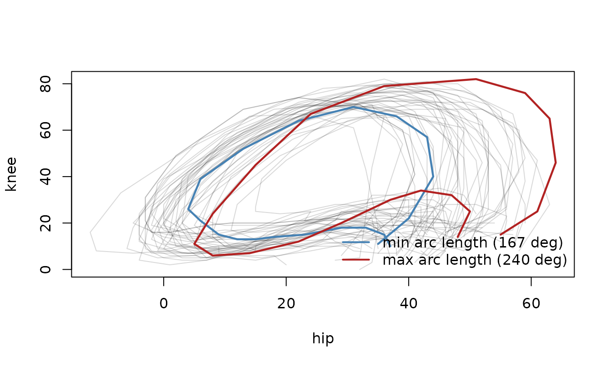

### A ladder of registrations

The pointwise sd above conflates two kinds of between-subject
variability: *amplitude* (how far the knee swings) and *phase* (at what
fraction of the cycle heel-strike happens). Removing phase –
“registration” – can mean progressively more, depending on what we are
willing to treat as a nuisance. Below are four rungs, applied in turn to
the gait sample, each followed by a facet plot of the result; we
quantify them together at the end.

Rungs 3 and 4 (and the rung-comparison at the end) use the elastic
registration routines from the suggested **fdasrvf** package – those
code chunks are only evaluated if `fdasrvf` is installed.

#### Rung 1 – arc-length reparametrization

The mildest operation re-labels time *within each curve* and uses no
template at all.
[`tf_reparam_arclength()`](https://tidyfun.github.io/tf/reference/tf_geom.html)
traverses every curve at approximately constant speed in its value
space: the `(hip, knee)` path is unchanged – the same set of points –
but equal time intervals now cover equal arc length.

``` r

g_unit <- tf_reparam_arclength(g)
plot(g_unit, type = "facet", alpha = 0.3)
```


[`tf_speed()`](https://tidyfun.github.io/tf/reference/tf_geom.html)
makes the effect explicit. The raw speeds swing wildly (fast through
swing, near-still in stance); after reparametrization they are nearly
flat – each curve traversed at constant speed:

``` r

sp_raw  <- tf_speed(g)
sp_unit <- tf_speed(g_unit)
yl <- c(0, max(c(unlist(tf_evaluations(sp_raw)),
                 unlist(tf_evaluations(sp_unit))), na.rm = TRUE))

op <- par(mfrow = c(1, 2), mar = c(4, 4, 2, 1))
plot(sp_raw,  alpha = 0.4, ylim = yl, main = "raw parameterization",
     ylab = "speed (deg / cycle)")
lines(mean(sp_raw),  col = "firebrick", lwd = 2)
plot(sp_unit, alpha = 0.4, ylim = yl, main = "arc-length parameterization",
     ylab = "speed (deg / cycle)")
lines(mean(sp_unit), col = "firebrick", lwd = 2)
```

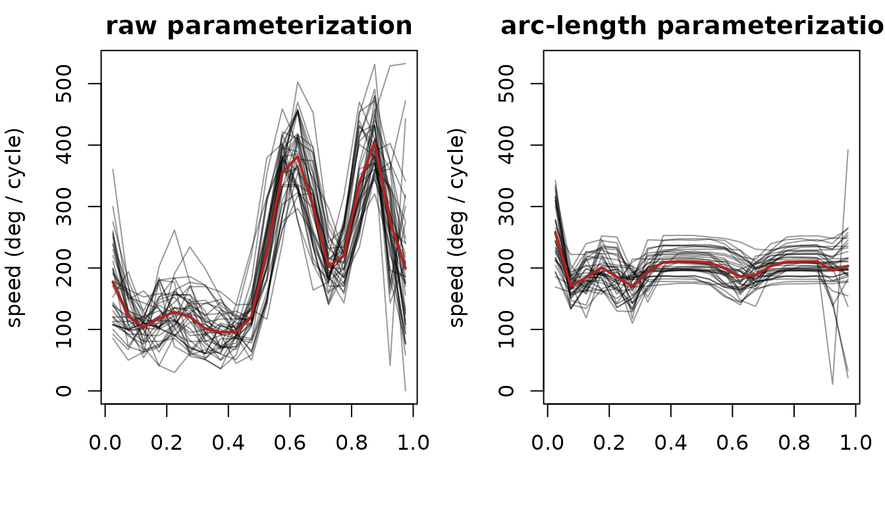

``` r

par(op)
```

No curve is moved toward any other: this removes the *parametrization*
only, leaving shape and size untouched and aligning nothing to a common
reference.

#### Rung 2 – alignment to a 1-d reference signal

The next rung aligns curves *to each other* by estimating one shared
time-warp per curve and applying it to both components. The warp is
driven by a single univariate **reference signal** – a component, or any
derived quantity. The choice matters: the knee carries the cycle’s
sharpest event (heel-strike), so it locks the alignment best.

``` r

r_knee <- tf_register(g, method = "cc", ref_component = "knee")
plot(tf_aligned(r_knee), type = "facet", alpha = 0.3)
```


The knee component visibly tightens; the hip, phase-coupled to it,
tightens only incidentally. Choosing `ref_component = "hip"` or
`= tf_speed` would emphasise different events – a 1-d reference forces
that modelling choice. The warps themselves are univariate `tfd`s
mapping raw to aligned phase, fanning out around the swing phase where
heel-strike timing varies between subjects:

``` r

plot(tf_invert(tf_inv_warps(r_knee)), alpha = 0.5,
     main = "reference (knee) warps", ylab = "aligned phase")
abline(0, 1, lty = 3)
```


#### Rung 3 – joint multivariate reparametrization (`srvf_mv`)

`method = "srvf_mv"` removes the choice of reference: it estimates the
single time-warp that best aligns the joint `(hip, knee)` trajectories
in the elastic (square-root-velocity) sense, using all components at
once ([Srivastava, Wu, et al. 2011](#ref-srivastava2011registration);
[Tucker et al. 2013](#ref-tucker2013generative)). It is still only a
re-timing – values are never rotated or rescaled – and the template is
the multivariate Karcher mean in `tf_template(reg_mv)`.

``` r

reg_mv <- tf_register(g, method = "srvf_mv", max_iter = 2)
plot(tf_aligned(reg_mv), type = "facet", alpha = 0.3)
```


``` r

plot(tf_invert(tf_inv_warps(reg_mv)), alpha = 0.5,
     main = "srvf_mv warps", ylab = "aligned phase")
abline(0, 1, lty = 3)
```


Because the warp must compromise between both components rather than
chase one, it need not shrink any single channel as hard as a
reference-targeted warp – but it needs no reference choice and respects
both axes symmetrically.

#### Rung 4 – full elastic shape registration

[`tf_register_shape()`](https://tidyfun.github.io/tf/reference/tf_register_shape.html)
goes furthest: on top of the time-warp it also fits, per curve, a
**rotation** and a **scale**, and reports the aligned curves in a
centered, normalised **shape space** ([Srivastava, Klassen, et al.
2011](#ref-srivastava2011shape); [Srivastava and Klassen
2016](#ref-srivastava2016)). Translation, rotation and size are all
quotiented out.

``` r

reg_shape <- tf_register_shape(g, max_iter = 2)
plot(tf_aligned(reg_shape), type = "facet", alpha = 0.3)   # note the y-axis: shape space
```


The `(hip, knee)` trajectory view makes the collapse vivid – the
original butterfly loops on the left, the shape-registered curves on the
right reduced to essentially one normalised shape (note the very
different axis ranges):

``` r

op <- par(mfrow = c(1, 2), mar = c(4, 4, 2, 1))
plot(g,                     type = "trajectory", alpha = 0.3, main = "original")
plot(tf_aligned(reg_shape), type = "trajectory", alpha = 0.3,
     main = "shape-registered (shape space)")
```


``` r

par(op)
```

The estimated rotations sit near the identity and the scales near 1
(little genuine rotation or scaling is present), yet the normalisation
alone flattens the real between-subject differences:

``` r

round(tf_rotations(reg_shape)[, , 1], 3)   # rotation for subject 1
#>         hip  knee
#> hip   1.000 0.023
#> knee -0.023 1.000
summary(as.numeric(tf_scales(reg_shape)))  # scales, relative to the template
#>    Min. 1st Qu.  Median    Mean 3rd Qu.    Max. 
#>   178.0   199.9   213.2   214.7   229.5   256.8
```

**Gait’s two axes are not interchangeable**: hip angle and knee angle
are distinct physical quantities in fixed units. Quotienting out
rotation mixes them into meaningless combinations, and quotienting out
scale discards amplitude – which here *is* the signal of interest. Shape
registration is the wrong tool for a bundle of fixed-unit channels; we
return to where it *is* right below.

#### Quantifying the alignment

Two views across the rungs. First, a visual overview: the two components
(rows *hip*, *knee*) and the estimated time-warp (row *warp*) for each
registration, side by side – *as-observed*, *arc-length* reparametrized,
registered to a 1-d *reference* (knee), registered jointly (*srvf_mv*),
and fully *shape*-registered. Raw data has no warp; arc-length has no
template warp but does reparametrize, so its warp panel shows the
normalised cumulative arc length.

``` r

# warp implied by arc-length reparametrization: normalised cumulative arc length
# (raw cycle phase -> arc-length phase, same direction as the registration warps)
arclen_warp <- function(mv) {
  sp  <- tf_speed(mv)
  arg <- as.numeric(tf_arg(sp))
  dom <- tf_domain(sp)
  d   <- diff(arg)
  w <- sapply(tf_evaluations(sp), function(s) {
    cum <- c(0, cumsum((head(s, -1) + tail(s, -1)) / 2 * d))
    dom[1] + diff(dom) * cum / cum[length(cum)]
  })
  tfd(t(w), arg = arg, domain = dom)
}
```

``` r

cols <- list(
  list(nm = "as-observed", data = g,                     warp = NULL),
  list(nm = "arc-length",  data = g_unit,                warp = arclen_warp(g)),
  list(nm = "ref = knee",  data = tf_aligned(r_knee),    warp = tf_invert(tf_inv_warps(r_knee))),
  list(nm = "srvf_mv",     data = tf_aligned(reg_mv),    warp = tf_invert(tf_inv_warps(reg_mv))),
  list(nm = "shape",       data = tf_aligned(reg_shape), warp = tf_invert(tf_inv_warps(reg_shape)))
)

op <- par(mfrow = c(3, 5), mar = c(2.6, 3.2, 2, 0.8), mgp = c(1.9, 0.6, 0))
for (j in seq_along(cols))
  plot(tf_component(cols[[j]]$data, "hip"),  alpha = 0.3,
       main = cols[[j]]$nm, ylab = if (j == 1) "hip" else "")
for (j in seq_along(cols))
  plot(tf_component(cols[[j]]$data, "knee"), alpha = 0.3,
       main = "", ylab = if (j == 1) "knee" else "")
for (j in seq_along(cols)) {
  w <- cols[[j]]$warp
  if (is.null(w)) {
    plot.new(); text(0.5, 0.5, "(identity)", col = "grey55")
  } else {
    plot(w, alpha = 0.4, main = "", ylab = if (j == 1) "warp" else "")
    abline(0, 1, lty = 3)
  }
}
```


``` r

par(op)
```

Across the warp row, the registration warps fan out around the swing
phase where heel-strike timing varies between subjects; the shape warp
is comparable, since it shares the same time-warp step. Down the `shape`
column the components have been rescaled into normalised shape space –
note the compressed vertical axis – which is why those curves look so
much tighter than the others.

Second, the numbers: the maximum pointwise sd of each component, before
and after. Rungs 1–3 keep the data in its original degree units and are
directly comparable; rung 4 (marked `*`) lives in normalised shape
space, so its row is on a different scale and only illustrates the
collapse.

``` r

peak_sd <- function(f, k) {
  arg <- tf_arg(f)
  max(unlist(tf_evaluate(tf_component(sd(f), k), arg)))
}
```

``` r

rungs <- list(
  "raw"                = g,
  "1 arc-length"       = g_unit,
  "2 reference (knee)" = tf_aligned(r_knee),
  "3 srvf_mv"          = tf_aligned(reg_mv),
  "4 shape (*)"        = tf_aligned(reg_shape)
)
data.frame(
  registration = names(rungs),
  sd_hip       = sapply(rungs, peak_sd, "hip"),
  sd_knee      = sapply(rungs, peak_sd, "knee"),
  row.names    = NULL
)
#>         registration     sd_hip    sd_knee
#> 1                raw 8.28498797 9.54533186
#> 2       1 arc-length 8.04009724 7.39283787
#> 3 2 reference (knee) 7.91270379 6.33047672
#> 4          3 srvf_mv 8.20232891 8.22321203
#> 5        4 shape (*) 0.01935199 0.02937269
```

In degree units the phase rungs chip away at the spread only modestly –
gait’s phase variation is real but subtle. The knee-reference warp
shrinks the knee component most (it targets that channel); `srvf_mv`
spreads a gentler correction across both; and arc-length
reparametrization, which aligns nothing to a common template, barely
moves the pointwise sd at all. Rung 4’s near-zero entries are *not* a
better alignment – they are the signal being quotiented away.

### Shape registration and its quotient spaces

Shape registration earns its keep when the components really are
*interchangeable spatial coordinates* and position, orientation and size
are all nuisances: handwriting, gesture or movement paths, object
outlines. Here is a synthetic example – a single base curve \\(t,\\
t^2)\\, copied three times with each copy rotated, rescaled and shifted
in the plane:

``` r

t      <- seq(0, 1, length.out = 51)
base   <- rbind(t, t^2)
scales <- c(1, 0.7, 1.3)
angles <- c(0, 0.4, -0.25)
offset <- rbind(c(0.2, -0.1), c(0.4, -0.2), c(0.6, -0.3))
beta   <- array(NA_real_, dim = c(3, length(t), 2),
                dimnames = list(c("a", "b", "c"), NULL, c("x", "y")))
for (i in 1:3) {
  rot   <- matrix(c(cos(angles[i]),  sin(angles[i]),
                    -sin(angles[i]), cos(angles[i])), nrow = 2)
  curve <- scales[i] * (rot %*% base) + matrix(offset[i, ], 2, length(t))
  beta[i, , 1] <- curve[1, ]
  beta[i, , 2] <- curve[2, ]
}
shapes <- tfd_mv(beta, arg = t)
```

What counts as “the same shape” depends on which transformations we
quotient out, and
[`tf_register_shape()`](https://tidyfun.github.io/tf/reference/tf_register_shape.html)
lets us choose via the `rotation` and `scale` flags (translation and the
time-warp are always removed). The three quotients differ in what
survives (again, these chunks need the suggested **fdasrvf** package):

``` r

reg_full  <- tf_register_shape(shapes, max_iter = 2, rotation = TRUE,  scale = TRUE)
reg_rot   <- tf_register_shape(shapes, max_iter = 2, rotation = TRUE,  scale = FALSE)
reg_scale <- tf_register_shape(shapes, max_iter = 2, rotation = FALSE, scale = TRUE)

op <- par(mfrow = c(2, 2), mar = c(4, 4, 2, 1))
plot(shapes,                asp = 1, col = 1:3, lwd = 2, main = "input: 3 placements")
plot(tf_aligned(reg_rot),   asp = 1, col = 1:3, lwd = 2, main = "rotation-only (keeps size)")
plot(tf_aligned(reg_scale), asp = 1, col = 1:3, lwd = 2, main = "scale-only (keeps orientation)")
plot(tf_aligned(reg_full),  asp = 1, col = 1:3, lwd = 2, main = "rotation + scale (full)")
```

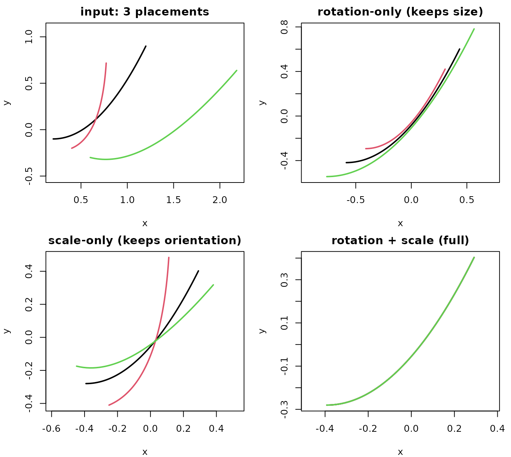

``` r

par(op)
```

- **rotation-only** (`scale = FALSE`): orientations are aligned but the
  original sizes are kept, so the curves stay nested.
- **scale-only** (`rotation = FALSE`): sizes are equalised but
  orientations are kept, so the curves fan out at one common size.
- **rotation + scale** (the full shape quotient): both are removed, and
  the three congruent curves collapse onto a single shape.

[`tf_scales()`](https://tidyfun.github.io/tf/reference/tf_registration.html)
reports the per-curve size factors that were removed (relative to the
template; `1` whenever scaling is off):

``` r

data.frame(curve      = c("a", "b", "c"),
           injected   = scales,
           full       = round(as.numeric(tf_scales(reg_full)),  3),
           rot_only   = round(as.numeric(tf_scales(reg_rot)),   3),
           scale_only = round(as.numeric(tf_scales(reg_scale)), 3))
#>   curve injected  full rot_only scale_only
#> 1     a      1.0 1.463        1      1.466
#> 2     b      0.7 1.024        1      1.026
#> 3     c      1.3 1.902        1      1.905
```

### Modes of variation via FPC

Back on the gait sample, with the most visible phase variation reduced
(we carry the knee-aligned curves forward), fit a per-component FPC
basis ([Ramsay and Silverman 2005](#ref-ramsay2005functional)). The
leading PCs now mostly describe within-component amplitude modes:

``` r

fpc_var <- function(comp) attr(comp, "score_variance")
```

``` r

g_aligned <- tf_aligned(r_knee)
g_b <- tfb_mv(g_aligned, basis = "fpc", verbose = FALSE)

v_hip  <- fpc_var(tf_component(g_b, "hip"));  v_hip  <- v_hip  / sum(v_hip)
v_knee <- fpc_var(tf_component(g_b, "knee")); v_knee <- v_knee / sum(v_knee)

op <- par(mfrow = c(1, 2), mar = c(4, 4, 2, 1))
barplot(head(v_hip,  6), names.arg = 1:6, main = "hip: variance share",
        ylab = "proportion", col = "grey70")
barplot(head(v_knee, 6), names.arg = 1:6, main = "knee: variance share",
        ylab = "proportion", col = "grey70")
```

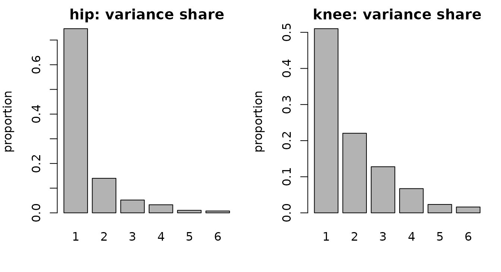

``` r

par(op)

# residual: how well does the low-rank FPC basis approximate the curves?
g_round <- vctrs::vec_cast(g_b, g_aligned)
resid   <- g_aligned - g_round
rmse_per_subject <- sqrt(unlist(lapply(tf_evaluations(resid), function(m) {
  mean(as.matrix(m[, -1L, drop = FALSE])^2)
})))
summary(rmse_per_subject)
#>    Min. 1st Qu.  Median    Mean 3rd Qu.    Max. 
#>  0.1685  0.2931  0.3377  0.3485  0.4048  0.5658
```

The first 2-3 FPCs explain most of the remaining within-component
variance, and the RMSE between the registered and FPC-reconstructed
`(hip, knee)` curves is well below a degree for most subjects.

### Joint modes of variation via MFPCA

The per-component FPC above gives each component its *own* scores: a
subject’s hip-mode-1 score and knee-mode-1 score are separate numbers,
so the basis cannot, on its own, express that the two joints co-vary.
**Multivariate FPCA** ([Happ and Greven 2018](#ref-happ2018)), via
[`tfb_mfpc()`](https://tidyfun.github.io/tf/reference/tfb_mfpc.html),
instead produces a *single* score per subject per mode, paired with a
**vector-valued eigenfunction** \\\Psi_m = (\Psi_m^{\text{hip}},
\Psi_m^{\text{knee}})\\. One shared score \\s\_{im}\\ scales both halves
at once, so each mode encodes coupled hip-knee co-variation in a single
coordinate system: \\ f_i(t) \approx \mu(t) + \sum_m s\_{im}\\\Psi_m(t).
\\

The default `weights = "inverse_variance"` normalises each component to
equal total variance before combining, so the (larger-range) knee does
not simply dominate the hip; `"snr"`, `"equal"`, or a numeric vector are
also available.

``` r

g_m <- tfb_mfpc(g_aligned, pve = 0.95)
g_m
#> tfb_mv<d=2>[39] (hip, knee): [0.025, 0.975] -> [-10.93848, 65.14214] x [0.405835, 80.19255]
#> components in basis representation: 7 MFPCs
#> [1]: ▆▆▅▅▄▄▃▃▂▂▂▂▃▄▅▆▇▇▇▆ | ▁▂▂▂▂▂▂▂▂▂▃▄▆▇▇▇▆▄▃▂
#> [2]: ▇▇▆▅▄▄▃▂▁▁▁▂▃▄▆▇▇▇▇▇ | ▂▃▃▃▂▂▁▁▁▂▃▄▆▇█▇▆▅▃▂
#> [3]: ▇▇▆▅▄▃▂▂▁▁▁▂▃▄▆▇███▇ | ▂▃▄▃▃▂▂▁▁▂▃▅▇███▇▅▃▂
#> [4]: ▆▆▅▄▄▃▃▂▁▁▁▁▂▃▄▅▅▆▅▅ | ▁▂▂▂▂▁▁▁▁▁▂▄▆▇▇▇▆▄▁▁
#> [5]: ▄▃▂▂▂▁▁▁▁▁▁▁▂▃▄▅▆▆▅▅ | ▁▁▁▁▁▁▁▁▁▂▃▄▆▇█▇▆▄▁▁
#> [6]: █▇▆▅▄▄▃▃▂▂▂▂▃▄▆▇████ | ▂▃▃▂▂▂▂▁▂▂▃▄▆▇▇▇▆▄▂▂
#> 
#>     [....]   (33 not shown)

scores <- tf_mfpc_scores(g_m)          # 39 x M, shared across both components
nu     <- attr(g_m, "mfpc")$evalues    # joint (multivariate) eigenvalues
ve     <- nu / sum(nu)                  # variance share per shared mode
dim(scores)
#> [1] 39  7
round(head(ve, 4), 3)
#> [1] 0.465 0.224 0.138 0.084
```

The multivariate eigenfunctions come back as a `tfd_mv` – one bivariate
“curve” per mode – so each MFPC can be inspected component by component.
The leading mode’s hip and knee parts move together, which is exactly
the coupling the independent per-component analysis could not represent:

``` r

psi    <- tf_mfpc_efunctions(g_m)
k_show <- min(3L, length(psi))
op <- par(mfrow = c(1, 2), mar = c(4, 4, 2, 1))
plot(tf_component(psi, "hip")[seq_len(k_show)], col = seq_len(k_show), lwd = 2,
     main = "MFPC eigenfunctions: hip", ylab = "loading")
plot(tf_component(psi, "knee")[seq_len(k_show)], col = seq_len(k_show), lwd = 2,
     main = "MFPC eigenfunctions: knee", ylab = "loading")
legend("topright", bty = "n", lwd = 2, col = seq_len(k_show),
       legend = paste("MFPC", seq_len(k_show)), cex = 0.85)
```

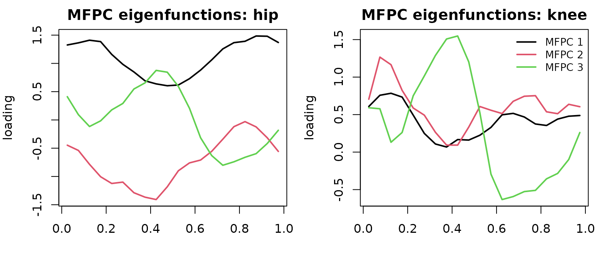

``` r

par(op)
```

The shared scores live in one coordinate system, so MFPCA summarises
each subject with a single set of `M` numbers rather than one set per
component. That is a genuine trade-off: the independent per-component
basis is free to optimise each component separately, so it reconstructs
more accurately for a given per-component truncation, while MFPCA spends
fewer, *coupled* scores and accepts a little more error in exchange for
the shared coordinate system:

``` r

rmse_mv <- function(approx) {
  resid <- g_aligned - vctrs::vec_cast(approx, g_aligned)
  sqrt(mean(unlist(lapply(tf_evaluations(resid), function(m) {
    as.matrix(m[, -1L, drop = FALSE])^2
  }))))
}
n_indep <- sum(vapply(tf_components(g_b),
                      function(co) length(attr(co, "score_variance")), integer(1)))
data.frame(
  representation = c("independent FPC", "joint MFPCA"),
  stored_scores  = c(n_indep, attr(g_m, "mfpc")$npc),
  rmse           = round(c(rmse_mv(g_b), rmse_mv(g_m)), 3)
)
#>    representation stored_scores  rmse
#> 1 independent FPC            23 0.359
#> 2     joint MFPCA             7 1.228
```

The first 2 shared modes already capture 69% of the joint variance. New
subjects can be projected onto this fitted basis with
[`tf_rebase()`](https://tidyfun.github.io/tf/reference/tf_rebase.html),
which re-scores them jointly rather than component by component.

## 3. Atlantic storms as 4-dimensional curves

[`dplyr::storms`](https://dplyr.tidyverse.org/reference/storms.html)
records four time-varying quantities for every Atlantic tropical storm
or hurricane from 1975 to 2024, sampled every 6 hours along the storm’s
life: position (longitude, latitude) and intensity (sustained wind
speed, central pressure). The natural object is a single
**four-component** vector-valued curve per storm, `f_i: [0, T_i] -> R^4`
– spatial trajectory and intensity life-cycle bundled together.

Two practical points:

- `tracks_km` – the *spatial* `(x_km, y_km)` view in physical units
  (projecting each storm’s `long` / `lat` into a per-storm local-km
  frame at its own mean latitude) – is what we use for arc length and
  forward speed, because deg/h speeds wrongly upweight east-west motion
  at high latitudes (a longitude degree is ~111 km at the equator but
  only ~78 km at 45 N).
- Most life-cycle comparisons between short and long storms only make
  sense on a **normalised time axis** `phase = t / T_i in [0, 1]`. We
  build a normalised 4-d object on top of the real-time one and use the
  appropriate version per question.

``` r

KM_PER_DEG <- 111.32

storms_clean <- storms |>
  mutate(
    storm_id = paste(name, year),
    ts       = as.POSIXct(ISOdate(year, month, day, hour), tz = "UTC")
  ) |>
  group_by(storm_id) |>
  distinct(ts, .keep_all = TRUE) |>      # dedupe duplicate-timestamp rows
  mutate(
    t_hours = as.numeric(ts - min(ts), units = "hours"),
    phase   = if (max(t_hours) > 0) t_hours / max(t_hours) else 0,
    ref_lat = mean(lat),
    x_km    = (long - mean(long)) * KM_PER_DEG * cos(ref_lat * pi / 180),
    y_km    = (lat  - ref_lat)    * KM_PER_DEG
  ) |>
  filter(n() >= 16, !is.na(wind), !is.na(pressure)) |>  # >= 4 days
  ungroup()

# spatial (km, real time): the compact data-frame constructor.
tracks_km <- storms_clean |>
  transmute(storm_id, t_hours, x = x_km, y = y_km) |>
  tfd_mv(id = "storm_id", arg = "t_hours", value = c("x", "y"))

# Equivalent spelling if the component tfd vectors are already available.
tracks_km_from_components <- tfd_mv(list(
  x = tfd(storms_clean, id = "storm_id", arg = "t_hours", value = "x_km"),
  y = tfd(storms_clean, id = "storm_id", arg = "t_hours", value = "y_km")
))

# full 4-d, on normalised life-cycle phase
tracks4 <- tfd_mv(list(
  long = tfd(storms_clean, id = "storm_id", arg = "phase", value = "long"),
  lat  = tfd(storms_clean, id = "storm_id", arg = "phase", value = "lat"),
  wind = tfd(storms_clean, id = "storm_id", arg = "phase", value = "wind"),
  pres = tfd(storms_clean, id = "storm_id", arg = "phase", value = "pressure")
))
tracks4
#> tfd_mv<d=4>[518] (long, lat, wind, pres): [0, 1] -> [-136.9, 13.5] x [7, 70.7] x [10, 165] x [882, 1024]
#> components based on 16 to 96 evaluations each, interpolation by tf_approx_linear
#> [1]: (0.000,-79);(0.033,-79);(0.067,-79); ... | (0.000,28);(0.033,28);(0.067,30); ... | (0.000,25);(0.033,25);(0.067,25); ... | (0.000,1013);(0.033,1013);(0.067,1013); ...
#> [2]: (0.000,-68);(0.053,-70);(0.105,-70); ... | (0.000,26);(0.053,26);(0.105,26); ... | (0.000,20);(0.053,20);(0.105,25); ... | (0.000,1014);(0.053,1014);(0.105,1014); ...
#> [3]: (0.000,-70);(0.031,-71);(0.062,-72); ... | (0.000,22);(0.031,22);(0.062,22); ... | (0.000,25);(0.031,25);(0.062,25); ... | (0.000,1011);(0.031,1011);(0.062,1010); ...
#> [4]: (0.000,-46);(0.036,-48);(0.071,-48); ... | (0.000,33);(0.036,34);(0.071,34); ... | (0.000,35);(0.036,40);(0.071,40); ... | (0.000,1005);(0.036,1005);(0.071,1005); ...
#> [5]: (0.000,-55);(0.022,-56);(0.044,-57); ... | (0.000,18);(0.022,18);(0.044,18); ... | (0.000,25);(0.022,25);(0.044,25); ... | (0.000,1009);(0.022,1009);(0.044,1009); ...
#> [6]: (0.000,-57);(0.056,-57);(0.111,-58); ... | (0.000,23);(0.056,24);(0.111,24); ... | (0.000,25);(0.056,30);(0.111,35); ... | (0.000,1005);(0.056,1005);(0.111,1005); ...
#> 
#>     [....]   (512 not shown)

# storm-level metadata
peak <- storms |>
  group_by(name, year) |>
  summarise(peak_cat = suppressWarnings(max(category, na.rm = TRUE)),
            .groups = "drop") |>
  mutate(peak_cat = if_else(is.finite(peak_cat), peak_cat, 0),
         peak_cat = as.integer(peak_cat),
         storm_id = paste(name, year))

df <- tibble::tibble(
  storm_id  = names(tracks4),
  track     = tracks4,
  track_km  = tracks_km
) |>
  left_join(peak, by = "storm_id") |>
  mutate(strength = factor(
    pmin(peak_cat, 4),
    levels = 0:4,
    labels = c("TS/TD", "Cat 1", "Cat 2", "Cat 3", "Cat 4+")
  ))
```

Before analysing the storms, inspect the irregular object directly.
Counts vary by storm because each lifetime has a different number of
6-hourly observations, while the long data-frame representation keeps
the components aligned by `(storm, phase)`.

``` r

head(tf_count(tracks4))
#>               long lat wind pres
#> Amy 1975        31  31   31   31
#> Blanche 1975    20  20   20   20
#> Caroline 1975   33  33   33   33
#> Doris 1975      29  29   29   29
#> Eloise 1975     46  46   46   46
#> Faye 1975       19  19   19   19
as.data.frame(tracks4[1:2], unnest = TRUE) |> head()
#>         id        arg component  value
#> 1 Amy 1975 0.00000000      long  -79.0
#> 2 Amy 1975 0.00000000       lat   27.5
#> 3 Amy 1975 0.00000000      wind   25.0
#> 4 Amy 1975 0.00000000      pres 1013.0
#> 5 Amy 1975 0.03333333      long  -79.0
#> 6 Amy 1975 0.03333333       lat   28.5
```

### Movement workflow: regularize, then describe

Joo et al. ([2019](#ref-joo2019)) describe movement analysis as a
workflow built around tracking records `(x, y, t)`: clean the fixes,
regularize or reconstruct the path when needed, visualize the track,
then extract descriptors such as speed, heading and turning angles. The
storm data follow the same pattern. The build step above already
performed basic preprocessing: duplicate timestamps were removed, very
short tracks were dropped, and longitude/latitude were projected into
local kilometre coordinates.

For diagnostic plots it is useful to regularize a few storms onto a
common lifecycle grid. Differentiating the regularized `(x, y)` curves
gives velocity components; their norm is forward speed, and
`atan2(v_y, v_x)` gives heading. Turning angle is the wrapped difference
between successive headings.

``` r

movement_ids <- c("Andrew 1992", "Katrina 2005", "Sandy 2012")
movement_ids <- movement_ids[movement_ids %in% df$storm_id]
movement_rows <- match(movement_ids, df$storm_id)
movement_grid <- seq(0, 1, length.out = 81)
movement_duration <- vapply(
  tf_arg(df$track_km[movement_rows]),
  \(t) max(t) - min(t),
  numeric(1)
)

movement_eval <- lapply(seq_along(movement_rows), function(k) {
  tf_evaluate(
    df$track_km[movement_rows[k]],
    arg = movement_grid * movement_duration[k]
  )[[1]]
})
movement_x <- do.call(rbind, lapply(movement_eval, `[[`, "x"))
movement_y <- do.call(rbind, lapply(movement_eval, `[[`, "y"))

movement_track <- tfd_mv(list(
  x = tfd(movement_x, arg = movement_grid, domain = c(0, 1)),
  y = tfd(movement_y, arg = movement_grid, domain = c(0, 1))
), domain = c(0, 1))
names(movement_track) <- movement_ids

movement_velocity <- tf_derive(movement_track)
movement_speed <- tf_norm(movement_velocity) / movement_duration

vx <- as.matrix(tf_component(movement_velocity, "x"),
                arg = movement_grid, interpolate = TRUE)
vy <- as.matrix(tf_component(movement_velocity, "y"),
                arg = movement_grid, interpolate = TRUE)
heading_mat <- atan2(vy, vx) * 180 / pi
heading <- tfd(heading_mat, arg = movement_grid, domain = c(0, 1))
names(heading) <- movement_ids

wrap_degrees <- function(x) ((x + 180) %% 360) - 180
turning_mat <- t(apply(heading_mat, 1, function(x) {
  c(NA_real_, wrap_degrees(diff(x)))
}))
turning <- tfd(turning_mat, arg = movement_grid, domain = c(0, 1))
names(turning) <- movement_ids

movement_cols <- c("#1b9e77", "#d95f02", "#7570b3")[seq_along(movement_ids)]
xy <- as.matrix(movement_track, interpolate = TRUE)

op <- par(mfrow = c(2, 2), mar = c(4, 4, 2, 1))
plot(range(xy[, , "x"], na.rm = TRUE), range(xy[, , "y"], na.rm = TRUE),
     type = "n", asp = 1, xlab = "x (km)", ylab = "y (km)",
     main = "regularized tracks")
lines(movement_track, col = movement_cols, lwd = 2)
legend("topleft", bty = "n", lwd = 2, col = movement_cols,
       legend = movement_ids, cex = 0.85)
plot(movement_speed, col = movement_cols, lwd = 2, alpha = 1,
     xlab = "lifecycle phase", ylab = "km / h", main = "forward speed")
plot(heading, col = movement_cols, lwd = 2, alpha = 1,
     xlab = "lifecycle phase", ylab = "degrees", main = "heading")
plot(turning, col = movement_cols, lwd = 2, alpha = 1,
     xlab = "lifecycle phase", ylab = "degrees", main = "turning angle")
```

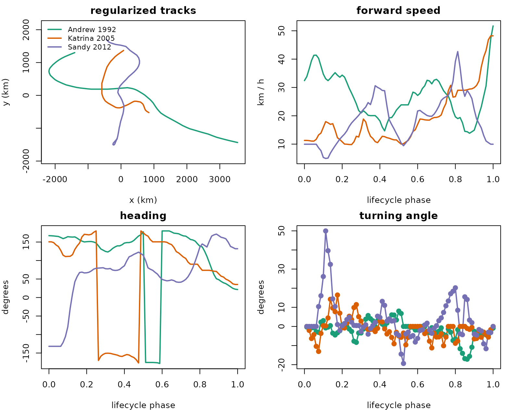

``` r

par(op)
```

The result is a movement-data diagnostic rather than just a map: storms
with visually similar tracks can differ sharply in when they accelerate,
when they turn, and how abruptly their heading changes during
recurvature.

### A single 4-d curve: Hurricane Katrina (2005)

For a single storm the 4-component `tf_mv` is naturally displayed in
facet mode (`type = "facet"`) – one panel per component, all on the same
normalised cycle phase axis:

``` r

katrina <- df |> filter(storm_id == "Katrina 2005") |> pull(track)
plot(katrina, type = "facet", lwd = 2)
```


Wind and pressure are anti-correlated – pressure dips below 920 mbar as
wind peaks above 150 knots near phase ~0.55 – and the `(long, lat)`
panels show Katrina sliding northwest across the Gulf and turning north
into Louisiana. Bundling intensity and trajectory as a single `tfd_mv`
lets every operation downstream (subsetting, summaries, arithmetic,
plotting) treat them as one object.

### Track map, faceted by peak intensity

The geographic view uses the `(long, lat)` components only. Faceting by
peak Saffir-Simpson category separates the populations cleanly, and a
coastline backdrop (from
[`maps::map`](https://rdrr.io/pkg/maps/man/map.html), if installed)
anchors the geography:

``` r

have_maps <- requireNamespace("maps", quietly = TRUE)
pal <- c("grey50", "#fed976", "#feb24c", "#fd8d3c", "#e31a1c")

draw_coast <- function(xlim, ylim) {
  if (!have_maps) return(invisible())
  m <- maps::map("world", plot = FALSE,
                 xlim = xlim, ylim = ylim, fill = FALSE)
  lines(m$x, m$y, col = "grey55", lwd = 0.6)
}
```

``` r

xlim <- range(unlist(tf_evaluations(tf_component(df$track, "long"))), na.rm = TRUE)
ylim <- range(unlist(tf_evaluations(tf_component(df$track, "lat"))),  na.rm = TRUE)

op <- par(mfrow = c(2, 3), mar = c(3.4, 3.4, 2, 1), mgp = c(2, 0.7, 0))
for (k in seq_along(levels(df$strength))) {
  lev   <- levels(df$strength)[k]
  trks  <- df$track[df$strength == lev]
  spatial <- tfd_mv(list(
    long = tf_component(trks, "long"),
    lat  = tf_component(trks, "lat")
  ))
  plot(range(xlim), range(ylim), type = "n",
       xlab = "long", ylab = "lat",
       main = sprintf("%s (n = %d)", lev, length(trks)))
  draw_coast(xlim, ylim)
  lines(spatial, col = pal[k], alpha = 0.4, lwd = 1)
}
plot.new()
legend("center", bty = "n", lwd = 2, col = pal, legend = levels(df$strength),
       title = "peak intensity", cex = 1.05)
```

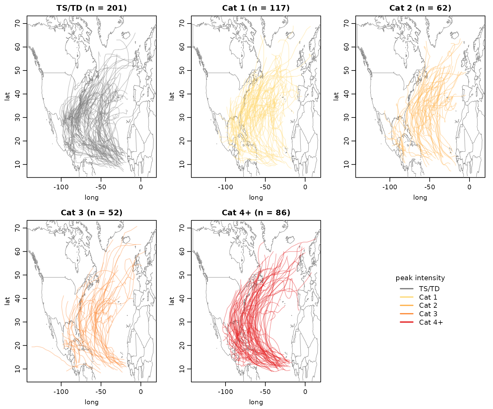

``` r

par(op)
```

Tropical storms / depressions stay in the southern, western basin; cat-3
and cat-4+ tracks reach further north and east – they live longer, get
caught by the westerlies, and recurve out to sea.

### Scalar features extracted from the 4-d object

Every component of a `tf_mv` is a real `tf` vector and supports the full
univariate API, so per-storm scalar features fall out as one-liners:

``` r

df <- df |> mutate(
  path_km    = tf_arclength(track_km),
  duration   = vapply(tf_arg(track_km), \(t) max(t) - min(t), numeric(1)),
  mean_speed = path_km / duration,            # km/h, lifetime average
  peak_wind  = vapply(tf_evaluations(tf_component(track, "wind")), max, numeric(1)),
  min_pres   = vapply(tf_evaluations(tf_component(track, "pres")), min, numeric(1))
)

df |>
  group_by(strength) |>
  summarise(
    n = dplyr::n(),
    median_path_km     = round(median(path_km)),
    median_speed_kmh   = round(median(mean_speed), 1),
    median_peak_wind   = median(peak_wind),
    median_min_pres    = median(min_pres),
    .groups = "drop"
  )
#> # A tibble: 5 × 6
#>   strength     n median_path_km median_speed_kmh median_peak_wind
#>   <fct>    <int>          <dbl>            <dbl>            <dbl>
#> 1 TS/TD      201           2924             20.8               50
#> 2 Cat 1      117           4266             21.4               75
#> 3 Cat 2       62           4860             22.2               90
#> 4 Cat 3       52           6035             22.9              105
#> 5 Cat 4+      86           7399             24.6              130
#> # ℹ 1 more variable: median_min_pres <dbl>
```

Median path length grows strongly from tropical-storm to cat-4+ storms,
whereas lifetime-average forward speed increases more modestly. The
canonical wind / pressure gap between categories is visible.

### Intensity and forward-speed life-cycles per category

Plotting all forward-speed and intensity time courses at once is
hopeless (hundreds of irregular noodles). What we actually want is the
*mean curve per intensity stratum* on the normalised lifecycle phase
axis. Evaluate each component on a common phase grid, average within
each stratum, and re-wrap the result as a length-`G` univariate `tfd` so
we can use the standard `plot.tf` / `lines.tf` machinery:

``` r

phase_grid <- seq(0, 1, length.out = 41)

# forward speed on normalised time: re-arg each storm's km-speed by
# t / T_i, so all storms share phase domain [0, 1].
speed_km  <- tf_speed(df$track_km)
#> ✖ Differentiating over irregular grids can be unstable.
#> ✖ Differentiating over irregular grids can be unstable.
durations <- df$duration
speed_long <- do.call(rbind, lapply(seq_along(speed_km), function(i) {
  data.frame(
    id    = names(speed_km)[i],
    phase = tf_arg(speed_km[i])[[1]] / durations[i],
    value = tf_evaluations(speed_km[i])[[1]]
  )
}))
speed_phase <- tfd(speed_long, id = "id", arg = "phase", value = "value",
                   domain = c(0, 1))

# per-stratum mean curve on the regular phase grid, packaged as length-G tfd
stratum_mean_tfd <- function(comp, grp, grid = phase_grid) {
  mat <- as.matrix(comp, arg = grid, interpolate = TRUE)
  means <- vapply(levels(grp), function(g) {
    rows <- which(grp == g)
    if (length(rows) < 2L) return(rep(NA_real_, length(grid)))
    colMeans(mat[rows, , drop = FALSE], na.rm = TRUE)
  }, numeric(length(grid)))
  out <- tfd(t(means), arg = grid, domain = c(0, 1))
  names(out) <- levels(grp)
  out
}

wind_avg  <- stratum_mean_tfd(tf_component(df$track, "wind"), df$strength)
pres_avg  <- stratum_mean_tfd(tf_component(df$track, "pres"), df$strength)
speed_avg <- stratum_mean_tfd(speed_phase,                     df$strength)
```

``` r

op <- par(mfrow = c(2, 2), mar = c(4, 4, 2, 1))
plot(wind_avg, col = pal, lwd = 2, alpha = 1,
     xlab = "lifecycle phase", ylab = "wind (knots)",
     main = "mean sustained wind")
legend("topright", bty = "n", lwd = 2, col = pal, legend = levels(df$strength),
       cex = 0.9, title = "peak intensity")
plot(pres_avg,  col = pal, lwd = 2, alpha = 1,
     xlab = "lifecycle phase", ylab = "pressure (mbar)",
     main = "mean central pressure")
plot(speed_avg, col = pal, lwd = 2, alpha = 1,
     xlab = "lifecycle phase", ylab = "forward speed (km/h)",
     main = "mean forward speed")
plot.new()
text(0.5, 0.7, "wind and pressure peak\nnear lifecycle phase 0.5;",
     adj = 0.5, cex = 1.05)
text(0.5, 0.35, "forward speed peaks\nlate, during recurvature",
     adj = 0.5, cex = 1.05)
```

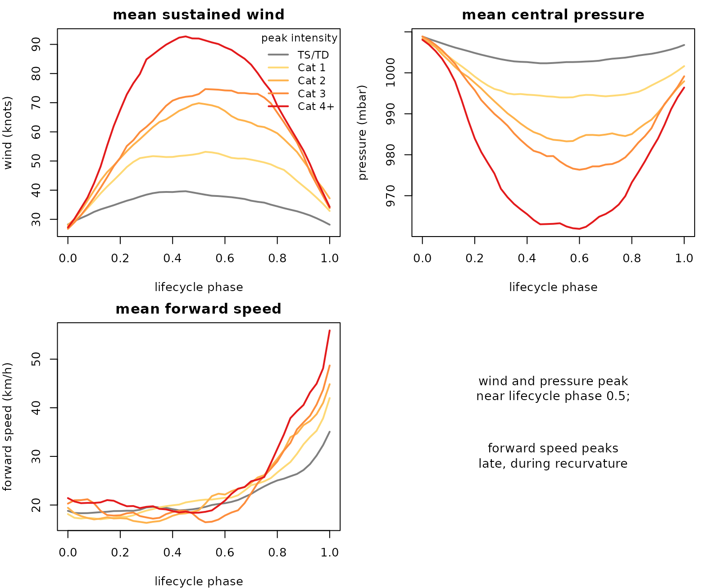

``` r

par(op)
```

Three clean stories on a single `tf_mv` object: intensity peaks
mid-life-cycle (around `phase ~ 0.5`) and the gap between categories is
roughly uniform across the cycle; central pressure mirrors wind; forward
speed peaks much later (around `phase ~ 0.75`) and the strongest storms
accelerate the most – the canonical recurvature signature.

### Smoothing on normalised time

Fitting a basis representation on raw real-time data has a tractable
domain-extrapolation problem – the longest storm runs 600+ hours, but
most tracks end after 100-200 hours, and a shared basis over \[0, 600\]
extrapolates wildly. On the **normalised phase** version this just
disappears, because every storm spans `[0, 1]`:

``` r

top6 <- df |> arrange(desc(path_km)) |> slice(1:6) |> pull(storm_id)

# fit a per-component spline basis on (long, lat, wind, pres) over [0, 1]
tb <- tfb_mv(df$track[df$storm_id %in% top6], k = 12, verbose = FALSE)

# pull just the (long, lat) components out of the 4-d objects so plot.tf_mv
# defaults to the trajectory (long, lat) view
raw_xy <- df$track[df$storm_id %in% top6, , c("long", "lat")]
sm_xy  <- tb[, , c("long", "lat")]

op <- par(mfrow = c(1, 2), mar = c(3.6, 3.6, 2, 1), mgp = c(2, 0.7, 0))
plot(range(xlim), range(ylim), type = "n",
     xlab = "long", ylab = "lat", main = "raw observations")
draw_coast(xlim, ylim)
lines(raw_xy, col = 1:6, lwd = 1.6)
plot(range(xlim), range(ylim), type = "n",
     xlab = "long", ylab = "lat", main = "spline-smoothed")
draw_coast(xlim, ylim)
lines(sm_xy, col = 1:6, lwd = 1.6)
```

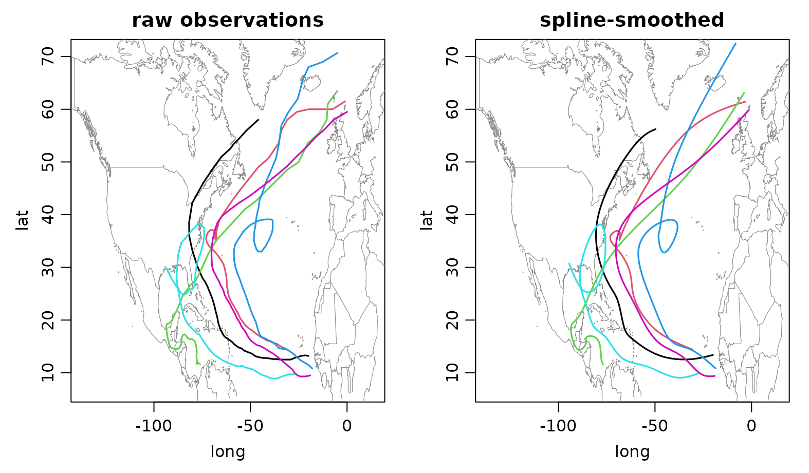

``` r

par(op)
```

The smoothed trajectories pick up the gross recurvature shape without
the 6-hourly sampling jitter and – thanks to the normalised time axis –
without any extrapolation pathology. The same `tb` object also carries
clean smoothed wind / pressure curves for each storm; for example:

``` r

op <- par(mfrow = c(1, 2), mar = c(4, 4, 2, 1))
plot(tf_component(tb, "wind"), col = 1:6, lwd = 2,
     xlab = "lifecycle phase", ylab = "wind (knots)",
     main = "smoothed wind")
plot(tf_component(tb, "pres"), col = 1:6, lwd = 2,
     xlab = "lifecycle phase", ylab = "pressure (mbar)",
     main = "smoothed pressure")
```

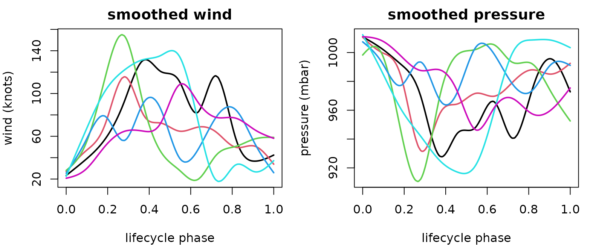

``` r

par(op)
```

## 4. Recap

The two case studies above exercised exactly the same surface:

- construction from per-component `tf` vectors (`tfd_mv(list(...))`),
  from a 3-d `[curve, arg, component]` array, or from a long/wide data
  frame;
- [`tf_components()`](https://tidyfun.github.io/tf/reference/tf_mv_methods.html),
  `$component`,
  [`tf_ncomp()`](https://tidyfun.github.io/tf/reference/tf_mv_methods.html)
  for component access;
- facet vs. trajectory plotting (`plot(..., type = ...)`);
- vctrs-native arithmetic / [`mean()`](https://rdrr.io/r/base/mean.html)
  / `sd()` returning a length-1 `tf_mv`;
- [`tf_arclength()`](https://tidyfun.github.io/tf/reference/tf_arclength.html)
  and
  [`tf_speed()`](https://tidyfun.github.io/tf/reference/tf_geom.html) as
  geometric primitives on the bundle;
- [`tfb_mv()`](https://tidyfun.github.io/tf/reference/tfb_mv.html) for
  smoothing (`basis = "spline"`) or per-component PC decomposition
  (`basis = "fpc"`), and
  [`tfb_mfpc()`](https://tidyfun.github.io/tf/reference/tfb_mfpc.html)
  for joint multivariate FPCA with a single set of shared scores per
  curve ([Happ and Greven 2018](#ref-happ2018));
- the alignment ladder:
  [`tf_reparam_arclength()`](https://tidyfun.github.io/tf/reference/tf_geom.html)
  for constant-speed (shape-only) reparametrization,
  [`tf_register()`](https://tidyfun.github.io/tf/reference/tf_register.html)
  for shared-warp alignment – from a single reference component
  (`method = "cc"`) or jointly from all components
  (`method = "srvf_mv"`) – and
  [`tf_register_shape()`](https://tidyfun.github.io/tf/reference/tf_register_shape.html)
  for full elastic shape registration, whose
  [`tf_rotations()`](https://tidyfun.github.io/tf/reference/tf_registration.html)
  /
  [`tf_scales()`](https://tidyfun.github.io/tf/reference/tf_registration.html)
  accessors expose the estimated rotations and (template-relative) scale
  factors;
- full dplyr / tibble integration via the underlying vctrs proxy.

The common pattern is simple: keep coupled signals bundled as one
object, use component accessors when a scalar or univariate summary is
needed, and let the multivariate methods reuse the existing univariate
kernels component-wise.

## References

Happ, Clara, and Sonja Greven. 2018. “Multivariate Functional Principal
Component Analysis for Data Observed on Different (Dimensional)
Domains.” *Journal of the American Statistical Association* 113 (522):
649–59. <https://doi.org/10.1080/01621459.2016.1273115>.

Joo, Rocío, Matthew E. Boone, Thomas A. Clay, Samantha C. Patrick,
Susana Clusella-Trullas, and Mathieu Basille. 2019. “Navigating Through
the r Packages for Movement.” *Journal of Animal Ecology* 89 (1):
248–67. <https://doi.org/10.1111/1365-2656.13116>.

Marron, J. S., James O. Ramsay, Laura M. Sangalli, and Anuj Srivastava.
2015. “Functional Data Analysis of Amplitude and Phase Variation.”
*Statistical Science* 30 (4): 468–84.
<https://doi.org/10.1214/15-STS524>.

Olshen, Richard A., Edmund N. Biden, Marilynn P. Wyatt, and David H.
Sutherland. 1989. “Gait Analysis and the Bootstrap.” *The Annals of
Statistics* 17 (4): 1419–40. <https://doi.org/10.1214/aos/1176347373>.

Ramsay, James O., and Bernard W. Silverman. 2005. *Functional Data
Analysis*. 2nd ed. Springer Series in Statistics. Springer.

Srivastava, Anuj, and Eric P. Klassen. 2016. *Functional and Shape Data
Analysis*. Springer Series in Statistics. Springer.
<https://doi.org/10.1007/978-1-4939-4020-2>.

Srivastava, Anuj, Eric Klassen, Shantanu H. Joshi, and Ian H. Jermyn.
2011. “Shape Analysis of Elastic Curves in Euclidean Spaces.” *IEEE
Transactions on Pattern Analysis and Machine Intelligence* 33 (7):
1415–28. <https://doi.org/10.1109/TPAMI.2010.184>.

Srivastava, Anuj, Wei Wu, Sebastian Kurtek, Eric Klassen, and J. S.
Marron. 2011. “Registration of Functional Data Using Fisher-Rao Metric.”
*arXiv Preprint arXiv:1103.3817*. <https://arxiv.org/abs/1103.3817>.

Tucker, J. Derek, Wei Wu, and Anuj Srivastava. 2013. “Generative Models
for Functional Data Using Phase and Amplitude Separation.”
*Computational Statistics & Data Analysis* 61: 50–66.
<https://doi.org/10.1016/j.csda.2012.12.001>.
