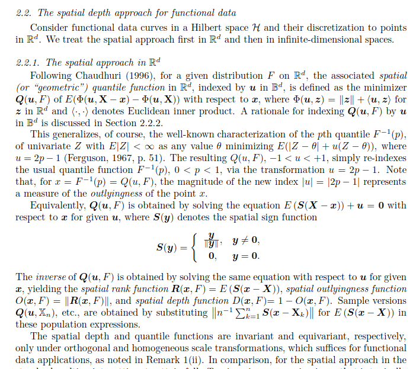

## Functional quantiles

... are hard:

1.  outlyingness/centrality can a) be defined in many different ways and b) only
    yields "center-outward" order, not "above-below"
2.  ordering infinite-dimensional objects seems like an ill-posed problem in
    general (functions cross, there's horizontal (low-high) and vertical
    (early-late) variation, etc...), so even with lots of fancy theory this
    seems like something that is impossible to achieve in full generality (in
    the sense of achieving meaningful, interpretable, reasonable results for
    arbitrary data, like in the scalar case).
3.  a method that is easy to understand intuitively and checks itself before it
    wrecks itself, i.e, comes with diagnostics about whether requesting a
    \*low-to-high\* ordering of functions is a sensible thing to do for a given
    dataset, might be useful.\

### Hard to compute, solid theory, dubious meaning: Directional quantiles for functions

[Serfling](https://personal.utdallas.edu/~serfling/papers/Serfling_and_Wijesuriya_July_13_2016.pdf)
gives definition based on reasonable looking spatial depth / "directional
quantiles" for functions, for specific constant "functional directions"
$u(t) \equiv \pm c \in \mathbb{R}$ :\
\
So these can also be used to define *empirical quantiles* relative to a dataset
of curves, not just distributions.\
*pros*: such quantiles won't necessarily be elements of the dataset, IIUC, they
can interpolate the functions in the dataset\
*cons*:\
- computation seems (very) hard, *for something that might not even work
reliably since the problem is not particularly well posed...*?\
- no internal diagnostics, AFAICT\

### Easy to compute & understand, barely any theory, same dubious meaning: using integrals of rank-transformed functions

Define *simple functional empirical quantiles* based on "how much of the
function is below/above how many other functions in the set":

1.  rough equivalent of order statistics for functions $x:T \to \mathbb{R}$ in
    dataset $X = \{x_1, \dots, x_n\}$ based on "modified epigraph index" MEI:
    $mei(x(t)) = (n|T|)^{-1}\int |\{x'(t) \in X: x(t) > x'(t)\}| dt \in [0, 1]$
2.  the function whose MEI is the $q \in [0,1]$ sample quantile of the MEIs in
    the dataset is the $q$ functional quantile. **That's it, that's the entire
    idea.** (We're using the simplest version of empirical quantiles here, i.e.,
    direct inverse of ECDF, so no interpolation/averaging/etc)

-   computation of this is very easy -- about the same complexity as
    Sun/Genton's efficient MBD-2 implementation: just pointwise ranks of
    function evals and then averaging those per function.
-   for datasets in which functions cross a lot, MEIs will be concentrated
    around 0.5, so its range/dispersion is a diagnostic for whether it even
    makes sense to try to order the functions according to their level. (More
    precisely, the shape of the MEI distribution can tell *which* functional
    quantiles are well defined -- could be that there is a clear ordering at the
    low end but not at the upper end, e.g., and in general, the more non-uniform
    the MEI distribution is the less well-defined this notion of functional
    quantile is...)

```{r, def-mei}
# simple functional "order statistics" based on "modified epigraph index"
mei_order <- function(x, arg = seq_len(ncol(x))) {
  ranks <- apply(x, 2, rank, na.last = "keep", ties.method = "min")
  ranks <- nrow(x) - ranks + 1
  weights <- {
    # assign half interval length to 2nd/nxt-to-last points to 1st and last point
    # assign other half intervals to intermediate points
    lengths <- diff(arg) / 2
    (c(lengths, 0) + c(0, lengths)) / diff(range(arg))
  }
  colSums(t(ranks) * weights, na.rm = TRUE) / nrow(x)
}
pc1 <- function(mei, mbd) {
  pc1 <- svd(cbind(mei, mbd))$u[, 1]
  # flip s.t. high means higher, don'T flip if cor NA (constant)
  sign <- sign(cor(mei, pc1))
  if (!is.na(sign)) pc1 <- sign * pc1
  pc1
}
pc1_order <- function(x, arg = seq_len(ncol(x))) {
  mbd <- tidyfun::mbd(x, arg = arg) #rank?
  mei <- tidyfun::mei(x, arg = arg) #rank?
  pc1(mei, mbd)
}
tf_quantile <- function(tf, q, method = c("mei", "pc1")) {
  assert_numeric(q, lower = 0, upper = 1, any.missing = FALSE)
  method <- match.arg(method)
  #! ... should check tfd_reg or tfb
  tf_mat <- as.matrix(tf)
  arg <- attr(tf_mat, "arg")
  
  rank <- switch(method,
    "MEI" = mei_order(tf_mat, arg = arg),
    "pc1" = pc1_order(tf_mat, arg = arg)
  )
  rank_q <- quantile(rank, q, type = 1) #!! type 1: return observed vals only, no interp
  tf_q <- tf[match(rank_q, rank)]
  names(tf_q) <- names(rank_q)
  tf_q
}
```

#### Examples:

`mbd` is modified 2-band depth, "median" and "quartiles" in middle panel
according to upper definition in gold and blue, and MBD-median in black)

```{r, def-data, echo = FALSE, message = FALSE, warning = FALSE}
library(tidyverse)
library(patchwork)
devtools::load_all() #tidyfun

n <- 70
g <- 50
grid <- seq(0, 1, l = g)

examples <- list(
  par = tfd(outer(1:n, 1:g, `+`), arg = grid),
  cross = tfd(outer(seq(-n/2, n/2, length = n), seq(-1, 1, length = g),  `*`), arg = grid),
  cross2 = tfd(rbind(outer(seq(0, 1, l = n), grid, `+`), outer(seq(0, 1, l = n), rev(grid), `+`) ), arg = grid), 
    #outer(seq(-n/2, n/2, length = n), seq(-1, 1, length = g),  `*`) + matrix(seq(-n/2, n/2, length = n) * rep(c(1, -1), l = n), nrow = n, ncol = g),
    
  gp = tf_rgp(n, grid),
  gp_shift = tf_rgp(n, grid, scale = .05) + seq(0, 10, l = n),
  gp_shift_skew = tf_rgp(n, grid, scale = .05) + 
    10 * qchisq(seq(0.01, 0.99, length = n), df = 1),
  phase_shift1 = sapply(seq(.2, .8, l = n), function(x) dnorm(grid, mean = x, sd = .1)) %>%
    t %>% tfd(arg = grid),
  phase_shift2 = sapply(seq(.2, .8, l = n), function(x) dnorm(2 * grid - 1, mean = x, sd = .1)) %>%
    t %>% tfd(arg = 2 * grid - 1),
  phase_stretch = sapply(seq(1, 6, l = n), function(x) dnorm(pbeta(grid, 1, x), mean = .3, sd = .3)) %>%
    t %>% tfd(arg = grid),
  cca50 = dti_df$cca[1:100] %>% tfd(arg = seq(0, 1, l = 93)),
  rcst50 = dti_df$rcst[1:100] %>% tfd(arg = seq(0.23, 1, l = 93)),
  acti50_zoom500550 = chf_df$activity[1:50] %>% tf_zoom(500, 550), 
  acti50_smooth = chf_df$activity[1:50] %>% tf_smooth()
)
```

```{r, viz}
for (ex in names(examples)) {
  ex_data <- tibble(x = examples[[ex]], mei = mei_order(as.matrix(examples[[ex]])), mbd = tf_depth(x)) %>% 
    mutate(pc1 = pc1(mei, mbd))
  #ex_quart <- tibble(x = tf_quantile(examples[[ex]], c(0.25, 0.5, 0.75)), q = factor(c(0.25, 0.5, 0.75)))
  #ex_pc1 <- tibble(x = tf_quantile(examples[[ex]], c(0.25, 0.5, 0.75)), method = "pc1", q = factor(c(0.25, 0.5, 0.75)))

  p1 <- ggplot() + 
    geom_spaghetti(data = ex_data, aes(y = x, col = mei)) + 
    scale_color_gradient2(mid = "gray80", midpoint = 1/2, limits = c(0, 1)) +
    labs(title = ex, 
      subtitle = paste0("MEI range:", paste(round(range(ex_data$mei), 3), collapse = "-"))) +
    theme_minimal() +  theme(legend.position = "bottom")
  if(FALSE) {
  p2 <- ggplot() + 
    geom_spaghetti(data = ex_data, aes(y = x), col = "grey80") +
    geom_spaghetti(data = ex_quart, aes(y = x, col = q), lwd = 1) +
    geom_spaghetti(data = ex_data %>% filter(mbd == max(mbd)), aes(y = x), lwd = 1, col = "black", alpha = .5) +
    scale_color_manual(values = c("cyan", "gold", "blue"), guide = guide_none()) +
    theme_minimal() + labs(subtitle = paste0("MEI quartiles, MBD median"))
  }
  p3 <- ggplot(ex_data) + 
    geom_spaghetti(aes(y = x, col = mbd)) + 
    scale_color_viridis_c() +
    theme_minimal() + theme(legend.position = "bottom")
  p4 <- ggplot(ex_data) + geom_point(aes(x = mbd, y = mei, col = pc1)) + 
    scale_color_viridis_c()
  p5 <- ggplot() + 
    geom_spaghetti(data = ex_data, aes(y = x, col = pc1)) + 
    scale_color_viridis_c() +
    theme_minimal() + theme(legend.position = "bottom")
  p6 <- ggplot(ex_data) + geom_point(aes(y = mbd, x = pc1)) + 
    scale_color_viridis_c()
  p7 <- ggplot(ex_data) + geom_point(aes(y = mei, x = pc1)) + 
    scale_color_viridis_c()
  print((p1 + p4) / (p3 + p5) / (p6 + p7))
}
```

#### Conclusions, tentative

-   for data in which "above-below" is a well defined notion over the entire
    domain, this seems to mostly yield reasonable answers. (in idealized cases,
    even the same as MBD)
-   breaks, as expected, for data with lots of crossing curves where there is no
    useful "level" variability: `cross`, `phase_shift1`
-   MBD medians for real data examples seem more reasonable than MEI medians -
    less frequently at extremes of the data. MEI averages local properties of
    the curve relative to all other curves while MBD considers all triplets of
    curves (all 2-bands vs function, so more "stable", maybe? *think more about
    this, might be exploitable somehow*)

desiderata for better f-quantiles: - symmetric (1-q/2, q/2)-quantiles should not
cross (prob. impossible if data cross a lot and fun. quantiles are (very similar
to) actual observed curves) - that

### Even more stupid ideas

**f-quantile by removing deepest curves**

idea: for scalar data, if we remove the middle q% of data, the min/max of the
remainder are (1-q/2, q/2) quantiles. So:

-   remove q% deepest curves based on suitable depth
-   find lowest/highest MEI (w.r.t to the deepest middle q% only! otherwise
    should be same as MEI-based q's as above) of remainder to get (1-q/2, q/2)
    f-quantiles
-   prob. needs different MEI implementation than above since it's no longer
    "in-sample" MEI ("rank remaining curves relative to removed", not "rank all
    curves pointwise"), might be computationally heavy(?)

**f-quantiles via function bands/envelopes**

-   find 2 deepest curves s.t. their 2-band contains q% of curves --\> (1-q/2,
    q/2) f-quantiles
    -   very likely not possible in general for curves with many crossings\
    -   seems like a hard computation, too, at least quadratic in \# of curves
-   alternative: find 2 deepest curves s.t. their 2-band contains q% of function
    evaluations

**something different: use data-driven directions for spatial depth**

IIUC, Serfling uses constant negative/positive functions as directions, which
makes sense to induce an "above-below" ordering of functions. But that's maybe
not a sensible ask for data with lots of crossings, dominant phase var, etc.

-   could it make more sense to use directions derived from FPCs? (i.e, in
    multivariate data, would use first PC as direction to use "most important
    mode of variation"-- *is there lit on this?*)\
-   could maybe even use multiple directions weighted by EVs if first FPC is not
    "large"/dominant...?
-   does this yield basically the same thing as Hyndman/Shang's functional
    bag/boxplots that use half-space depth of FPC score vectors for constructing
    f-medians and "deepest q%" function bands? seems close...
