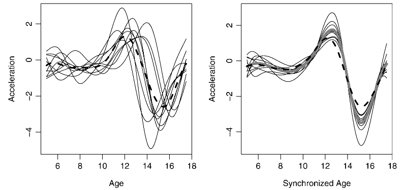
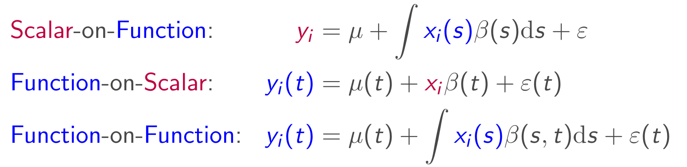

```{r setup, include=FALSE}
library(knitr)
knitr::opts_chunk$set(
  collapse = TRUE,
  size = 'footnotesize',
  cache = TRUE,
  fig.width = 8, fig.height = 5.5, 
  warning = FALSE, message = FALSE)

library(tidyverse)
library(refund)
library(mgcv)
library(ggplot2)
library(patchwork)
library(viridisLite)
theme_set(theme_minimal())
options(
  ggplot2.continuous.colour = "viridis",
  ggplot2.continuous.fill = "viridis"
)
scale_colour_discrete = scale_colour_viridis_d
scale_fill_discrete = scale_fill_viridis_d

library(tidyfun)

pal_5 = viridis(7)[-(1:2)]
format_glimpse.tf <- tf:::format.tf
```

```{r load, echo=FALSE, include=FALSE}
dti = with(refund::DTI, 
           data.frame(id = ID, sex = sex, 
                      case = factor(ifelse(case, "MS", "control")))) |> 
  as.tbl() |> 
  mutate(cca = tfd(DTI$cca, seq(0,1, l = 93), resolution = .01) |>
           tfd(arg = round(seq(0,1,l = 93), 3)),
         rcst = tfd(DTI$rcst, round(seq(0, 1, l = 55), 3), resolution = .01))
set.seed(1221)
ex_data = dti$cca[1:5, seq(0, 1, l = 93), interpolate = TRUE]
rownames(ex_data) = LETTERS[1:5]
ex = tfd(ex_data, signif = 2)
dti_wide <- select(dti, -rcst) |> tf_spread()
dti_long <- select(dti, -rcst) |> tf_unnest()
dti_mat <- select(dti, -rcst)
dti_mat$cca <- as.matrix(dti$cca) 
attr(dti_mat$cca, "arg") <- NULL
dti_mat$cca <- unname(dti_mat$cca)

biscuit_nirc <- tfd(t(fds::nirc$y), arg = fds::nirc$x)
pigweight <-  tfd(t(fds::Pigweight$y), arg = fds::Pigweight$x)
weather <- fda::CanadianWeather
canada <- data.frame(
  place = weather$place,
  region = weather$region,
  lat = weather$coordinates[, 1],
  lon = -weather$coordinates[, 2],
  region = weather$region
)
canada$temp <- tfd(t(weather$dailyAv[, , 1]), arg = 1:365)
canada$precipl10 <- tfd(t(weather$dailyAv[, , 3]), arg = 1:365) |> tf_smooth()
canada_map <-
  data.frame(maps::map("world", "Canada", plot = FALSE)[c("x", "y")])
#' # map of canada with annual temperature averages in red, precipitation in blue:
#' ggplot(canada, aes(x = lon, y = lat)) +
#'   geom_capellini(aes(tf = precipl10), width = 3, height = 5, colour = "blue") +
#'   geom_capellini(aes(tf = temp), width = 3, height = 5, colour = "red") +
#'   geom_path(data = canada_map, aes(x = x, y = y), alpha = 0.1) +
#'   coord_quickmap()
format_glimpse.tf <- tf:::format.tf
```

# Functional Data

## What is Functional Data?

```{r}
#| echo: false
ggplot(tibble(x = biscuit_nirc)) + geom_spaghetti(aes(tf = x), alpha = .2) + 
  labs(y = "NIR Reflectance", x = "Wavelength [nm]", 
       subtitle = "Biscuit Dough Spectroscopy") + 
  ggplot(tibble(x = tf_sparsify(pigweight, dropout = .2) |> tf_jiggle())) + 
  geom_polpette(aes(tf = x), alpha = .2) + 
  labs(y = "Weight [kg]", x = "Time [weeks]", 
       subtitle = "Pig Fattening") + 
  ggplot(canada) + 
  geom_spaghetti(aes(tf = temp, col = region), alpha = .4) + 
  labs(y = "Temperature [°C, Average]", x = "DOY", 
       subtitle = "Canada Temperatures") +
  theme(legend.position = "bottom") +
  ggplot(subset(dti, case == "MS")) + 
  geom_spaghetti(aes(tf = cca, col = sex), alpha = .2) + 
  labs(y = "Fractional Anisotropy", x = "Distance", 
       subtitle = "Corpus Callosum (MS patients)") +
  theme(legend.position = "bottom")
```

## What is "functional data"?

*Formally:*

Observations of a function-valued random variable, i.e. a *stochastic process*, defined over some compact domain.

*Pragmatically*, arise from:

-   Repeated measurements for the same statistical unit, usually over time or space,
-   with smooth variation that could be assessed (in principle) as often as desired.

Properties of *real-world functional data*:

- Sampling grids not necessarily identical across units or equally spaced, often sparse
- Noisy observations: stochastic process + (measurement) error

## Aims of functional data analysis:

-   Represent the data $\to$ interpolation, **basis representation, smoothing**  
$x_i(t) \approx \sum_j B_j(t) w_{ij}$

```{r x-xsm}
#| echo: false
#| message: false
#| out-width: 100%

set.seed(1337)
x <- tf_rgp(1, nugget = .2, arg = 201L, scale = .01) |> tf_sparsify(.7)
x_sm <-tfb_spline(x, verbose = FALSE)
layout(t(1:2))
plot(x, points = TRUE, alpha = .2, ylab = "x(t)", xlab = "t", pch = 19, cex = .5, 
     ylim = range(tf_evaluations(x)))
plot(x_sm, xlab = "t", ylim = range(tf_evaluations(x)), lwd = 2)
points(x, pch = 19, cex = .5, alpha = .5)
```

## Aims of functional data analysis:

-   **Represent** the data $\to$ interpolation, basis representation, smoothing
-   Display the data $\to$ **exploratory analysis, outlier detection**, registration 

```{r}
#| echo: false
#| message: false
#| out-width: 100%

t_summary <- canada$temp |> summary() 
t_summary <- tibble(id = names(t_summary), t_summary) |> 
  pivot_wider(names_from = id, values_from = t_summary)

ggplot(canada) + geom_spaghetti(aes(tf = temp)) +
ggplot(t_summary) + 
  geom_spaghetti(aes(tf = median)) + 
  geom_papardelle(aes(fmin = lower_mid, fmax = upper_mid)) + 
  geom_spaghetti(data = filter(canada, tf_depth(temp) < .2), 
                 aes(tf = temp), alpha = .3, col = "red")
```

## Aims of functional data analysis:

-   Represent the data $\to$ interpolation, basis representation, smoothing
-   Display the data $\to$ exploratory analysis, outlier detection, **registration** 

{width=60%} 

<span style="font-size: 0.8em;">Fig.: James (2007). Curve Alignment by Moments. *AoAS* 1(2):480--501</span>

## Aims of functional data analysis:

-  **Represent** the data $\to$ interpolation, basis representation, smoothing
-  **Display** the data $\to$ exploratory analysis, registration, outlier detection
-   Study sources of pattern and variation $\to$ **functional principal component analysis**, canonical correlation analysis
 
```{r x-fpc}
#| echo: false
#| message: false
#| fig-asp: .5
#| out-width: 100%

tfpc <- canada$temp_fpc <- tfb_fpc(canada$temp)
fpcs <- attr(tfpc, "basis_matrix") |>  t() |> as.tfd() |> tf_smooth() |> 
  suppressMessages()
fpcs <- tf_rebase(fpcs, fpcs, arg = seq(1, 365, l = 51)) * 
  sqrt(c(1, attr(tfpc, "score_variance")/365)) 
dfpc <- tibble(mean = fpcs[1], pc1 = fpcs[2], pc2 = fpcs[3])
p <- ggplot(canada) + geom_spaghetti(aes(tf = temp_fpc)) +
  #ggplot(dfpc) + geom_spaghetti(aes(tf = mean)) + ylim(range(as.matrix(tfpc))) 
  ((ggplot(dfpc) + geom_spaghetti(aes(tf = mean)) +
      geom_polpette(aes(tf = mean - 3 * pc1), col = "blue", shape = "+") +
      geom_polpette(aes(tf = mean + 3 * pc1), col = "red", shape = "-") +
      ylim(range(as.matrix(tfpc))) + labs(subtitle = "mean +/- 1st FPC")) /
     (ggplot(dfpc) + geom_spaghetti(aes(tf = mean)) +
        geom_polpette(aes(tf = mean - 3 * pc2), col = "blue", shape = "+") +
        geom_polpette(aes(tf = mean + 3 * pc2), col = "red", shape = "-") +
        ylim(range(as.matrix(tfpc))) + labs(subtitle = "mean +/- 2nd FPC")))
p
```

## Aims of functional data analysis:

-   **Represent** the data $\to$ interpolation, basis representation, smoothing
-   **Display** the data $\to$ exploratory analysis, registration, outlier detection
-   **Study** sources of pattern and variation $\to$ functional principal component analysis, canonical correlation analysis
-   **Explain** variation in a dependent variable by using independent variable information $\to$ **functional regression models**
{width=100%}
-   ~~Forecasting / extrapolation~~ $\rightarrow$ time series analysis (mostly), not FDA

## Functional data in practice

**Painful** to work with:

- huge amounts of data
- regular grids? irregular grids?
- work with:
    -   raw data?
    -   smooth/interpolated data?
    -   coefficient vectors of basis representations?  

## Functional data in practice

**Painful:**\
Two (2.5, actually..) bad options to keep it in the same `data.frame` as the rest of your data:

1.  **wide** format:\
    -   does not work (well) for sparse/irregular data
    -   way too many weird columns
    -   need to keep track of argument values $t$ separately somehow:

```{r, echo = FALSE}
glimpse(dti_wide)
```

## Functional data in practice

**Painful:**\
Two (2.5, actually..) bad options to keep it in the same data.frame as the rest of your data:

2.  **long** format:
    -   unwieldy amounts of rows, lots of duplication in all "not functional data"- columns
    -   need to keep track of grouping structure (which rows belong to the same observation?) throughout
    -   infeasible if different functions for same observational unit are evaluated on different argument values 

```{r, echo = FALSE}
glimpse(dti_long)
```

## Functional Data in Practice

**Painful** to work with:

Third bad option: **matrix columns** in a `data.frame`.

Sucks, too:

- not well supported: breaks many `tidyverse`-packages, lots of unpleasant surprises in `R-base`
- doesn’t keep track of argument values 
- doesn't work for irregular grids

-- more trouble than it’s worth.

## Functional Data in Practice

Despite all that, people keep measuring ever more of the damn things.

`{tf}` + `{tidyfun}`  try to make dealing with functional data in **`R`** less painful:

- treat *functions* as primary observational units
- easy conversion between different representations of functional data
- implement common tasks in exploratory & descriptive analyses of functional data:  
  graphics, arithmetic, smoothing, derivatives & integrals, summaries, extracting landmarks, ....


# Start at the end...

## This is what we're aiming for:

```{r, echo = TRUE, out.height = '.4\\textheight', fig.width = 6, fig.height = 2}
# group-wise functional medians:
medians <- dti |> 
  group_by(case, sex) |> 
  summarize(median_rcst = median(rcst))
# plot them:
ggplot(medians, 
       aes(tf = median_rcst, 
           col = sex, 
           linetype = case)
       ) + 
  geom_spaghetti(linewidth = 1.5)
```

## This is what we're aiming for:

```{r}
glimpse(dti)
```

# **`tidyfun` & `tf`**

## Collaborators  

{height=70%}


## **`tidyfun` & `tf`**

> Provide accessible and well-documented software 
> that makes **data wrangling** and **exploratory analysis** 
> for **functional data** in `R`  **easy & fun**

**`{tf}`** provides:  

- new **data types** for representing functional data: `tfd` & `tfb`, based on the `{vctrs}`**-framework  
 (so: `S3`-classes). 
- arithmetic **operators**, descriptive **statistics** and R-`base` **graphics** functions for such data
- with few dependencies (particulary: no  `{tidyverse}`)

**`{tidyfun}`** provides:  

- `{ggplot2}`-geoms for functional data
- `tidyverse`-verbs for handling functional data **inside** data frames.


## Plan for today

- `tf` class + subclasses
- methods & functions in `{tf}`, `{tidyfun}` 

# `tf` class definition

##  `tf` class

**`tf`** is a new data type for (vectors of) functional data: 

- an abstract superclass for functional data in 2 forms:
    - as **(argument, value)-tuples**: subclass **`tfd`**, also irregular or sparse
    - or in **basis representation**: subclass **`tfb`**
    
- basically, a glorified `list` of numeric vectors  
  (... since `list`s work well as columns of data frames ...)

- with additional attributes that define *function-like* behavior:
    - how to **evaluate** the given "functions" for new arguments
    - their **domain**: the range of valid argument values 

- implemented as `S3`-classes using `{vctrs}`-infrastructure 

## Example Data

```{r, ex-fig, echo = FALSE, out.height = '.45\\textheight', fig.width = 6, fig.height = 4}
plot(ex,  xlim = c(-0.15, 1), col = pal_5)
text(x = -.1, y = ex[,0.07], labels = names(ex), col = pal_5)
```

```{r}
ex
```

## Example Data

```{r}
glimpse(dti)
```

## **`tf`** subclass: **`tfd`**

**`tfd`** objects contain "raw" functional data:

 - represented as a list of `evaluations` $f_i(t)|_{t=\mathbf{t'}}$ and corresponding `arg`ument vector(s) $\mathbf{t'}$
 - has a `domain`:  the range of valid `arg` values.

```{r}
ex |> tf_evaluations() |> str()

ex |> tf_arg() |> str()

ex |> tf_domain()
```

## **`tf`** subclass: **`tfd`**

- contains an `evaluator` function that defines how to inter-/extrapolate `evaluations` between `arg`s 

```{r}
ex_spline <- ex
tf_evaluator(ex_spline) <- tf_approx_spline
ex_spline[1]
ex[1]
```

## **`tf`** subclasses: **`tfd`**

subclasses `tfd_reg` for regular data with a common grid and `tfd_irreg` for irregular / sparse data:

```{r, out.height = '.30\\textheight', fig.width = 6, fig.height = 4.5}
dti$rcst[1:2]
dti$rcst[1:2] |> tf_arg() |> str()
dti$rcst[1:2] |> plot(pch = "x", col = viridis(2))
```


## **`tf`** subclass: **`tfb`**

Functional data in basis representation: $x_i(t) \approx \sum^K_j B_j(t) w_{ij}$

 - represented as a list of *coefficient vectors* $\mathbf{w}_i$ and a common `basis_matrix` $\mathbf B = [B_j(t_g)]_{g = 1, \dots, G \atop j = 1, \dots, K}$ of basis function evaluations on a vector of `arg`-values
 - contains a `basis` function that defines how to compute the basis for new `arg`s and how to differentiate/integrate.
- (internal) flavors: 
    - `tfb_spline`: use any `{mgcv}`-spline basis 
    - `tfb_fpc`: FPC basis 

- significant memory (and time) savings:
```{r, cache = TRUE}
refund::DTI$cca |> object.size() |> print(units = "Kb")

dti$cca |> object.size() |> print(units = "Kb")

dti$cca |> tfb(verbose = FALSE) |> object.size() |> print(units = "Kb")
```

## **`tf`** subclass: **`tfb`**

```{r}
dti$rcst[1:5] |> tfb() 
```

## **`tf`** subclass: **`tfb_spline`**
- default for `tfb()`
- accepts all arguments of `{mgcv}`'s `s()`-syntax:  
  e.g. basis function type `bs`, basis dimension `k`, penalty order `m`, ...
- also does non-Gaussian (penalized) spline fits: `family` argument 
    - all exponential families
    - but also: $t$-distribution (robust smoothing), ZI-Poisson (accelerometry), Beta, ... 

## **`tf`** subclass: **`tfb_spline`**

```{r, message = TRUE}
ex_b = ex |> tfb(); ex_b[1:2]

ex[1:2] |> tfb(bs = "tp", k = 55)

ex[1:2] |> tfb(bs = "ps", m = c(2,1), family = betar(link = "cloglog"))
```

## **`tf`** subclass: **`tfb`** spline basis

- penalization: <span style="color:red;">function-specific (default)</span>, none, prespecified (`sp`), or global 

```{r, eval = FALSE}
ex |> plot()
ex |> tfb() |> plot(col = "red")
```
```{r, echo = FALSE, results = 'hide', out.height = '.4\\textheight', fig.width = 8, fig.height = 4}
layout(t(1:2))
plot(ex, alpha = 1)
plot(ex |> tfb(verbose = FALSE), col = "red", ylab = "tfb(ex)")
```

## **`tf`** subclass: **`tfb`** spline basis

- penalization: <span style="color:red;">function-specific (default)</span>, <span style="color:blue;">none</span>, prespecified (`sp`), or global 

```{r, eval = FALSE}
ex |> plot()
ex |> tfb() |> plot(col = "red")
ex |> tfb(k = 35, penalized = FALSE) |> lines(col = "blue")
```
```{r, echo = FALSE, results = 'hide', out.height = '.4\\textheight', fig.width = 8, fig.height = 4}
layout(t(1:2))
plot(ex, alpha = 1)
plot(ex |> tfb(verbose = FALSE), col = "red", ylab = "tfb(ex)")
lines(tfb(ex, k = 35, penalized = FALSE, verbose = FALSE), col = "blue")
```

## **`tf`** subclass: **`tfb`** spline basis

- penalization: <span style="color:red;">function-specific (default)</span>, none, <span style="color:orange;">prespecified (`sp`)</span>, or global

```{r, eval = FALSE}
ex  |> plot()
ex |> tfb() |> plot(col = "red")
ex |> tfb(sp = .001) |> lines(col = "orange")
```
```{r, echo = FALSE, results = 'hide', out.height = '.4\\textheight', fig.width = 8, fig.height = 4}
layout(t(1:2))
plot(ex, alpha = 1)
plot(ex |> tfb(verbose = FALSE), col = "red", ylab = "tfb(ex)")
lines(tfb(ex, sp = .001), col = "orange")
```

## **`tf`** subclass: **`tfb`** spline basis

**"Global" smoothing**:  

1. estimate smoothing parameters for subsample (~10\%) of curves
2. use geometric mean of estimated smoothing parameters to smooth *all* curves

**Pros:**

- (much) faster than optimizing amount of smoothing for each curve
- scales better for large data sets

**Cons:**

- needs more observations than basis functions *for every curve*.
- subsample could miss small subgroups with different roughness
- not much borrowing of information across curves (e.g. for very sparse or functional fragment data, e.g.)


<!--*Should global smoothing be the default?*-->

## **`tf`** subclass: **`tfb`** spline basis

**Global** smoothing: 

```{r, echo = FALSE}
set.seed(1212)
raw <- c(
  tf_rgp(5, scale = 0.2, nugget = .05, arg = 101L) - 5,
  tf_rgp(5, scale = 0.02, nugget = .05, arg = 101L),
  tf_rgp(5, scale = 0.002, nugget = .05, arg = 101L) + 5)
```

```{r, eval = FALSE}
raw |> plot() 
tfb(raw, k = 55) |> plot() #curve-specific smoothing
tfb(raw, k = 55, global = TRUE) |> plot() #global smoothing
```

```{r, echo = FALSE, results = 'hide', out.height = '.5\\textheight', fig.width = 10, fig.height = 4}
layout(t(1:3))
clrs <- scales::alpha(sample(viridis(15)), .5)
plot(raw, main = "raw data", col = clrs)
plot(tfb(raw, k = 55), main = "curve-specific", col = clrs)
plot(tfb(raw, k = 55, global = TRUE), main = "global", col = clrs)
```

## **`tf`** subclass: **`tfb`** FPC-based

- defaults to simple (weighted, truncated) SVD of the data matrix to get FPCs
  - nuclear-norm regularized SVD^[Dasa & Neumaier (2011). Fast regularized low rank approximation of weighted data sets. In *Proc. Mat. Univ.* (pp. 1-29).] for partially missing / irregular inputs
  - easy to extend for your favorite FPCA algorithm, see `?tfb_fpc` for example
- estimated FPCs and mean function saved as basis matrix, observed functions are simply linear combinations of those.

```{r}
(ex |> tfb_fpc(pve = .999))
(ex |> tfb_fpc(pve = .9))
```

## **`tf`** subclass: **`tfb`** FPC-based

```{r, eval = FALSE}
ex |> plot()
ex |> tfb_fpc(smooth = FALSE, pve = .999) |> plot(col = "red")
ex |> tfb_fpc(pve = .9) |> lines(col = "blue")
```

```{r, echo = FALSE, results = 'hide', out.height = '.4\\textheight', fig.width = 8, fig.height = 4}
layout(t(1:2))
plot(ex, alpha = 1)
plot(ex  |> tfb_fpc(smooth = FALSE, pve = .999), col = "red", ylab = "tfb_fpc(ex)")
lines(ex |> tfb_fpc(pve = .9), col = "blue")
```

# Methods for `tf` objects 

## Subset & subassign

Special `[`-methods:

```{r}
ex[1:2]

ex[1:2] = ex[2:1]
ex
```

## Evaluate anywhere

Overload second argument for `[` as *"evaluate the function at"*:

```{r, warning  = FALSE}
ex[1:2, seq(0, 1, l = 5)]

ex["B", seq(0, .15, l = 3), interpolate = FALSE]

ex[1:2, c(0, 1), matrix = FALSE] |> str()
```

## Compare & compute

```{r, echo = FALSE}
n_ex = names(ex)

ex = unname(ex)
```

```{r}
ex[1] + ex[1] == 2 * ex[1]

log(exp(ex[2])) == ex[2]

ex - (2:-2) != ex 
```

```{r, echo = FALSE}
names(ex) = n_ex
```

## Arithmetic with `tfb`

:::{.callout-warning}
Computations that cannot be expressed as operations
on the basis coefficients lose numerical precision for `tfb`:
:::

```{r}
#| warning: true
ex_b <- tfb(ex, verbose = FALSE)

(2 * ex_b) / 2 == ex_b

(ex_b + 0) - ex_b

log(exp(ex_b)) - ex_b
```

## Summarize 

Functional summaries like mean or median functions etc:

```{r}
c(mean = mean(ex), sd = sd(ex))

# Modified Band-2 Depth (Sun/Genton/Nychka, 2012)
tf_depth(ex) 

median(ex) == ex[which.max(tf_depth(ex))]
```

## (Simple, local) smoothing

```{r, eval  = FALSE}
ex |> tf_smooth("lowess") |> plot()
ex |> tf_smooth("rollmedian", k = 5) |> plot()
```
```{r, echo = FALSE, fig.height = 4.5}
layout(t(1:2))
ex |> plot(alpha = .2, ylab = "lowess")
ex |> tf_smooth("lowess") |> lines(col = pal_5)
plot(ex, alpha = .2, ylab = "rolling median (k=5)")
lines(tf_smooth(ex, "rollmedian", k = 5), col = pal_5)
#plot(ex, alpha = .2, ylab = "Savitzky-Golay (quartic, 11 steps)")
#lines(tf_smooth(ex, "savgol", fl = 11), col = pal_5)
```

## Differentiate & integrate
```{r, eval  = FALSE}
ex[1:2] |> tf_smooth() |> plot()
ex[1:2] |> tf_smooth() |> tf_derive() |> plot()
ex[1:2] |> tf_integrate(definite = FALSE) |> plot()
```
```{r, echo = FALSE, fig.height = 4.5}
layout(t(1:3))
plot(tf_smooth(ex[1:2]), col = pal_5[c(1,4)], ylab = "tf_smooth(ex[1:2])")
plot(tf_derive(tf_smooth(tfd(ex[1:2], signif = 4))), col = pal_5[c(1,4)], ylab = "tf_smooth(ex[1:2]) |> tf_derive")
plot(tf_integrate(tf_smooth(ex[1:2]), definite = FALSE), col = pal_5[c(1,4)])
```
```{r}
ex[1:2] |> tf_integrate()
```

## Query

Find `arg`uments $t$ satisfying a condition on `value` $x_i(t)$ (and on `arg`ument $t$, optionally):

:::: {.columns}

::: {.column width="50%"}
```{r}
ex |> tf_anywhere(value > .62)

ex[1:2] |> tf_where(value > .62, return = "all")

ex["B"] |> tf_where(value > .62, return = "range")

ex |> tf_where(value > .62 & arg > .5, 
               return = "first")
```
:::

::: {.column width="50%"}
```{r ex-fig2, fig.height=5, fig.width=5, echo = FALSE}
#| out-width: 100%
plot(ex,  xlim = c(-0.15, 1), col = pal_5, lwd = 2)
text(x = -.1, y = ex[,0.07], labels = names(ex), col = pal_5, cex = 1.5)
lines(median(ex), col = pal_5[3], lwd = 4)
```
:::

::::

## Zoom & query

```{r}
ex |> tf_where(value == max(value), "first")

# locations of maxima on [.5, 1]:
ex[c("A", "D")] |> tf_zoom(.5, 1) |> tf_where(value == max(value), "first")

# which functions dip below the median curve anywhere in [0.2, 0.6]:
ex |> tf_zoom(0.2, 0.6) |> tf_anywhere(value < median(ex)[, arg])
```

```{r ex-fig2b, echo = FALSE, out.height = '.35\\textheight', fig.width = 6.5, fig.height = 4}
plot(ex,  xlim = c(-0.15, 1), col = pal_5, lwd = 2)
text(x = -.1, y = ex[,0.07], labels = names(ex), col = pal_5, cex = 1.5)
lines(median(ex), col = pal_5[3], lwd = 4)

```

## Convert & construct

To & from list, matrix or data frame^[with `"id, arg, value"`-columns]:

```{r}
ex_matrix = ex |> as.matrix(); str(ex_matrix)

ex_matrix[1:2, ] |> tfd()

ex_df = ex |> tf_unnest(); str(ex_df)

tfd(ex_df) == tfd(ex_matrix)
```

Same for `tfb`.

## Change representation: `tf_rebase`

Make the representation of a `tf`-object identical to that of another --  
e.g. switch from `tfd` to `tfb` or harmonize details of evaluation/basis representation:

```{r}
cca_fpc <- tfb_fpc(dti$cca)
cca_fpc[1]

ex_b15 <- tfb(ex, k = 15)
tf_rebase(object = ex_b15, basis_from = cca_fpc)[1]

tf_rebase(object = dti$cca, basis_from = ex_b15)[1]
```

-- crucial for many operations to make functional data commensurable!

# Visualize `tf` objects

## Visualize: `base` 

```{r ex-fig3,  out.height = '.35\\textheight', fig.width = 8, fig.height = 4}
layout(t(1:2))

plot(ex, type = "spaghetti")
lines(c(median(ex), mean(ex)), col = c(2, 4))

plot(ex, type = "lasagna", col = viridis(50))
```

## Visualize: `{ggplot2}`

*Pasta-themed* `geom`s for functional data:

- `geom_spaghetti` for lines
- `geom_polpette` for (lines &) points
- `geom_pappardelle`  for ribbons
- `geom_capellini` for little sparklines / glyphs on maps etc. 
- `gglasagna` for heatmaps, with an `order`-aesthetic for sorting rows (lasagna layers)

## `{ggplot2}`: line plots

:::: {.columns}

::: {.column width="40%"}
```{r, eval = FALSE}
ggplot(dti, 
       aes(tf =  cca, colour = case)) +
  geom_spaghetti() + 
  facet_wrap(~ sex)
```
:::

::: {.column width="60%"}
```{r, dti-fig1, echo = FALSE,  fig.width = 6, fig.height = 6}
#| out-height: 100%

ggplot(dti) + 
  geom_spaghetti(aes(tf =  cca, col = case, alpha = 1*(case == "control"))) + 
  facet_wrap( ~ sex, nrow = 2) + scale_alpha(guide = 'none', range = c(.2, .4)) + 
  theme(legend.position = "bottom", )
```
:::

::::

## `{ggplot2}`: ribbon plots
:::: {.columns}

::: {.column width="40%"}

```{r, eval = FALSE}
dti |>
  group_by(sex, case) |>
  summarize(
    mean_cca = mean(cca),
    sd_cca = sd(cca),
    hi_cca = mean_cca + sd_cca,
    lo_cca = mean_cca - sd_cca
  ) |> 
  ggplot(
    aes(tf = mean_cca, 
        color = sex, 
        fill = sex)
  ) +
  geom_papardelle(
    aes(fmax = hi_cca, fmin = lo_cca), 
    alpha = 0.3
  ) +
  geom_spaghetti(
    alpha = .9, linewidth = 2
  ) +
  facet_grid(~ case) 
``` 
:::

::: {.column width="60%"}
```{r, echo=FALSE, fig.width = 5, fig.height= 5}
#| out-height: 100%
dti |>
  group_by(sex, case) |>
  summarize(
    mean_cca = mean(cca),
    sd_cca = sd(cca),
    hi_cca = mean_cca + sd_cca,
    lo_cca = mean_cca - sd_cca
  ) |> 
  ggplot(aes(tf = mean_cca, color = sex, fill = sex)) +
  geom_papardelle(aes(fmax = hi_cca, fmin = lo_cca), alpha = 0.3) +
  geom_spaghetti(alpha = .9, linewidth = 2) +
  facet_wrap(~ case, nrow = 2) + 
  theme(legend.position = "bottom")
``` 
:::

::::
## `{ggplot2}`: heatmaps

```{r, eval = FALSE}
gglasagna(dti, 
          tf =  cca, 
          order = tf_integrate(cca, definite = TRUE)) +
  facet_wrap(~ case)
```

```{r, dti-fig2, echo = FALSE}  
#| out-width: 100%
#| out-height: 40%
#| fig-height: 3.5
gglasagna(dti[1:100,], tf =  cca, order = tf_integrate(cca, definite = TRUE)) + 
  theme(axis.text.y = element_text(size = 6)) + 
  facet_wrap(~ case, ncol = 2, scales = "free_y")
```


## `{ggplot2}`: glyph plot maps

Plots for spatial functional data:

```{r}
weather <- fda::CanadianWeather
canada <- data.frame(
   place = weather$place,
   region = weather$region,
   lat = weather$coordinates[,1],
   lon = -weather$coordinates[,2],
   region = weather$region)
canada$temp <- tfd(t(weather$dailyAv[,,1]), arg = 1:365)
canada$precipl10 <- tfd(t(weather$dailyAv[,,3]), arg = 1:365) |> tf_smooth()
glimpse(canada)
```

## `{ggplot2}`: glyph plot maps

```{r, eval = FALSE}
canada_map <- maps::map("world", "Canada") |> data.frame()
map_plot <- ggplot(canada, aes(x = lon, y = lat)) + 
  geom_path(data = canada_map, aes(x = x, y = y), alpha = .3) 

map_plot + geom_cappellini(aes(tf = precipl10), colour = "blue") + 
  labs(subtitle = "Precipitation [log10]") +
map_plot + geom_cappellini(aes(tf = temp), colour = "red") +
  labs(subtitle = "Temperature")
```


```{r, echo = FALSE, out.height = '.5\\textheight', fig.width = 10, fig.height = 5}
canada_map <-
   data.frame(maps::map("world", "Canada", plot = FALSE)[c("x", "y")])
 # maps of Canada with annual temperature averages in red, precipitation in blue:
map_plot <- ggplot(canada, aes(x = lon, y = lat)) + 
  geom_path(data = canada_map, aes(x = x, y = y), alpha = .3) +
  coord_quickmap()
map_plot + 
  geom_cappellini(aes(tf = precipl10), width = 5, height = 4, line.linetype = 1, colour = "blue", 
                  box.alpha = .8, box.fill = "white", box.colour = "black") + 
  labs(subtitle = "Precipitation [log10]") +
map_plot + 
   geom_cappellini(aes(tf = temp), width = 5, height = 4, line.linetype = 1, colour = "red", 
                  box.alpha = .8, box.fill = "white", box.colour = "black") +
  labs(subtitle = "Temperature")
```

# Wrangling `tf`s inside data frames

## Wrangling `tf`s inside data frames: `dplyr`

`{dplyr}` verbs like  
`filter`, `select`, `mutate`, `summarize`  
simply work on `tf`-columns - e.g.:

```{r, dplyr}
# group-wise functional means:
dti |> group_by(case, sex) |> 
  summarize(mean_rcst = mean(rcst, na.rm = TRUE))

# select subjects that go below cca = .26:
dti |> filter(tf_anywhere(cca, value < .26))
```

## Wrangling `tf`s inside data frames: `dplyr`

```{r, dplyr2}
# mutate to save smooth and derived functional data:
dti |> 
  select(c(id, rcst)) |> 
  mutate(
    rcst_smooth = tfb(rcst, k = 15, verbose = FALSE),
    rcst_deriv = tf_derive(rcst_smooth)) |> 
  glimpse()
```

## Wrangling `tf`s inside data frames: `{tidyr}`

`{tidyfun}` provides `tf_` variants of `{tidyr}`-verbs to reshape and reformat functional data while keeping it in sync with other covariates:

<br>
wide $\leftrightarrow$ narrow:

- `tf_spread`: `tf` $\rightarrow$ separate columns for each `arg`
- `tf_gather`: separate columns for each `arg` $\rightarrow$ `tf`

<br>
long $\leftrightarrow$ short:

- `tf_nest`: data in long format (`id`, `arg`, `value`)  $\rightarrow$ `tf`
- `tf_unnest`: `tf` $\rightarrow$ data in long format (`id`, `arg`, `value`)  

## `{tidyr}`: spread & gather

```{r, tidyr}
# *spread* tf out into separate columns for each arg:
dti_wide <- dti |> tf_spread(cca)
dti_wide[, 1:10] |> glimpse()  

# *gather* separate columns representing f(<arg>) into a single tf-column: 
dti_wide |> tf_gather(matches("cca_")) |> glimpse()
```

## `{tidyr}`: nest & unnest


```{r, tidyr2}
# unnest tf by writing 3 long columns id, arg, value:
# (will try to avoid unnecessary duplication of columns)
dti_long = dti |> mutate(cca_id = seq_len(nrow(dti))) |> tf_unnest(cca)
dti_long |> glimpse()  

# create tf ("nested data") by re-combining (id, arg, value):
dti_long |> tf_nest(cca_value, .id = cca_id, .arg = cca_arg) |> glimpse()
```


## Wrangling `tf`s inside `data.table`:

Works as well, `data.table` generally handles list columns as well as `base`-R:

```{r}
dti_dt <- data.table::as.data.table(dti)

dti_dt[tf_anywhere(cca, value > .8), ]

dti_dt[ , .(cca_mean   = tf:::mean.tf(cca),
            cca_median = median(cca)), 
       by = case:sex]
``` 


# Wrap-Up & Discussion

## Next up:

- more glue code for `{fda}`, `{fda.usc}`, `{roahd}` 
- registration: time-warping, alignment, elastic deformation 
- FPCA refinements: more covariance-estimators, generalized case, multi-level data
- put `{tidyfun}` on CRAN, too (... finally)
- fresh functional datasets: `{tidyfundata}`

further out:

- multivariate functions in `{tf}`: $f:\mathbb R \to \mathbb R^d$
- upstream packages (e.g. functional regression) that use these as inputs/outputs:  
  integration with `refund`, `FDboost`, `registr` (or re-implementation)

## {.large} 

:::{.r-stack}
**What else is missing?**
:::

<br><br>

:::{.r-stack}
Join us on Github to propose features or contribute code!
:::

<br><br>

:::{.r-stack}
[**github.com/tidyfun**](https://github.com/tidyfun)
:::

Try it yourself: 

<br>

```r
install.packages("tf") # on CRAN
remotes::install_github("tidyfun/tidyfun") # only on Github, currently
```


# Thanks for listening 

